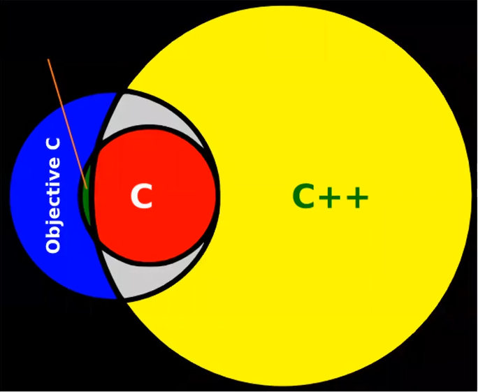
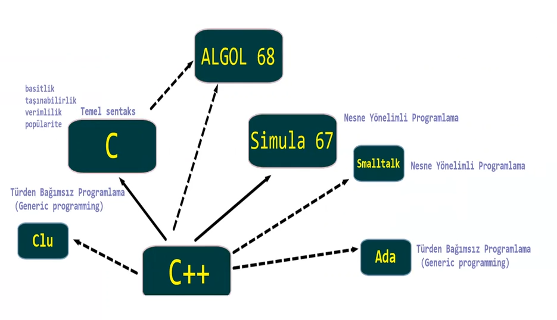

# Giris

C++ dili, icerisinde C dilinden 

C++, multi-paradigm bir programlama dilidir.

* prosedural programming
* object-oriented programming
* generic programming 
* functional programming

C++ dili, data abstraction icin cok zengin bir arac setine sahiptir.

   
  Sekil: C++ Etkilendigi programlama dilleri

C++ dili, herhangi bir firmaya bagli olmayan bir standart komitesi tarafindan gelistirilmeye devam etmektedir.

# Kitaplar

* **C++ Primer, 5th edition**
  S.B.Lippman, J.Lajoie, B.Moo
  *C++11, yeni surumu hazirlaniyor.*
        
* **The Standard C++ Library, 2nd edition**
  N.M.Josuttis

# Yararli Baglantilar

* [Programlama dilleri populite indexi](https://www.tiobe.com/tiobe-index/)  

* [C++ Core Guidelines](https://isocpp.github.io/CppCoreGuidelines/CppCoreGuidelines)  
  Bjarne Stroustrup ve Herb Sutter tarafindan olusturulmus best practices ve bad practices aciklanan bir kilavuz dokumandir.  
 
  **GSL**: Guideline support library (header only)

* [wandbox.org](https://wandbox.org/)  
  Online C/C++ derleyicisi
  
* [cppinsights.io](https://cppinsights.io/)  
  Derleyicinin urettigi koda yonelik bilgi

<!-- 
C dilinde tekrar edilmesi gereken konular
==========================================

* C'den gelen operatorler
* Operatorlerin urettigi degerler
* Operatorlerin yanetkileri ve seq pt
* Operatorler ile olusturulan ifadelerin deger kategorisi
* Ozellikle sizeof ve ?: operatorleri
* Comma operatoru
* ++x ve --x operatorleri C'de rvalue, C++'da lvalue
* x-- ve x-- operatorleri rvalue expr
* +x integral promotion gerceklestirirken ayrica lvalue expr rvalue cevirir.
* Sequence pt olusturan operatorler:
  * && ||   ilk operandlarindan sonra
  * ?: expr eval edildikten sonra
  * , operatorunun sol operandindan sonra
* Adres alan fonksiyonlar:
* const anahtar sozcugu ve pointerlar
* adres donduren fonksiyonlar
* string literalleri
* type alias declarations (typedef)
* pointer aritmetigi
* pointerlar ve karsilastirma yontemleri
* pointer dizileri
* pointer to pointer
* void pointerlar ve kullanim alanlari
  * `void *` turu ile `void**` arasindaki fark
* fonksiyon pointerlari
  * fonksiyon pointerlarinin dizileri
  * function returning function pointers
  * callback 
* Multi-dimensional arrays
  * Fonksiyonlara gonderilmesi
* Dinamik bellek yonetimi
* array decay / function to pointer conversion 

-->