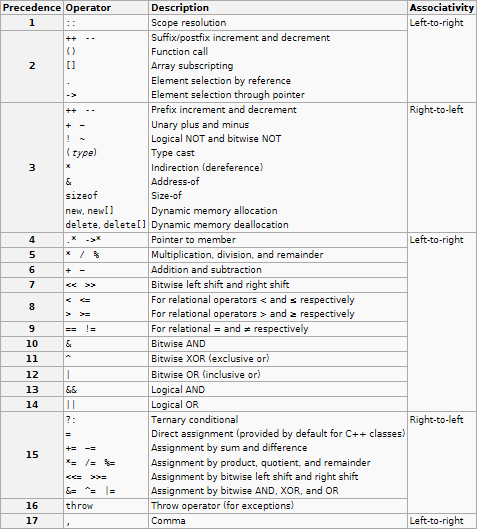

# Basic Types

## Tam sayi turleri

| type                                           |        sizeof         |      suffix      | Expression |
| ---------------------------------------------- | :-------------------: | :--------------: | :--------- |
| `bool`                                         |           1           |                  |            |
| `char`<br/> `signed char`<br/> `unsigned char` |           1           |                  |            |
| `short`<br/> `usinged short`                   |                       |                  |            |
| `int`<br/> `unsigned int`                      | 2/*4/8 <br/> impl-def |      <br/>U      |            |
| `long`<br/> `unsigned long`                    |       >= 8 byte       |   L<br/>UL/LU    |            |
| `long long`<br/> `unsigned long long`          |       >= 8 byte       | LL <br/> ULL/LLU |            |
  
* `int` turu boyutu icin tipik olarak islemcinin **WORD** uzunlugu kullanilir.
* `signed`/`unsigned` tur belirtilmeden kullanildiginda `int` turunu temsil eder.
* Tum derleyiciler asagidaki ifadeye uymak zorundadir:
  ```C++
  sizeof(short) <= sizeof(int) <= sizeof(long) <= sizeof(long long)
  ```
* [C++20] Standart olarak negatif sayilaring gosterimi [**2's complement**](extras/twos_compliment.md) olmasi garanti altindadir.

* Eger literal belirtec kullanilmadan (orn LL) `int` sayi sinirlarini asan bir deger ile ifade ediliyor ise hangi ture sigacagina bakilarak turu tespit edilir. 
  ```C
  // int'e sigmadigi icin long olur
  329'200'0123;
  ```

* Isaret operatoru `+` ve `-` sabit ifadesine dahil degildir.
  ```C++
  -23;            // sabit ifdes = 23
  -2147483648;    // long long, unsigned int degil
  ```
  2147483648 ifadesi degeri `int` turune sigmaz. Isaret, sabit sayi ifadesinden ayri olmasi nedeniyle `unsigned int` turune sigmasina ragmen `long long` olur. Bu durum derleyiciye *int kac byte olduguna* gore degisir.

## Gercek sayi turleri

| type          |  sizeof  | suffix | Expression |
| ------------- | :------: | :----: | :--------- |
| `float`       |    4     |   F    | 4.5F       |
| `double`      |    8     |        | 4.5        |
| `long double` | impl-def |   L    | 4.5L       |

* IEEE758 formati
* `double` yerine `float` kullanimi hassasiyetin onemli olmadigi, memory'nin onemli oldugu durumlarda kullanilmalidir.

# Sayi Sistemleri

| Number System | Base  | Prefix | Expression | Value |
| ------------- | :---: | :----: | :--------- | :---- |
| binary (C++)  |   2   |   0b   | 0b00101001 | 41    |
| octal         |   8   |   0    | 041        | 33    |
| decimal       |  10   |        | 41         | 41    |
| hexadecimal   |  16   |   0x   | 0x41       | 65    |

* Kullanilan sayi sistemine gore literalin turu degisebilir.
  ```C
  // unsigned int, cunku hex olarak ifade edilmis
  0x8000'0111;
  ```
  
# Name lookup
Derleyicinin derleme sureclerinden biridir. Identifier'larin (isimlerin) hangi varliklara ait oldugunu anlamasina denir. Bu isim neyin ismi sorusuna cevaptir. Dilin kurallari ismin hangi kod alanlarinda hangi sira ile yapilacagini belirlemektedir.

Isim aramanin **altin kurallari**:
1. Isim arama belirli bir siraya gore yapilir.
2. Aranan isim bulundugunda, isim arama sureci sonlanir ve bir daha baslamaz.

Isim arama C++'da 3 sekilde sonlanabilir:
1. Aranan isim bulunamaz (Undefined ideftifier)
2. Aranan isim bulunur ve sonraki surece gecilir
3. Ambiguity 

**Ornek**
```C++
int x;

int main() {
    int x = x;
    std::cout << x << std::endl;
}
```
UB'dir. Cunku once isim arama yapilir.


# Scope
Scope, isimleri niteleyen bir terimdir. C++'da bildirilen bir isim bir scope ait olmalidir.

C++'da scope kategorileri:
1. Block scope
2. namespace scope
3. class scope
4. Function prototype scope
5. Function scope

* Ayni scope'da ayni ismin birden fazla varliga verilmesi syntax hatasidir.
* Farkli scopelarda tanimlanan ayni isimlerin, kendisini kapsayan (enclosing) scopedaki ismileri gizlemesine **name-hiding** (name masking/name shadowing) denilir.

* Fonskiyon parametre degiskenlerinin scope'u tanim bloguna aittir.
  *`a` ve `b`nin scopelari aynidir:*
  ```C++
  void func(int a) {
    int b;
  }
  ```
  
* Unary `::` operatoru kullanildiginda operand isim icin isim arama global scope'da yapilir.
  ```C++
  void x();
  
  int main() {
    int x = 34;     // name-hiding
    std::cout << x; // local'de tanimlanan x degiskenidir.
    ::x();          // global'de tanimlanan x fonskiyonudur.
  }
  ```


# Expression

Her bir ifadenin bir **data type**'i ve bir **value category**'si bulunmaktadir.

C++'da  
Primary value categories: 
* PR
* L
* X

Secondary value categories: 
* R  = PR $\cup$ X
* GL = L $\cup$ X

| expression |   C   |  C++  |
| ---------- | :---: | :---: |
| +x         |   R   |       |
| ++x        |   R   |   L   |
| --y        |   R   |   L   |
| a, b       |   R   |   L   |
| ? :        |   R   |   L   |
| assignment |   R   |   L   |

* Bildirilen isimlerin bir value categorysi yoktur, expressionlarin vardir.

# Operatorler

Operatoreler operand sayisina gore nitelendirilir. 
* unary
* binary
* ternary

<center>
<br/>
Sekil: Operator oncelik tablosu
</center> 

* `sizeof` operatorunun onemli ozellikleri:
  1. `sizeof` anahtar sozcugu bir operatordur, bir fonksiyon degildir.
  2. sizeof operatoru ile olusturulan ifadeler **constant expression**dir. Yani compile-time sabitidir.
  3. sizeof operatorunun urettigi deger `size_t` turundendir. `size_t` turu derleyiciye gore degisebilir.
   > **DIKKAT!** 
   > Tur donusumu kurallari geregi, isaretli ve isaretsiz bir tur arasinda islem yapilacagi zaman tur donusumu isaretsiz olan yone yapilir!  
  4. `sizeof` operatorunun operandi tur bilgisi ile `()` kullanimi zorunludur, ancak bu parantez sizeof operatorunun bir parcasi degildir!
  5. `sizeof` operandi **unevaluted context**'tir!

* `&&` ve `||` icin **short circuit behavior**:
  Once sol operand sonra sag operand degerlendirilir. Eger sol operand ile nihai sonuc kesin olarak elde edilmis ise sag operand icin islem kodu isletilmez.
  ```C++
  int x = 0;
  int y = 10;

  // x false olmasindan dolayi y icin islem yapilmayacaktir.
  int z = x && ++y; 
  ```
  ```C++
  // i < 10 yanlis ise a[i] erisilmeyecek.
  for(int i = 0; i < 10 && a[i] != val; i++);
  ```

* Tum atama operatorlerinin urettigi deger, nesneye atanan degerdir. Tur donusumu olmasi durumunda atanan deger donusume ugramis degerdir.
  ```C
  // = operatorunun urettigi deger y degildir, x'e atanan degerdir.
  x = y;
  ```

* Operatore olan `,` ile ayrac olan `,` karistirilmamali
  ```C
  void func(int, int, int);
  
  int x = 10, y=20;
  int a[] = { 1, 2, 3};
  func(x, y, 5);  // buraya kadar hepsi ayirac
  
  int b[] = { 1, (2, 3)}; // (2,3) olan , operatoru
  func((x, y, 5));        // hepsi , operatoru
  ```
  
* Unary `+` ve `-` isaret operatorleri
  1. integer promotiona neden olur
  2. lvalue bir expression'i prvalue'ya cevirir.

------------

## sequence point (sequencing) and order of evaluation
C ve C++'da sequence point kurallari farklidir. Kaynak kodda bir nokta belirtilmektedir. Yani compile-time'e iliskin bir kavram.

Operator onceligi, islemin daha once yapilmasi anlamina gelmemektedir:
```C
f1() + f2() * 5; 
```
```C
x = 10;
x++     //x'in degeri ne zaman 11 olacak? Ilk sequence pointten sonra.
```
```
++x     yan etkileri seq pointte uygulanir
---------- code point/seq point
burada x'in degeri kullanildiginda yan etkiler uygulanmistir

```
> **DIKKAT!**
> Eger bir nesne yan etkiye maruz kalmis ve ayni ifade icerisinde seq. pt'den once kullanilmis ise hem C'de hem de C++'da **tanimsiz davranis**dir.
> ```
> ++x + x
> ```

Tipik sequence pointler:
1. Deyim sonu
    ```C
    statement;
    ```
2. Bildirimlerdeki virgul  
    ```C
    int x = 5, y = ++x, z = y + x;
    ```
3. Kontrollerin ifadelerinde kullanilan ()'den sonra
   ```C++
   if(expr)
   while(expr)
   do while(expr);
   for(;;)
   switch()
   ```
4. Dort adet operatorde
   1. `&&` ve `||` sol operandi evaluate edildikten sonra seq pt vardir
      ```C++
      x = 4;
      x++ && f(x); // f fonks. 5 degeri ile cagrilir.
      ```
   2. Comma operatorunun sol operandi evaluate edildikten sonra seq pt vardir
      ```C++
      if(++x, f(x) != 0);
      ```
   3. `expr?` da bir sequence pt vardir.

------------

* Shift operatorleri `<<` ve `>>` icin 
  1. Sag operandin degeri sol operanding donusturulmus turunun bit sayisindan kucuk ve pozitif bir deger olmasi gerekir. Aksi halde **UB**dir.
     `int`'in 32 bit oldugu varsayilir ise:
     ```C++
     int x = 0;
     x << 33;   // UB
     x << -3;   // UB
     ```
     `int` 32 bit, `short` 16 bit oldugu varsayilir ise:
     ```C++
     int x = 17;
     short s = 98;
     s << x;    // Gecerli: s degeri integer promotion'a ugradigi icin
     ```
  2. Negatif degerleri `<<` (sola kaydirma) **UB**dir.
  3. `signed` ve negatif bir deger `>>` isleminde soldan eklenecek bitlerin degeri **implementation-defined**dir.

* Karsilastirma operatorlerinde sik yapilan yapilan hatalar:
  1. Gercek sayilarin `==` karsilastirmasi yapilmasi
     ```C++
     double x = 0.;
     for(int i=0; i<10; ++i)
      x += .1;
     
     auto b = x == 1.0;   // b = false
     ```
  
  2. Ternary operatorun uygun kullanimlari
     ```C++
     z = x > y ? a : b;
     ```
     ```C++
     f(a > b ? a : b);
     ```
     ```C++
     return a > b ? a : b;
     ```


# Functions

<!-- Kursta burasi yoktu cppref'den toparla -->

> **Not**
> **Variadic functions**
> ```C++
> // Syntax
>   void func(int, ...)
>     
> func(1);
> func(1,4,5);
> ```
> Tipler variadic conversion ile tespit edilir.


* Global (free) yada bir member function, bir sinifi parametrik olarak aliyorsa sunlardan biri olmak zorunda:
  1. accessor: Sinif nesnesinin degeri kullanmaya yonelik
    ```C++
    void func(T *);         // mutator
    void func(T &);         // mutator
    ```
  2. mutator: Sinif nesnesinin degerini degistirmeye yonelik
    ```C++
    void func(const T *);   // accessor
    void func(const T &);   // accessor
    ```
    
> **mutable**: Degistirilebilen.  
> **immutable**: Degistirilemeyen.  

## deleted functions
Fonksiyon bildirimi yapilmis ve bu fonksiyona cagri yapilmasi syntax error olusturmasi istendiginde fonksiyon delete edilebilmektedir.
```C++
void func(int) = delete;
```
```C++
func(12); // hata!
```
> **DIKKAT!**
> Fonksiyonun hic bildirilmemis olmasindan farki, delete edilmis bir fonksiyon function overload resolution'da yine aday ve viable fonksiyonlardan biri olmasidir. Argumanlarin implicit donusumunu engellemek icin kullanilabilir.
```c++
void func(double);            // (1)
void func(float);             // (2)
void func(int)  = delete;     // (3)
```
```C++
func(2.4f);   // (1) secilir ve cagrilir
func(2.4);    // (2) secilir ve cagrilir
func(3);      // (3) secilir ancak cagrilamaz, syntax error verir.
```
