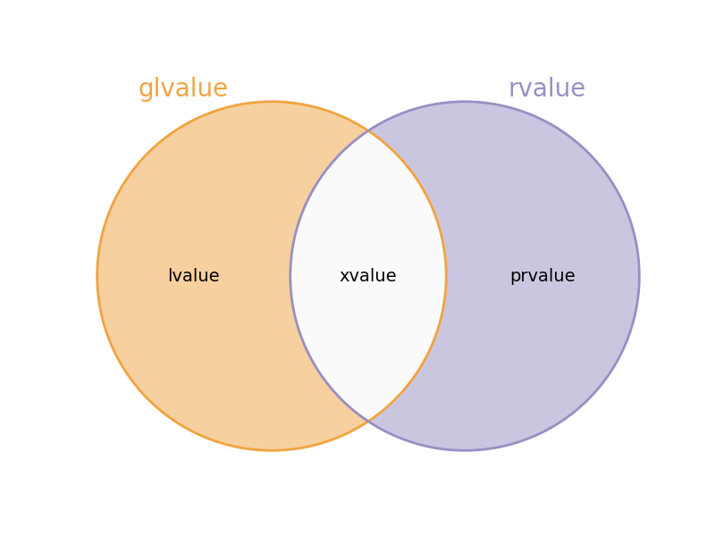

# Value Categories

Modern C++ ogrenenlerin en sik yaptigi hatalardan biri data type ile value category'i karistirmasidir. Bir **<ins>IFADENIN</ins>** value kategorisi olur, bir degiskenin value kategorisinden bahsedilemez. Bir degiskenin data type (declaration type)'i olur.

Modern C++'a geciste primary value category sayisi 2'den 3'e cikarildi.

**Primary value categories**
* PR value (pure rvalue)
* L value
* X value (expired value)

**Secondary value categories**
* R value = PR value $\cup$ X value
* GL value = L value $\cup$ X value

<p align="center">
  <br/>
  <i>Sekil: C++ Deger kategorileri</i>
</p>
<!--  -->

[bknz: valcat.cpp](res/src/valcat01.cpp)

* Bir ismin olusturdugu ifade her zaman **lvalue expression**dir.
  ```C++
  int &&rr = 10;
  rr  // turu int&& olan bir lvalue expr
  ```
  `rr` ifadesi bir **lvalue expr**dir. Cunku derleyici arkaplanda bir gecici nesne olusturmaktadir.

* `*` ve `[]` olusturulan ifadeler her zaman **lvalue expr**'dir.

* `()` oncelik parantezidir. Icerisinde bulunan ifadenin deger kategorisini **degistirmez**.
  ```C++
  (((((((x))))))) = 9; // gecerli
  ```
* Ifadenin turu ve deger kategorisi farkli seylerdir.
  ```C++
  void func(int && r)     // r'nin turu rvalue reference ve value categorisi yoktur
  {                       // cunku bir expr degil bildirimdir.
    r;  // lvalue expr
  }
```

-----

**Ornekler**
```C++
20  // prvalue expr
```
```C++
int x = 5;
x   // lvalue expr
```
```C++
int &r = x;
r   // lvalue expr
```

```C++
int x = 10;

&x;                     // data type: int*

int* &r = &x;           // sentaks hatasi: cunku &x ifadesi bir rvalue expr ve lvalue ref'e baglanamaz.
int* &&rr = &x;         // gecerli: cunku &x rvalue expr. ve rvalue ref'e baglanabilir.

const int* &r = &x;     // sentaks hatasi: constluk verilen ref degil, pointerin isaret ettigi int turu
int* const &r = &x;     // gecerli: cunku rvalue expr, const lvalue ref'e baglanabilir.

using iptr = int*;    
const  iptr& r = &x;    // gecerli: cunku const iptr == int* const (top-level const)
```
