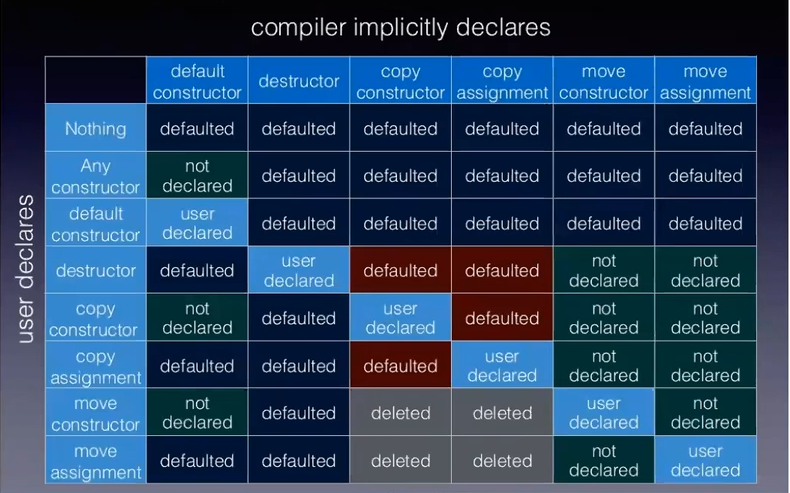

## SMF'ler icin Derleyicinin kod uretme kurallari

* Hicbir SMF bildirilmemis ise 6 SMF de default edilir.

* Eger parametreli (SMF olmayan) bir ctor bildirilmis ise default ctor uretilmez **(not declared)**, diger 5 SMF **default** edilir.

* Eger sinifin default ctor'u user declared ise, diger SMF fonksiyonlar da default edilir.

* Eger sinifin dtor'u user declared ise, default ctor ve copy memberlar **default** edilir.  
  Ancak move member'lar **not-declared** olacaktir.
  > **DIKKAT!**
  > Eger `dtor` bildiriliyorsa, muhtemel kaynak iadesi yapilmaktadir. Bu nedenle copy member'larin da uygun bicimde tanimlanmasi gerekmektedir. *Ileride, yeni standartlarda bu durumun degismesi bekleniyor.*
  
<center>
<br/>
Tablo: SMF Kurallari<br/>
<i>Everything You ever wanted to know about move semantics, Howard Hinnant, Accu 2014</i>
</center>
  
Yukaridaki tablo[1] kisaca soyle aciklanabilir:
* `dtor` ya user declared yada `defaulted`.
* `default ctor` hicbir ctor user-declared degil ise *defaulted* aksi halde *not declared*.
* `dtor` veya `copy member`lardan herhangi biri user-declared ise `move members` *not declared*
* `move member`lardan herhangi biri user-declared ise `copy members` *deleted*
* `copy member`lardan sadece biri user-declared ise, digeri *defaulted*


**Ornekler**

1. Eger sinifa sadece `copy ctor` user-declared ise diger SMF'lerin durumu nedir?
   
   * default ctor: not-declared (Kural: Herhangi bir ctor yazilirsa, default ctor not-declared)
   * dtor: defaulted            (!)
   * copy assignment: defaulted (!)
   * move members: not-declared
   

2. Eger sinifa sadece `copy assignment` user-declared ise diger SMF'lerin durumu nedir?
   
   * default ctor: defaulted
   * dtor: defaulted            (!)
   * copy ctor: defaulted       (!)
   * move members: not-declared

3. Eger sinifa sadece `move ctor` user-declared ise diger SMF'lerin durumu nedir?
   
   * default ctor: not-declared
   * dtor: defaulted            (!)
   * copy members: deleted
   * move assignment: not-declared

4. Eger sinifa sadece `move assignment` user-declared ise diger SMF'lerin durumu nedir?
   
   * default ctor: declared
   * dtor: defaulted            (!) 
   * copy members: deleted
   * move ctor: not-declared

5. Sinifi kopyalamaya karsi kapatmak icin:
    
   `copy member`lari `delete` etmelisiniz. `move member`lari delete etmeye gerek yok, cunku zaten not-declared olacaklardir.

<!--  -->

> **DIKKAT!**  
> `copy member`larin bildirip, `move member`lari **asla** delete etmeyin!
> 
> Cunku bu durumda tasima yapilmasi gereken yerde kopyalama yapilmasi istenmektedir. Ancak, move members bildirildigi icin function overload resolution'a girecek ve delete edildigi icin **syntax hatasi** olusacaktir!

> **Not**
> 
> SMF Not declared olma durumlari:
> ```
> Herhangi bir ctor bildirilir ise       -->  default ctor not declared
> dtor/copy ctor/copy= bildirilir ise    -->  move members not declared
> move ctor bildirilir ise               -->  move= not declared
> move= bildirilir ise                   -->  move ctor not declared
> move memberlardan biri bildirilir ise  -->  copy members deleted
> ```