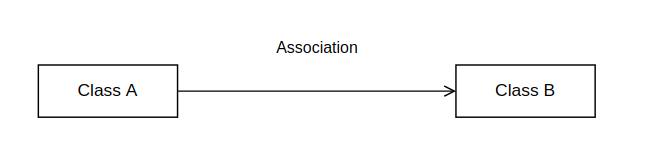
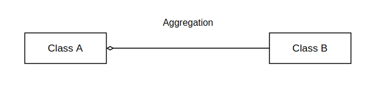
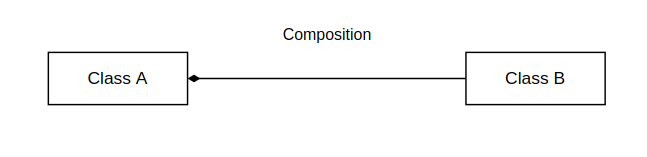

# Composition
*Containment*

<!-- Ders 18 1:09:55 -->

**Association**
Iki sinif turunden nesnenin birlikte calisarak bir isi gerceklestirmesini ifade eden iliski bicimidir.
<center>
<br/>
Sekil: UML Class Diagram
</center>

**Aggregation**
Nesnelerden birinin digerini sahiplendigi bir iliski bicimidir. *Association*'in alt kumesidir. 
<center>
<br/>
Sekil: UML Class Diagram
</center>

**Composition**
Nesnelerden birinin digerini sahiplenmesi ile beraber hayatini da kontrol ettigi iliskisi bicimidir. Sahip olan nesne hayata geldiginde sahip olacagi nesne de hayata gelmekte, sonlandiginda sahip olduklari da sonlanmaktadir. *Aggregation*'in alt kumesidir.

Composition, siniflar arasinda **`has-a`** iliskisi ile bir varligin baska bir varligin sahibi oldugunu ifade eder.

<center>
<br/>
Sekil: UML Class Diagram
</center>

> 
> $$
> \text{Association} \supset \text{Aggregation} \supset \text{Composition}
> $$
> *Her aggregation bir association'dir, ancak her association bir aggregation olmak zorunda degildir. Her bir composition bir aggregation'dir, ancak her aggregation bir composition olmak zorunda degildir.*

**C++ dilinde composition sinif iliskisi**
*Bir sinifin elemanlarinin baska siniflar turunden olmasi*

  ```C++
  class Member {};
  
  class Owner { 
    Member mx;
  };
  ```
  
Elemanlarin hayata gelme sirasi bildirim sirasi ile gerceklesir. ctor initializer list'de de bu sira takip edilmesi tercih edilmektedir.
  
<details>
<summary><b>Ornek</b> (Click to expand)</summary>

```C++
class Person { 
public:
    Person(const char* p) : m_name{p}, m_grades{}
    {
    }
    
private:
  std::string m_name;
  std::vector<int> m_grades;
};
```
</details>
<!--  -->

Composition iliskisine sahip member siniflarin interface'i owner sinifa dahil edilmemektedir. Ancak, adapte edilerek sinifin interface'ine tabiki eklenebilmektedir.
<details>
<summary><b>Ornek</b> (Click to expand)</summary>

```C++
class Member {
public:
  void foo();
  void bar();
};

class Owner {
public:
  void foo() {
    mx.foo();
  }
  
private:
  Member mx;
};
```

</details>
<!--  -->
[Ornek](res/src/composition01.cpp)

Eger sinifin default ctor'i derleyici tarafindan yazilirsa, veri elemanlari da default init edilmektedir. Bu, veri elemanlarinin sinif turunden oldugunda [default ctor](210_ctors_dtor.md#default-constructor)'u cagrilmaktadir.
**Istisna**: Eger [default member initializer](210_ctors_dtor.md#default-member-initializer) ile initialize edilmis ise, derleyicinin yazdigi default ctor'da belirtilen ctor cagrilacaktir.

> **DIKKAT!**  
> Eger sinifin data memberlarindan birinin default ctor'u bulunmuyor ise, derleyici sinifin default ctor'u `delete` etmektedir!


Bir sinif olustururken:
1. Sinifin default ctor'u olsun mu?
   *Bir sinifin default ctor'u bulunmayabilir, ancak dezavantajlarinin farkinda olunmasi gerekiyor.*
2. Sinif kopyalanabilmeli mi?
   > **DIKKAT!**
   > Bir sinif icin **copy ctor** yaziyorsaniz, sinifin tum veri elemanlarinin copy construct edilmesinden programci sorumludur. Eger veri elemanlarindan biri icin copy ctor'unu calistiracak cagri eklenmez ise **default ctor** cagrilir. 
   
   > **DIKKAT!**
   > Bir sinifin data memberlarindan birinin copy ctor'u `delete` edilmis ise, derleyicinin urettigi default copy ctor'da syntax hatasi olusacaktir. Derleyici, dilin kurallarina aykiri bir durumla karsilastiginda `default` etmesi gereken bildirimi `delete` eder!
   
   `std::unique_ptr` kopyalanamayan ancak tasinabilen bir siniftir.
   
   ```C++
   class Myclass {
   public:
     std::unique_ptr<std::string> mptr;
   };
   ```
   ```C++
   Myclass m1;
   Myclass m2(m1);              // syntax error
   Myclass m3(std::move(m1));   // gecerli
   ```
