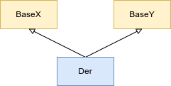

# Inheritance

C++ dilinde kalitim, nesne yonelik programlamadaki kalitima nispeten daha genic bir arac setidir. 

**Inheritance**, nesne yonelik progralama kapsaminda siniflar arasinda **`is-a`** iliskisini ifade ederken C++'da daha farkli amaclar ile de kullanilabilmektedir. Bir sinif turunden nesnenin, baska bir sinif turundenmis gibi kullanilabilmesine olanak saglar. Nesne yonelik programlamada genelde runtime ile ilgili iken, C++'da hem runtime hemde generic programlama ile salt compile-time olarak kullanilabilmektedir.

C++'da kalitim 2 nokta ustunde odaklanir:
  1. Eski kodlarin (onlarda bir degisiklik yapilmadan) yeni kodlari kullanabilmesi  
     *Ana catiyi olusturan eski kodlar, daha alt sevideki kodlara bagimli degil.*
  2. Kodlarin yeniden kullanimi *(code reuse)*
     
## Terminoloji

**Base class** *(parent/super/taban)*
Kalitimda kaynak olarak kullanilacak sinif. (Kurs suresince `Base` olarak isimlendirilecek)
**Derived class** *(child/sub/turemis)*
Kalitimda hedef olarak kullanilan sinif. (Kurs suresince `Der` olarak isimlendirilecek)
**Derivation** 
Kalitimi gerceklestirme fiili

**Single-level inheritance**
<!-- TODO Tanim ekle -->
UML Modelleme dilinde inheritance, turemis siniftan taban sinifa giden bir ok isareti ile `is-a` iliskisi gosterilir.
<p align="center">
  <br/>
  <i>Sekil: Single-level inheritance</i>
</p>

**Multi-level inheritance**
<!-- TODO Tanim ekle -->
<p align="center">
  <br/>
  <i>Sekil: Multi-level inheritance</i>
</p>

**Direct base class**
Kalitim yapilan bir sinifin direkt olarak taban sinifidir. Ornegin; `Mercedes` sinifi `Merceder_S500`'un direct base classidir.  
**Indirect base class**: Kalitim yapilan bir sinifin dolayli olarak taban sinifidir. Ornegin; `Car` sinifi `Merceder_S500`'un indirect base classidir.

**Multiple inheritance**
Bir sinifin birden fazla taban sinifi direct base class olarak kullanarak olusturulan kalitim bicimidir.
<p align="center">
  <br/>
  <i>Sekil: Multiple inheritance</i>
</p>


## Genel kurallar

* C++'da inheritance 3 ayri kategoriye ayrilir:
  1. public inheritance
     ```C++
     class Base {};
     class DerPub : public Base {};
     ```
  1. private inheritance
     ```C++
     class Base {};
     class DerPriv : private Base {};
     ```
  1. protected inheritance
     ```C++
     class Base {};
     class DerProt : protected Base {};
     ```


* Base class olarak kullanilacak sinifin **complete type** olmasi gerekmektedir.
* Eger kalitim ile olusturulan sinif `class` anahtar sozcugu ile olusturulurmus ise, inheritance specifier kullanilmadiginda varsayilan olarak **private inheritance** uygulanir.
  ```C++
  class DerPriv : Base {};  // private inheritance
  ```
* Eger kalitim ile olusturulan sinif `struct` anahtar sozcugu ile olusturulurmus ise, inheritance specifier kullanilmadiginda varsayilan olarak **public inheritance** uygulanir.
  ```C++
  struct DerPub : Base {};  // public inheritance
  ```
* Kalitim ile olusturulan **is-a** iliskisi cift yonlu degildir. Yani, her bir `Der` nesnesi ayni zamanda `Base` turunden bir nesne iken; her bir `Base` nesnesi, bir `Der` nesnesi olmak zorunda degildir.
  <details>
  <summary><b>Ornek</b> (Click to expand)</summary>
  
  ```C++
  class Car {
  public:
    void start();
    void run();
    void stop();
  };
  
  class Volvo : public Car {
  public: 
    void open_sunroof();
  };
  ```
  ```C++
  Volvo v;
  v.start();        // legal: volvo is a car
  
  Car c;
  c.open_sunroof(); // illegal: Car is not a Volvo.
  ```
  </details>
  <!--  -->
  
  
* Kalitim yoluyla elde edilmis bir `Derived` sinif icersinde onun `Base` sinifi turunden bir nesne oldugunu soylenebilir.
  ```C++
  class Base {
  public:
      int x,y;
  };
  
  class Composition {
  private:  
      Base b;
  };
  
  class Der : public Base {};
  ```
  ```C++
  constexpr auto sz1 = sizeof(Composition);     // sz1 = 8UL
  constexpr auto sz2 = sizeof(Der);             // sz2 = 8UL
  ```

* `Base` ve `Der` siniflari ayri ayri siniflardir ve scope'lari **farklidir**!
  <details>
  <summary><b>Ornek</b> (Click to expand)</summary>
  
  ```C++
  class Base {
  public:
    void func(int);
  };
  
  class Der : public Base {
  public:
    void func(double);
  };
  ```
  </details>

  `func` fonksiyonlari arasinda function overloading **yoktur**!

  <!--  -->
  
## Name-lookup kurallari

* Isim arama sirasi asagidaki gibidir:
  1. Kullanildigi blok icinde
  2. Kapsayan bloklar icinde icten disa sirayla
  3. class definition icinde
  4. direct base class definition icinde
  5. indirect base class definition icinde
  6. namespace'de

```C++
class Base{ 
public:
  int mx, my;
};

class Der : public Base { 
public:
  void func() {
      mx = 5;         // Der icindeki mx
      my = 20;        // Base icindeki my
      Base::mx = 10;  // Base icindeki mx
  }
  int mx{};
};
```

`.` operatorunun yada `->` operatorunun saginda kullanilan isim, eger sol operand bir `derived` sinif turunden ise once `derived` sinifin scope'unda, bulunamaz ise `base` sinifin scope'unda aranmaktadir.

> :pushpin: 
> Farkli scopelarda bildirilmis cakisan isimlerden once bildirilen name-hiding'e ugrar.
  
*Eger turemis sinifta ki bir isim taban sinifta ki bir varlik ile ayni isim verilmis ise, taban siniftaki isim gizlenir.*
<details>
<summary><b>Ornek</b> (Click to expand)</summary>

```C++
class Base{
public:
  void foo(int);
};

class Der : public {
  void foo(int, int);
};
```
`der.foo(10)` ifadesinde foo ismi `Der` icinde bulundu, ancak context uyumsuzdur.
```C++
Der der;
der.foo(10);        // gecersiz
der.foo(3, 5);      // gecerli
der.Base::foo(10);  // gecerli
```
</details>
<!--  -->
  

## Access Control

Taban sinifin;
* `public` bolumu her koda acik, 
* `protected` bolumu kalitim yolu ile elde edilen siniflara acik ancak disari kapali, 
* `private` bolumu *friend bildirimleri haric* disari kapalidir.

Yani, `Derived` sinif, `Base` sinifin **public** ve **protected** bolumlerine erisebilir, ancak **private** bolumune erisemez.
<details>
<summary><b>Ornek</b> (Click to expand)</summary>

```C++
class Base {
public:
    void func_pub();
protected:
    void func_prot();
private:
    void func_priv();
};

class Der: public Base {
    
    void func() {
        func_pub();     // gecerli
        func_prot();    // gecerli
        func_priv();    // syntax error: inaccessible
    }
};
```
```C++
Der der;
der.func_pub();         // gecerli
der.func_prot();        // syntax error: inaccessible
der.func_priv();        // syntax error: inaccessible
```
</details>
<!--  -->

Eger kalitim turu `public inheritance` ise; taban sinifin uyeleri asagidaki gibi turemis sinifin bolumlerine **eklenmektedir**.
* `public` isimleri turemis sinifin `public` bolumune
* `protected` isimleri turemis sinifin `protected` bolumune
* `private` isimlere erisim yoktur.

<details>
<summary><b>Ornek</b> (Click to expand)</summary>

```C++
class Base {
protected:
    void foo();
};

class Der : public Base {};

class DerDer : public Der {
public:
    void func() { 
        foo();      // gecerli
    }
};
```
</details>
<!--  -->

> :pushpin: 
>  Access control en son yapilir.  
>  *Once name-lookup, sonra context control, en son access control*
>  <details>
>  <summary><b>Ornek</b> (Click to expand)</summary>
>
>  `Der::foo` fonksiyonunu `private` olduguna dikkat edin:
>  ```C++
>  class Base {
>  public:
>    void foo(int);
>  };
>  
>  class Der : public Base {
>  private:
>    void foo(double);   // private olduguna dikkat edin
>  };
>  ```
>  `der.foo(12)` ifadesinde `foo` ismi `Der` icinde bulundu, ancak access control `private`!
>  ```C++
>  Der der;
>  der.foo(12);          // syntax error: inaccesible
>  der.Base::foo(12);    // legal
>  ```
>  </details>
>  <!--  -->

-------

## Type casting

### Upcasting
Bir turemis sinif turunun taban sinif turune yapilan donusumdur. C++'da upcasting implicit olarak yapilabilmektedir, ancak tersi (downcasting) implicit olarak yapilmamaktadir.
  ```C++
  class Base {};
  class Der : public Base {};
  ```
  Normalde bir pointer turu sadece kendi turunden bir nesneyi isaret edebilmekteydi.
  ```C++
  Der der;
  Base* baseptr = &der;   // gecerli: implicit upcasting
  Base& baseref = der;    // gecerli: implicit upcasting
  
  Base base;
  Der* derptr = &base;    // gecersiz: implicit downcasting yok!
  Der& derptr = base;     // gecersiz: implicit downcasting yok!
  ```
  
  > :warning:   
  > `Base` sinif nesnesine dogrudan `derived` turunden bir nesne atanabiliyor olsa da kullanilmasi istenen bir arac degildir. Bu duruma **object slicing** (nesne dilimlenmesi) denir.
  > 
  > *-ileride detayli aciklanacak-*
  > 
  > ```C++
  > Der der;
  > Base base = der;    // gecerli ancak kacinilmali
  > ```

### Downcasting
Bir taban sinif turunun turemis sinif turune yapilan donusumdur. C++'da downcasting implicit olarak **yapilamamaktadir**, ancak bazi ozel durumlarda; `base` turunden bir pointer'in isaret ettigi nesnenin turunden eminsek, `derived` turune `explicit` downcast uygulanabilmektedir.
```C++
Car* cptr = Volvo();
Volvo* vptr = (Volvo*) cptr;    // Taban sinifin Volvo nesnesi oldugu biliyoruz.
```

Bir `base` sinif pointer'ina, bir `derived` sinif nesnesi adresi atandiginda, derleyici nasil bir kod uretiyor?
<!-- TODO tamamla Ders 21 1:47:00 civari -->

## Inheritance ve Ctors/Dtor

Bir turemis sinif nesnesi hayata getirilirken asagidaki sira ile barindirdigi nesneler hayata getirilir:

1. `Base` non-static data members by order of declaration
2. `Base` sinif nesnesi
3. `Derived` non-static data members by order of declaration
4. `Derived` nesnesi

Programin akisi `Derived` nesnesinin ctor bloguna girdigi zaman, `Base` sinifin hayata geldigini biliyoruz.

Benzer sekilde turemis sinif nesnesinin hayati sonlandirilirken; yukaridaki siranin **tersi** sirada nesnelerin hayatlari sonlandirilir.

[Ornek](res/src/class_inheritance01.cpp)


* Eger `derived` sinif default ctor'i derleyici tarafindan default ediliyorsa, 
derleyici `derived` sinif nesnesi icindeki `base` sinif nesnesi icin default ctor'u cagiracaktir.

  Benzer sekilde `derived` sinifinin dtor'u derleyici tarafindan yaziliyorsa, derleyici `derived` sinif dtor'u sonuna `base` sinif nesnesinin dtor'una yapilan cagriyi da ekler.
  <details>
  <summary><b>Ornek</b> (Click to expand)</summary>

  [Ornek: Calisan kod](res/src/class_inheritance02.cpp)
  ```C++
  class Base {
  public:
      Base() {
          std::cout << "Base default ctor\n";
      }
      
      ~Base() {
          std::cout << "Base dtor\n";
      }
  };
  
  class Der : public Base {
  };
  ```
  ```C++
  Der der;
  ```
  Output:
  ```
  Base default ctor
  Base dtor
  ```
  </details>
  <!--  -->
  
* Eger `base` sinifin default ctor'u bulunmamasi durumunda, `derived` sinifin default ctor'u derleyici tarafindan delete edilir.
  Eger `derived` sinifin default ctor'u user-defined ise, `direct base` sinifin ctor'u member initializer list'e eklenmesi zorunludur. *`Derived` sinifin ctor'unda `indirect base` sinifinin ctor'una cagri yapilamaz!*

  <details>
  <summary><b>Ornek</b> (Click to expand)</summary>
  
  [Ornek: Calisan kod](res/src/class_inheritance03.cpp)
  ```C++
  class Base {
  public:
    Base(int) {
        std::cout << "Base(int) x = " << x << '\n';
    }
  };
  
  class Der : public Base {
  public:
    Der(): Base{ 0 }
    {
    }
  };
  ```
  ```C++
  Der der;
  ```
  Output:
  ```
  Base(int) x = 0
  ```
  </details>
  <!--  -->

  > :pushpin:   
  > Derleyici default ettigi bir SMF icin dilin kurallari geregi hata olusturacak bir kod uretmesi gerekiyorsa, **sentaks hatasi vermek yerine** ilgili SMF'i **delete** eder.

* Eger `derived` sinif ctor'unun user-declared olmasi durumunda, derleyici `base` sinif icin default ctor cagrisini ekler.
    
  Benzer sekilde `derived` sinifinin dtor'u user-declared olmasi durumunda, derleyici `derived` sinif dtor'u sonuna `base` sinif nesnesinin dtor'una yapilan cagriyi da ekler.
  
  <details>
  <summary><b>Ornek</b> (Click to expand)</summary>
  
  [Ornek: Calisan kod](res/src/class_inheritance04.cpp)
  ```C++
  class Member{};
  class Base{};
  class Der : public Base {
  public:
    Der()
    {
        std::cout << "Der default ctor this = " << this << '\n';
    }

    ~Der()
    {
        std::cout << "Der dtor\n";
    }
  private:
    Member mx;
  };
  ```
  Output:
  ```
  Base default ctor this = 0x7fffffffd55f
  Der default ctor this = 0x7fffffffd55f
  Der dtor
  Base dtor
  ```
  </details>
  <!--  -->
  
## Inheritance ve diger SMF'ler

### Copy ve Move Constructor

* Eger `Derived` sinifin `copy ctor` derleyici tarafindan default edilmis ise, `base` nesnesinin de `copy ctor`'u cagrilacaktir.
 
  Benzer durum `move ctor` icin de gecerlidir.
  <details>
  <summary><b>Ornek</b> (Click to expand)</summary>
  
  [Ornek: Calisan kod](res/src/class_inheritance05.cpp)
  ```C++
  class Base {
  public:
    Base() = default;
    
    Base(const Base& other) 
    {
      std::cout << "Base copy ctor\n";
    }
    
    Base(Base&& other)
    {
        std::cout << "Base move ctor\n";
    }
  };
  
  class Der : public Base {};
  ```
  Yukaridaki kod icin derleyicinin urettigi copy ve move ctor soyledir:
  ```C++
  Der(const Der& other) : Base(other) {}
  Der(Der&& other) : Base(std::move(other)) {}
  ```
  ```C++
  Der d1;
  Der d2 = d1;
  Der d3 = std::move(d1); 
  ```
  Output:
  ```
  Base copy ctor
  Base move ctor
  ```
  </details>
  <!--  -->
  
  
* Eger `Derived` sinifin `copy ctor` user-defined ise, `base` sinif copy ctor'u ctor initializer list'e **eklenmelidir**.
  > :warning:   
  > Eger `derivied` sinif ctorlarinda initializer list'e `base` sinif **copy ctor'u eklenmez ise**, derleyici `base` sinif icin copy ctor yerine **default ctor** cagrisini ekleyecektir!
  
  Benzer durum `move ctor` icin de gecerlidir.
  
  <details>
  <summary><b>Ornek</b> (Click to expand)</summary>
  
  [Ornek: Calisan kod](res/src/class_inheritance06.cpp)
  ```C++
  class Base {
  public:
    Base() 
    {
      std::cout << "Base default ctor\n";
    }
    
    Base(const Base& other) 
    {
      std::cout << "Base copy ctor\n";
    }
    
    Base(Base&& other) 
    {
      std::cout << "Base move ctor\n";
    }
  };

  class Der : public Base {
  public:
    Der(){
      std::cout << "Der default ctor\n";
    }
    
    // Base copy ctor eklenmeseydi Base default ctor cagrilacakti
    Der(const Der& other) : Base(other) 
    {
      std::cout << "Der copy ctor\n";
    }
    
    Der(Der&& other) : Base(std::move(other))
    {
      std::cout << "Der copy ctor\n";
    }
  };
  ```
  ```C++
  Der d1;
  Der d2 = d1;
  Der d3 = std::move(d1);
  ```
  Output:
  ```
  Base default ctor   <-- d1 icin default ctor
  Der default ctor    <-- d1 icin default ctor
  Base copy ctor      <-- d2 copy ctor
  Der copy ctor       <-- d2 copy ctor
  Base move ctor      <-- d3 move ctor
  Der move ctor       <-- d3 move ctor
  ```
  </details>
  <!--  -->
  
### Copy ve Move Assignment

* Eger `derived` sinif icin atama operator fonksiyonlarini derleyici default ederse, `base` sinifin atama operator fonksiyonlarina da cagri yapilir.

  <details>
  <summary><b>Ornek</b> (Click to expand)</summary>
  
  [Ornek: Calisan kod](res/src/class_inheritance07.cpp)
  ```C++
  class Base {
  public:
    Base& operator=(const Base&) 
    {
      std::cout << "Base copy assignment\n";
      return *this;
    }
    
    Base& operator=(Base&&) 
    {
      std::cout << "Base move assignment\n";
      return *this;
    }
  };
  
  class Der : public Base {};
  ```
  ```C++
  Der d1;
  Der d2;
  
  d2 = d1;
  d2 = std::move(d1);
  ```
  Output
  ```
  Base copy assignment  <-- d2 = d1
  Base move assignment  <-- d2 = std::move(d1)
  ```
  </details>
  <!--  -->
  

* Eger `derived` sinif atama operator fonksiyonlari **user-defined** ise, derleyici herhangi bir ekleme yapmaz. Bu atama **isteniliyorsa user tarafindan yapilmalidir**.
  
  <details>
  <summary><b>Ornek</b> (Click to expand)</summary>
  
  [Ornek: Calisan kod](res/src/class_inheritance08.cpp)
  ```C++
  class Base {
  public:
    Base& operator=(const Base&) 
    {
      std::cout << "Base copy assignment\n";
      return *this;
    }
    
    Base& operator=(Base&&) 
    {
      std::cout << "Base move assignment\n";
      return *this;
    }
  };
  
  class Der : public Base {
  public:
    Der& operator=(const Der& other) 
    {
      std::cout << "Der copy assignment\n";
      Base::operator=(other);
      return *this;
    }
    
    Der& operator=(Der&& other) 
    {
      std::cout << "Der move assignment\n";
      Base::operator=(std::move(other));
      return *this;
    }
  };
  ```
  ```C++
  Der d1;
  Der d2;
  
  d2 = d1;
  d2 = std::move(d1);
  ```
  Output
  ```
  Der copy assignment  <-- d2 = d1
  Base copy assignment  <-- d2 = d1
  Der move assignment  <-- d2 = std::move(d1)
  Base move assignment  <-- d2 = std::move(d1)
  ```
  </details>
  <!--  -->
  
**Ozet**: *[Rule of Zero](223_smf_explicit.md#rule-of-zero)'ya uygun*
Eger zaten sizin istediginiz `derived` sinifin SMF'larinin `derived` sinif nesnesi icindeki `base` sinif nesnesinin yine ayni SMF'larini cagirmasini saglamak ise, bu fonksiyonlarin yazimini derleyiciye birakabilirsiniz.

## Sinif tanimi icinde yapilan `using` bildirimi

Turemis sinifin tanimi icinde, `using` anahtar sozcugu ile taban sinif ismi ile **nitelenmis bir taban sinif memberin** ismini kullanilir ise, isim turemis sinifin scope'una **enjekte** edilir.
```C++
class Base {
public:
    void func(int x);
};

class Der : public Base {
public:
    using Base::func;
};
```
Bu durumda taban sinifa ait isim dogrudan turemis sinif icinde de **visible** olacaktir.

* Bu aractan faydalanilarak **function overload** olusturulabilmektedir. Ancak, hangi overloadun enjekte edilecegini secme opsiyonu yoktur. Isme ait tum overloadlar enjekte edilir.
* Ayni parametrik yapida taban ve turemis sinif fonksiyonu olursa, turemis sinifta tanimli uye fonksiyona **oncelikli** cagri yapilir. *Ambiguity olusmaz.*
* Taban sinif icerisinde tanimlanmis ismin **access control**'u using bildirimi ile **degistirilebilir**.
* `using` bildirimi veri elemanlari icin de uygulanabilir.

<details>
<summary><b>Ornek</b> (Click to expand)</summary>

[Ornek](res/src/class_inheritance09.cpp)
```C++
class Base {
public:
    void func(int x);
protected:
    void foo();

    inline static int x{};
    int y{};
};

class Der: public Base {
public:
    using Base::func;
    using Base::foo;
    using Base::x;
    using Base::y;

    void func(double);
};
```
```C++
Der der;
der.foo();        // legal

der.func(12);     // legal
der.func(3.14);   // legal

der.y = 10;       // legal

Base::x = 5;      // illegal: inaccessible
Der::x = 5;       // legal
```
</details>
<!--  -->

> :pushpin:   
> C++'da `using` keyword kullanimlari:
> * `using std::cout`
> * `using namespace std;`
> * `using enum Color;`  [C++20]
> * `using Color::Blue;`   [C++20]
> * `using Word = int;`
> * `using fptr = int(*)(int);`

### Inherited Constructor [C++11]

Taban sinifin public member fonksiyonlari turemis sinif nesnesi ile erisilebiliyor olmasina ragmen bu durum ctor'lar icin gecerli degildir. Ancak, taban sinifin ctor'lari da `using` bildirimi ile enjekte edilebilmektedir.

[Ornek](res/src/class_inheritance10.cpp)
```C++
class Base {
public:
  Base(int);
  Base(int, int);
  Base(double);
};

class Der : public Base {
public:
  using Base::Base;   // inherited ctor
};
```
```C++
Der der(10);        // gecerli
Der der2(1, 2);     // gecerli
Der der3(3.14);     // gecerli
```

> :triangular_flag_on_post: 
> Inherited ctor araci ozellikle generic programlamada cok ise yaramaktadir.

