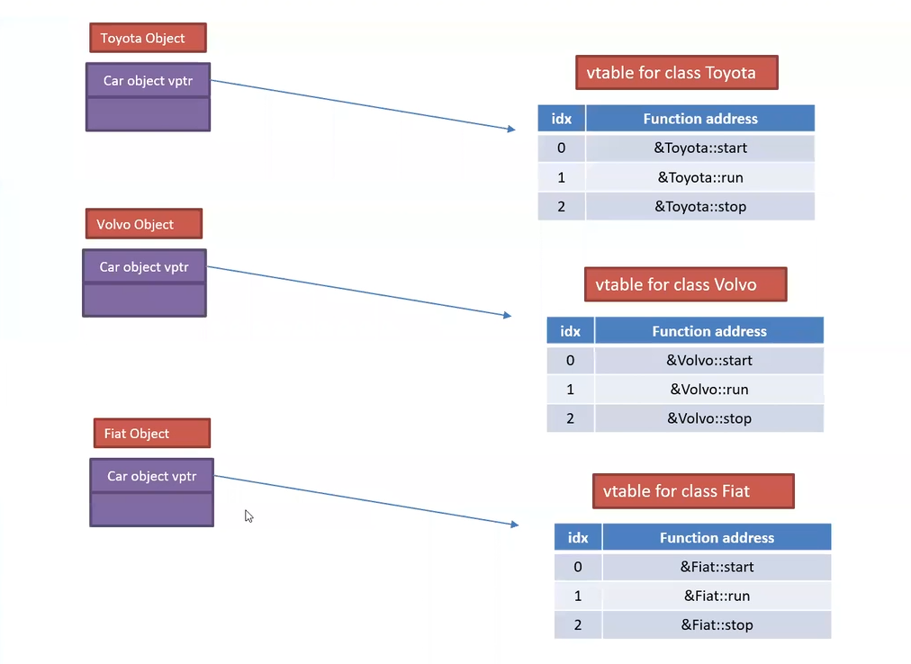

# Virtual Function Table Pointer (vtable)

**Derleyiciler Virtual Dispatch mekanizmasini nasil implemente ediyorlar?**

Derleyici, virtual dispatch mekanizmasini gerceklestirmek icin her [polymorphic taban sinif](290_runtime_polymorphism.md#polymorphic-class) nesnesinin icine sinifin kendi memberlarina ek olarak bir pointer *(vtable pointer, vptr)* daha eklemektedir. Bu nedenle sinif turunun storage ihtiyaci normalde olmasi gerekenden 1 pointer buyuklugu fazla olmaktadir. 

Bu pointer, derleyicinin urettigi bir kod ile sinifin sanal fonksiyonlarin nihai adreslerinin barindirildigi bir veri yapisinin *(vtable)* adresini gostermektedir. 

[Ornek](res/src/vtable01.cpp) Output *on Linux 64-bit*
```
sizeof(int) = 4
sizeof(int*) = 8
sizeof(NonpolymorphicClass) = 8
sizeof(Base) = 16
sizeof(Der) = 16
```

<center>
<br/>
<i>Sekil 1: vtable - sinif iliskisi</i>
</center>


<details>
<summary><b>Sekil 1'de gosterilen sinif tanimlari</b> (Click to expand)</summary>

```C++
class Car {
public:
    virtual void start() = 0;
    virtual void run() = 0;
    virtual void stop() = 0;
};

class Toyota : public Car{
public:
    void start() override;
    void run() override;
    void stop() override;
};

class Volvo : public Car{
public:
    void start() override;
    void run() override;
    void stop() override;
};

class Fiat : public Car{
public:
    void start() override;
    void run() override;
    void stop() override;
};
```
</details>
<!--  -->

* `virtual` fonksiyon sayisi arttikca, sinif nesnesinin boyutu artmaz.
* Uye fonksiyonlarin sinif nesnesinin bellek alani ile dogrudan bir iliskisi bulunmamaktadir.
* Turemis siniflarin icinde de taban sinif icinde bulunan pointer inherit edilir.
* Sinif nesnesi icinde bulunan vptr, runtime'da olusturulur ve ilk degerini alir.
* Derleyici sinif hiyerarsisindeki her sinif *(nesne degil)* icin virtual fonksiyonlarin adreslerini tutmak amaciyla bir dinamik veri yapisi *(vtable)* olusturmaktadir.
* Her nesne icinde vptr bulunur, ancak her sinif icin tek bir vtable bulunmaktadir.
* *vtable* icinde bulunan nihai fonksiyon adreslerinin degerleri statik olarak *(compile-time'da)* olusturulmaktadir.
* Ayni taban siniftan turetilmis siniflar icin tum vtable'lar icinde ayni sanal fonksiyon icin ayni indexde barindirilmaktadir.

> **NOT**  
> C++ standartlarinda derleyiciler icin implementasyon detaylari belirtilmez. Bunun yerine C++ soyut makinasi *(abstract machine)* kavrami uzerinden ilgili islem icin olmasi gereken durum *(state)* degisikleri tarif edilir.


## Sanal bir fonksiyona cagri yapilmasi ve maliyeti

Bir fonksiyonun virtual olup olmadigi, statik olarak anlasilabilmektedir. Sanal bir fonksiyon cagrisi icin, nesne icerisinde bulunan vptr'in gosterdigi vtable'a erisilerek, ilgili fonksiyon indexinde bulunan fonksiyon adresine cagri yapilmaktadir.

`Car*` turunden bir `p` degiskeni ile yapilan `start` fonksiyonu *(index'inin oldugu 2 varsayilirsa)* cagrisi icin sembolik olarak asagidaki islem yapilmaktadir:
```C++
p->vptr[2]();
```

**Dogrudan maliyet**
  * Normal fonksiyon cagrisina kiyasla her sanal fonksiyon cagrisinin ek maliyeti 2 kere dereferencing islemi yapilmasidir.
    `dereferencing + dereferencing`
    1. vtable'a erisilmesi
    2. vtable icindeki fonksiyon adresine erisilmesi 
  * Her polymorphic sinif nesnesi 1 pointer buyuklugu kadar daha fazla yer kaplayacak.
    *Polymorphic bir sinif turunden 10.000 elemanli bir dizi icin ek bellek maliyeti: `10000 * sizeof(int*) byte`*

**Dolayli maliyet**
  * Programin runtime'i basladigi zaman her polymorphic sinif icin ilgili vtable'larin olusturulmasinin yer ve zaman maliyeti.
  * Runtime polymorphism'den faydalanmak icin senaryolarin buyuk cogunlugunda **dinamik omurlu nesneler** olusturulmaktadir. Bu nesnelere bellek alani ayrilmasinin ve iade edilmesinin de ayrica maliyeti bulunmaktadir ve bu maliyet otomatik omurlu nesne olusturma maliyetine kiyasla **yuksek bir maliyettir**.

> **DIKKAT!**  
> ```C++
> Myclass x; 
> 
> new Myclass;
> ```
> Yukaridaki ifadeler arasinda ciddi bir maliyet farki bulunmaktadir.  
> * Heap alaninda yeteri kadar buyuk bir bellek alani aranmak zorundadir.
> * Heap alaninda olusturulan her bellek alani icin dinamik bellek yonetimi icin bir header bilgi alani da ayrilmak zorundadir. 

[Odev](hw/shape_impl/)