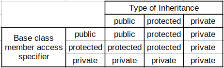

<p align="center"></p>

# private inheritance

Taban sinifin `public` ve `protected` uyeleri, turemis sinifin `private` bolumune eklenir.

Private inheritance ile taban sinifin interface'i turemis sinifin clientlarina acik olmamasi nedeniye `is-a` iliskisini dogrudan temsil etmemektedir. Ancak taban sinif nesnesi yine turemis sinif nesnesi icerisinde bulunmaktadir.
  
*Her `Der` bir `Base`dir denilemez, cunku `Base`in public interface'inde bulunan ogeler `Der`in public interface'inde bulunmamaktadir.*

```C++
class Base {
private:
    void priv();
protected:
    void prot();
public:
    void publ();
};

class Der : private Base {
    void func() {
        publ();  // gecerli
        prot();  // gecerli
    }
};
```
```C++
Der der;
der.publ();      // syntax error: access-control publ is private
```

* Turemis sinif nesnesin private alanina erisim bulunmayan yerlerde *`is-a` iliskisi saglanamamasi nedeniyle* turemis siniftan taban sinifa ortulu donusum bulunmamaktadir.
  *Conversion from 'Der' to 'Base' exists, but is inaccessible*
  ```C++
  Der der;
  Base* baseptr = &der; // sentaks hatasi
  Base& baseref = der;  // sentaks hatasi
  ```
  Turemis sinif nesnesin private alanina erisim bulunan yerlerde *`is-a` iliskisi saglanmasi nedeniyle* private taban sinif nesnesine ortulu donusum bulunmaktadir.
  ```C++
  class Base {};
  class Der : private Base {
    void foo() {
        Der der;
        Base* baseptr = &der;   // gecerli
        Base& baseref = der;    // gecerli
    }
    
    friend void g_f() {
        Der der;
        Base* baseptr = &der;   // gecerli
        Base& baseref = der;    // gecerli
    }
  };
  ```

## Private inheritance usacases

### Containment

C++ dilinde private inheritance, containment'a bir alternatif olarak kullanilabilir. Ancak birincil secim olarak containment kullanilmalidir.

Asagidaki durumlarda containment yerine private inheritance mecburi bir secenek haline gelebilir:
1. Member'in protected interface'indeki ogeleri kullanabilmek icin
2. Elemanin sanal fonksiyonlarini override edebilmek icin
3. Eleman olarak abstract bir sinif turunden nesne kullanamadigimiz icin

Ornegin; `Myclass` sinifinin, `Member` sinifinin kodlarini kullanmasini istiyorsunuz.

1. Containment ile:
   <details>
   <summary><b>Ornek</b> (Click to expand)</summary>
   
   ```C++
   class Member {
   protected:
      void pro();
   public:
       void foo();
       void bar();
       virtual void vfunc();
   };
   
   class Myclass {
   public:
       void bar() {
          m_a.bar();
          m_a.pro();  //syntax error: B cannot access A's protected members
       }
       
       void func() {
           m_a.foo();
       }
   private:
       Member m_a;
       Member m_a2;
   };
   ```
   </details>
   <!--  -->
   

2. Private inheritance ile:
   <details>
   <summary><b>Ornek</b> (Click to expand)</summary>
   
   ```C++
   class Member {
   protected:
       void pro();
   public:
       void foo();
       void bar();
       virtual void vfunc();
   };
   
   class Myclass : private Member {
   public:
       using Member::bar;
       
       virtual void vfunc() override;
       
       void func() {
           foo();
           pro();     // gecerli
       }
   };
   ```
   </details>
   <!--  -->
   
   
**Containment[1] vs Private Inheritance[2]**

* [1]'de hic bir yerde `is-a` iliskisi saglanamaz, [2]'de private bolume erisim bulunan yerlerde `is-a` iliskisi bulunur.
* [1] Memberin protected memberlarina erisemez, [2] ile erisilebilir.
* [1]'de Memberin bir fonksiyonunu `public`e cevirmek icin bir fonksiyon eklenmeli, [2]'de `using` bildirimi de kullanilabilir.
* [1]'de Memberin virtual fonksiyonunun `override` edilme sansi yok, [2]'de var.
* [2]'de ikinci bir Member sinifi inherit edilemez, [1]'de ikinci bir Member sinifi eklenebilir.
* Member sinif bir `abstract class` olsaydi, [1]'de Member turunden bir nesne eklenemez, [2]'de eklenebilir.

> **Composition vs Containment**  
> Composition daha genel bir kavramdir. Her composition bir containment olmasi gerekmiyor.
> Ornegin `Member` turunden bir pointer barindirma da composition'dir ancak bir containment degildir.
> <!-- ??? -->

<!-- Ders 21 2:05 civari -->

### Empty Base Optimization (EBO)

Data member'a sahip olmayan bir sinif, baska bir sinif icinde kullanilmak istendiginde;
<details>
<summary><b>Ornek</b> (Click to expand)</summary>

```C++
class EmptyClass {};

class A {
    EmptyClass m_x;
    int ival;
};
```
```C++
std::cout << "sizeof(EmptyClass) = " << sizeof(EmptyClass) << '\n';
std::cout << "sizeof(A) = " << sizeof(A) << '\n';
```
</details>
<!--  -->

Output 
```
sizeof(EmptyClass) = 1      // empty class'lar 1 byte yer kaplar.
sizeof(A) = 12              // alignment nedeniyle 5 yerine 8 byte yer kaplar.
```
Bu durumu iyilestirmek icin:
```C++
class EmptyClass {};

class A : private EmptyClass {
    int ival;
};
```
```C++
std::cout << "sizeof(EmptyClass) = " << sizeof(EmptyClass) << '\n';
std::cout << "sizeof(A) = " << sizeof(A) << '\n';
```
Output
```
sizeof(EmptyClass) = 1      // empty class'lar 1 byte yer kaplar.
sizeof(A) = 4               // 5 olmasi gerekirken EBO nedeniyle 4 byte yer kaplar
```

> [C++20]'de eleman olarak alsa dahi yine boyle bir optimizasyonun yapilabilmesini saglayan bir arac eklenmistir. Bu nedenle EBO icin private inheritance kullanimi onemli olcude azaltilmistir.
> <!-- tamamla -->

### Restricted Polymorphism

Normalde private inheritance ile upcasting yapilamiyor, ancak uye ve friend fonksiyonlarda upcasting yapilabilmesinden faydalanilir.

Polymorphism'i sadece belirli fonksiyonlarin kullanabilmesini kisitlamak isteniyor ise:
```C++
class Base {
    
};

class Der : private Base {
    friend void func(Base&);
};

void func(Base&);
void foo(Base&);
void bar(Base&);
```
`func` fonksiyonu icin `der` nesnesini base turune upcast uygulanabilmketedir. Ancak `foo` ve `bar` fonksiyonlari icin bu donusum yapilamamaktadir.
```C++
Der der;
func(der);  // gecerli
foo(der);   // sentaks hatasi
```

# protected inheritance

Taban sinifin `public` ve `protected` uyeleri, turemis sinifin `protected` bolumune eklenir. 

Protected inheritance ile private inheritance tamamen ayni amac ile kullanilmaktadir. Private inheritance ile ilgili gecerli hersey, protected inheritance icin de gecerlidir.

Ancak, multi-level inheritance kullanildiginda private inheritance ile fark olusturmaktadir:
```C++
class Base {
protected:
    void foo();
};

class PubDer : protected Base {
    void bar()
    {
        foo();
    }
};

class DerDer : public Der { 
    void baz() 
    {
        foo();
    }
};
```
