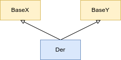
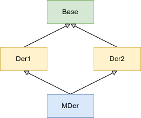
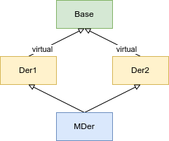
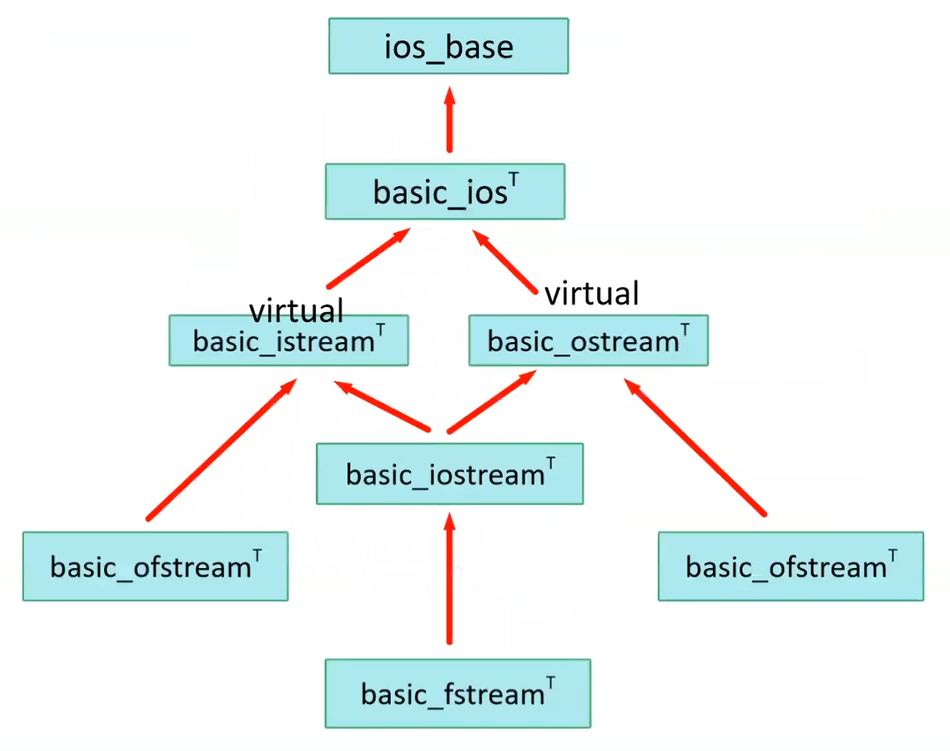

# Multiple Inheritance
*Coklu kalitim*

<!--
Bilgilendirme
    Runtime Type Information (RTTI) anlatilmadan once araya exception handling konusu anlatilacaktir.
-->


Multiple inheritance, bir sinifi dogrudan tek bir kalitim ile birden fazla taban sinif kullanilarak olusturmaktir.

<p align="center">
<br/>
<i>Sekil: Multiple Inheritance</i>
</p>


```C++
class BaseX{};
class BaseY{};
class Der : public BaseX, public BaseY {};
```

Daha once single inheritance ile anlatilan hersey her taban sinif icin de gecerli olacaktir.

* Her `Der` nesnesi, ayni zamanda bir `BaseX` veya bir `BaseY` olarak kullanilabilmektedir.
* `Der`'in public interface'ine, hem `BaseX`'in public interface'inden gelen ogeler, hem de `BaseY`'in public interface'inden gelen ogeler eklenmektedir.
* `Der` sinifi, `BaseX`'in de `BaseY`'nin de sanal fonksiyonlarini override edebilmektedir.

  <details>
  <summary><b>Ornek</b> (Click to expand)</summary>
  
  [Ornek](res/src/multiple_inheritance01.cpp)
  ```C++
  class A {
  public:
      virtual void foo();
  };
  
  class B {
  public:
      virtual void bar();
  };
  
  class C : public A, public B {
  public:
      void foo() override;
      void bar() override;
  };
  ```
  ```C++
  C c; 
  c.foo();
  c.bar();
  
  A* aptr = &c;
  B* bptr = &c;
  
  A& aref = c;
  B& bref = c;
  ```
  </details>
  <!--  -->


> Bazi siniflarin varlik nedeni, sinifa bazi ozellikler eklemektedir. Bu amacla olusturulan siniflara **[mixin class](https://en.wikipedia.org/wiki/Mixin)** denir.


## Name-lookup kurallari

* Multiple inheritance soz konusu oldugunda, nitelenmemis nesneler icin **tum taban siniflarda birlikte** isim arama yapilir. Taban siniflardan ayni isim gelirse **name collision** olusacak ve ambiguity'ye neden olacaktir.
  
  <details>
  <summary><b>Ornek</b> (Click to expand)</summary>
  
  ```C++
  class A {
  public:
      void foo(int);
  };
  
  class B {
  public:
      void foo(double);
  };
  
  class C : public A, public B {
    void func() 
    {
        foo(12);    // ambiguity: name lookup ambiguity
        A::foo(13); // gecerli
        B::foo(14); // gecerli
        
        ((A*)this)->foo(17);    // gecerli
        ((B*)this)->foo(1.8);   // gecerli
    }

  };
  ```
  ```C++
  C c;
  c.foo(11);        // ambiguity: name lookup ambiguity
  c.A::foo(15);     // gecerli
  c.B::foo(1.6);    // gecerli
  ```
  </details>
  <!--  -->
  

* `using` bildirimi ile **function overloadin** olusturma kurallari gecerlidir.
  <details>
  <summary><b>Ornek</b> (Click to expand)</summary>
  
  ```C++
  class A {
  public:
      void foo(int);
  };
  
  class B {
  public:
      void foo(double);
  };
  
  class C : public A, public B {
  public:
    using A::foo;
    using B::foo;
  };
  ```
  ```C++
  C c;
  c.foo(512);   // gecerli: overloading
  c.foo(3.14);  // gecerli: overloading
  ```
  </details>
  <!--  -->
  

* Taban siniflarin hayata gelme sirasi **bildirim sirasi**dir.
  <details>
  <summary><b>Ornek</b> (Click to expand)</summary>
  
  ```C++
  class A {
  public:
      A() { std::cout << "A()\n"; }
  };
  
  class B {
  public:
      B() { std::cout << "B()\n"; }
  };
  
  class C : public A, public B { };
  class D : public B, public A { };
  ```
  ```C++
  C c;
  D d;
  ```
  Output
  ```
  A()
  B()
  
  B()
  A()
  ```
  </details>
  <!--  -->
  
[Ornekler](res/src/multiple_inheritance01.cpp)

## Diamond Formation  

*Dreadful Diamond of Derivation (DDD)*

Ayni taban sinif nesnesinden turetilen birden fazla sinifin multiple inheritance ile taban sinif olarak kullanilarak yeni bir sinif turetilmesi durumunda olusan durumdur.

<p align="center">
<br/>
<i>Sekil: UML Class Diagram of a Diamond formation </i>
</p>

`Der1` ve `Der2` sinif turlerinden nesneler icerisinde ayri ayri `Base` nesneleri bulunmaktadir. Bu siniflardan turetilen `MDer` icinde de `Der1::Base` ve `Der2::Base` nesneleri bulunmaktadir.

```C++
class Base {
public:
    void base_func();
};
  
class Der1 : public Base {};
class Der2 : public Base {};
  
class MDer : public Der1, public Der2 {};
```

[Ornek](res/src/multiple_inheritance02.cpp)
```C++
MDer mder;
// mder.base_func();      // sentaks hatasi: hangi taban turden gelen gelen base_func?
mder.Der1::base_func();   // gecerli
mder.Der2::base_func();   // gecerli
```

**Static/compile-time iliskin ambiguity problemleri**
* `MDer` icinde, `Base` turunden gelen bir isim kullandiginda, hangi taban siniftan gelecegi nitelenmediyse ambiguity olusur.
* `MDer` turunden bir nesneyi `Base` turunden bir referansa baglanmasi istendiginde hangi `Base` nesnesi oldugu belirtilmez ise ambiguity olusur.
  ```C++
  // Base& baseref1 = mder;                   // sentaks hatasi
  Base& baseref2 = static_cast<Der1&>(mder);  // gecerli: Baseref = Der1::Base
  Base& baseref3 = static_cast<Der2&>(mder);  // gecerli: Baseref = Der2::Base
  ```

[Ornek: Devices](res/src/multiple_inheritance03.cpp)

## Virtual Inheritance
Coklu kalitimda taban siniflarin ortak bir taban sinifi var ise; coklu kalitim ile elde edilecek nesnenin **ortak taban siniflarindan bir tane nesne** olusturmasi icin **virtual inheritance** kullanilmaktadir.
<p align="center">
<br/>
<i>Sekil: UML Class Diagram of a virtual multiple inheritance</i>
</p>

```C++
class Base {
public:
    void base_func();
};
  
class Der1 : virtual public Base {};
class Der2 : virtual public Base {};
  
class MDer : public Der1, public Der2 {};
```
Asagidaki cagrilarda `MDer` sinifinin sadece 1 tane `Base` nesnesi bulundugu icin ambiguity olmayacaktir:
```C++
MDer mder;
mder.base_func();       // gecerli
Base& baseref = mder;   // gecerli
```

<p align="center">
<br/>
<i>Sekil: std::ios hiyerarsisi</i>
</p>

`std::cout` `basic_ostream` turunden, `std::cin` `basic_istream` turunden, her ikisi de `basic_ios` sinifindan virtual inheritance ile elde edilmistir. `basic_iosstream` ise coklu kalitim ile `basic_ostream` ve `basic_istream` siniflarindan elde edilmistir. Ancak; `basic_ios` virtual olarak inherit edilemesi sebebiyle `basic_iostream`in bir adet `basic_ios` sinifi bulunmaktadir.

* Ortak taban sinifa sahip yapilan tum kalitimlarda `virtual` kullanilmalidir.

* Coklu kalitim ile olusturulmus bir nesne turu, **ortak taban sinif** turunden nesnenin constructor'unu **ctor initializer list**'de cagirmak zorundadir.
  *Asagidaki ornekte DerAB ve DerDerAB siniflari Base sinifini dogrudan kalitim ile elde etmemis olsa da, Base ctor'u cagirmak zorundadir.*
  
  <details>
  <summary><b>Ornek</b> (Click to expand)</summary>
  
  [Ornek](res/src/virtual_inheritance01.cpp)
  ```C++
  class Base {
  public:
    Base(const char* p) { 
      std::cout << "Base(const char*) p = " << p << '\n';
    }
  };
  
  class DerA : virtual public Base { 
  public:
    DerA() : Base("DerA") 
    {
    }
  };
  
  class DerB : virtual public Base { 
  public:
    DerB() : Base("DerB") 
    { 
    }
  };
  
  class DerAB : public DerA, public DerB { 
  public:
    DerAB() : Base("DerAB")
    { 
    }
  };
  
  class DerDerAB : public DerAB {
  public:
    DerDerAB() : Base("DerDerAB")
    {
    }
  };
  ```
  ```C++
  DerA dera;
  DerAB derab;
  DerDerAB derderab;
  ``` 
  Output
  ```
  Base(const char*) p = DerA
  Base(const char*) p = DerAB
  Base(const char*) p = DerDerAB
  ```
  </details>
  <!--  -->
  
  

[Ornek: Devices](res/src/virtual_inheritance02.cpp)