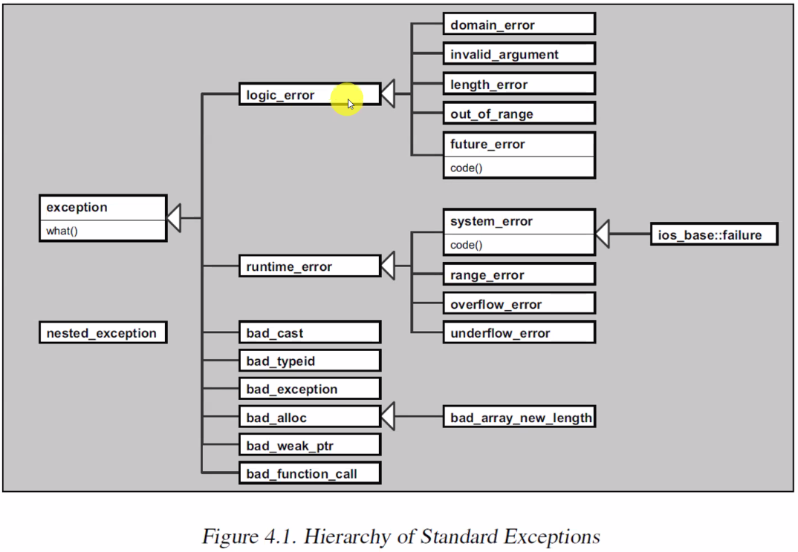

# Exception Handling in C++

[cppreference.com: exceptions]([https://](https://en.cppreference.com/w/cpp/language/exceptions))


Exception handling, bir programın yürütülmesindeki bir noktadan, yürütme tarafından daha önce geçirilen bir noktayla ilişkili bir isleyiciye kontrol ve bilgi aktarmanın bir yolunu sağlar. Başka bir deyişle; exception handling, call stack kontrolunu transfer eder.

```C++
try {
    throw e;                  // hata nesnesi firlatilmasi (throwing)
}
catch(type_of_error e) {  
                              // hata nesnesi isleyici (handler)
}
```
`throw` anahtar kelimesi bir **throw statement** olusturmak icin kullanilir. `throw e` ifadesi bir *throw statement*dir ve bir hatayi ifade eden bir hata nesnesi *(exception object)* gondermek icin kullanilir.

`try` blogu; icinde calisan kodlardan herhangi biri bir hata nesnesi firlattiginda o hatayi yakalayip, **hataya mudahale etmeye aday** oldugunu belirtmektedir.

`catch` blogu; hatayi isleyecek kodlari *(exception handler)* barindirmaktadir.

> **DIKKAT!**  
> Yakalanmamis hata birakmamak hedeflenmelidir. Ancak, mudahale edilmemesi gereken bir exception da **yakalanmamalidir**.  
> *Yakaladiginda ne yapilacagi bilinmeyen bir exception, en basta yakalanmamalidir!*

<!--  -->

## Genel Kurallar
* Her `try` blogundan sonra en az bir `catch` blogu bulunmak zorundadir.
* `try` ve `catch` bloklari, birer scopetur ve icerisinde bildirilen isimler scope kurallarina tabidir.
* `throw e` ile gonderilen hata nesnesi, hata isleyiciye iletilen nesne **degildir**.    
  Otomatik omurlu hata nesnelerinin, hatanin yakalandigi yerde hayatta olmasini saglamak amaciyla; derleyici ifadeden faylanarak kendisi **yeni bir nesne olusturur** ve onu throw eder.
* `throw` ifadesi bir hata nesnesi olmadan kullanilar ise, bu bir **rethrow statement**dir. Rethrow yapilirken, yeni bir hata nesnesi olusturulmamaktadir.
* `throw` ile gonderilen hata nesnesi, hatanin ne oldugu ile ilgili bilgi vermelidir ki hatayi isleyecek olan kodlar *`catch` bloklari*, hatanin neden kaynaklandigi ile ilgili bilgiyi kullanarak dogru olarak isleyebilsin. Hata hakkinda bilgi **hatanin turu** ve **hatanin degeri** ile belirtilebilmektedir.
* `catch` blogunda hata nesnesinin degeri kullanilmayacak ise, isim verilmesi zorunlu degildir.
* `catch` blogunun parametrelerinde **ortulu donusum yapilmamaktadir**. Gonderilen hatanin turu ile yakalanan hatanin turlerinin birebir ayni olmasi gerekmektedir.
  **Istisna**: `catch` blogu parametrelerinde `is-a` iliskisi ile [upcasting](280_inheritance.md#upcasting) uygulanabilmektedir. [Ornek: std::bad_alloc](res/src/exceptions02.cpp)  
* `catch` blogu parametreleri `const T&` turunden olmasi, virtual dispatch mekanizmasini devreye sokar. 
  > **DIKKAT!**
  > `catch` blogu parametrelerinde `T&` kullanilmamasi durumunda **copy ctor** cagrisina neden olur ve bu da copy ctor cagrisi sirasinda baska bir exception'in firlatilma riskini olusturmaktadir.
* `catch(...)` ifadesi tum turlerden hatalari yakalamak icin kullanilir.
* `catch` bloklari yazilma sirasiyla sinanir ve bulunan ilk uygun handler calistirilir.
  > **Not**
  > `catch` bloklari ozelden genele siralanmasi iyi bir pratiktir.
* Hata nesneleri, kalitimdan faydalanarak belirli bir hiyerarsik yapiya sahip olmasi zorunlu olmasa da iyi bir pratiktir.

<!--  -->

[Ornek](res/src/exceptions01.cpp)  


<center>
<br/>
<i>Sekil: Standard exception hiyerarsisi</i>
</center>

`std::exception` sinifi interface'i:
```C++
class exception {
public:
    exception() noexcept;
    virtual ~exception() noexcept;
    
    exception(const exception&) = default;
    exception& operator=(const exception&) = default;
    exception(exception&&) = default;
    exception& operator=(exception&&) = default;
    
    virtual const char* what() const noexcept;
};
```

### **uncaught exception**
*(yakalanmayan hata nesnesi)*

Bir exception gonderilmis ve herhangi bir hata isleyici tarafindan yakalanamamis ise *uncaught exception* durumu olusmaktadir. Bir uncaught exception durumu olusmasi durumunda derleyicinin olusturdugu kod, `std::terminate` fonksiyonunu cagirmaktadir.

`std::terminate` fonksiyonunun varsayilan davranisi `std::abort` fonksiyonunun cagrilmasidir. `std::abort` cagrisi yapildiginda program, *abnormal termination* durumu ile sonlandirilmaktadir.

**`std::abort` ve `std::set_terminate` kullanimi**

`<exception>` baslik dosyasinda tanimlidirlar.  

* `abort`: Ekrana hata ile ilgili bir bilgi mesaji olusturarak programi sonlandirir.
* `terminate`: varsayilan olarak `abort()` cagrisi yapilir.
  <details>
  <summary><b>Detaylar</b> (Click to expand)</summary>
  
  ```C++
  using terminate_handler = void(*)(void);
  terminate_handler g_term_handler = &abort;
  
  void terminate() {
      g_term_handler();
  }
  ```
  </details>
  <!--  -->
  
* `set_terminate`: terminate varsayilan davranisini degistirmek icin kullanilir.
  <details>
  <summary><b>Detaylar</b> (Click to expand)</summary>
  
  ```C++
  terminate_handler set_terminate(terminate_handler new_handler){
      auto ret = g_term_handler;
      g_term_handler = new_handler;
      return ret;
  }
  ```
  </details>
  <!--  -->
  
[Ornek: terminate](res/src/exceptions_terminate01.cpp)  

> **DIKKAT!**
> Bir **global sinif nesnesi** yada bir **static veri elemani** olusturulurken ctor icinde firlatilan exceptionlarin **yakalamasi mumkun degildir**. 

Uygulama calisirken, calisma zamaninda bir exception gonderildiginde, kalici bir zarar olusmamasidir.

Bir exception yakalandiginda iki farkli yaklasim izlenebilmektedir:
1. **Terminative**: Programin isini yapmasi imkani bulunmayan durumlarda programi sonlandirmaya yonelik.
   * Exception'in yakalanip programin sonlandirilmasi 
2. **Resumptive**: Exception'in yakalanip handle edilmesi ile kalici bir zarar olusmadan *hicbir kayip veya kaynak sizintisi olmadan* programin calismasinin devam ettirilmesine yonelik.
    * Exception'in yakalanip tam mudahalede bulunarak programin devam etmesi
    * Exception'in yakalanip kismi mudahale yapilip, ayni exception rethrow edilmesi
    * Exception'in yakalanip baska bir turden exception gonderimi


## Stack unwinding
*Yiginin geri sarimi*

Bir exception throw edilen nokta ile yakandigi nokta arasinda farkli stack framelerde olusan otomatik omurlu nesnelerin destructorlarinin cagrilmasini saglayan bir mekanizmadir. 

> **DIKKAT!**
> Eger exception yakalanmaz ise, stack unwinding devreye girmez.

> Once the exception object is constructed, the control flow works backwards (up the call stack) until it reaches the start of a try block, at which point the parameters of all associated catch blocks are compared, in order of appearance, with the type of the exception object to find a match. If no match is found, the control flow continues to unwind the stack until the next try block, and so on. If a match is found, the control flow jumps to the matching catch block.
> 
> As the control flow moves up the call stack, destructors are invoked for all objects with automatic storage duration that are constructed, but not yet destroyed, since the corresponding try-block was entered, in reverse order of completion of their constructors. 
> 
> [cppref/throw](https://en.cppreference.com/w/cpp/language/throw)

* RAII Idiom ile olusturulan nesnelerin kaynaklari stack unwinding ile iade edilebilir.  
  <details>
  <summary><b>Ornek</b> (Click to expand)</summary>
  
  [Ornek](res/src/stack_unwinding01.cpp)
  ```C++
  class File { 
      FILE* fhandle;
  public:
      File() : fhandle { fopen("sample.txt", "w") } 
      {
      }
      
      ~File() {
         if(fhandle){
            fclose(fhandle);
            fhandle = nullptr;
         }
      }
  };
  ```
  </details>
  <!--  -->
  
* smart pointer'lar ile yonetilen dinamik bellek alani stack unwinding ile iade edilebilir.  
  <details>
  <summary><b>Ornek</b> (Click to expand)</summary>
  
  [Ornek](res/src/stack_unwinding02.cpp)
  ```C++
  struct List;
  typedef sturct List* ListHandle;
  
  ListHandle create_list(/* ... */);
  void destroy_list(ListHandle);
  
  ListHandle handle = create_list();
  //
  destroy_list(handle);
  
  void func() {
    //unique ptr icin deleter fonksiyonu:
    auto fdel = [](ListHandle h){
        destroy_list(h);
    };
      
    std::unique_ptr<List, decltype(fdel)>(create_list(), fdel);
  }
  ```
  </details>
  <!--  -->
  

<!-- Ders 25 -->


## Rethrowing an exception

Yakalanmis bir exception nesnesini tekrar olusturulmadan yine throw edilmesini saglamaktadir.

```C++
try
{
    ...
}
catch(const std::exception& ex)
{
    std::cout << "exception caught: "  << ex.what() << '\n';
    throw;      // (1) rethrow
}    
```

* Rethrow `throw` statement bir catch blogu icerisinde olmak zorunda degildir.
  
  > **DIKKAT!**
  > Bir exception caught edilmeden `throw` statement calistirilirsa `abort` cagrisi yapilarak program sonlandirilir.


**`throw` ile `throw ex` ifadelerinin farklari**

* `throw` ifadesi yeni bir exception uretmeden ayni hata nesnesini tekrardan throw etmektedir, `throw ex` orjinal exception yok ederek derleyiciye yeni bir exception nesnesi urettirir.
  [Ornek](res/src/exceptions04.cpp)
* `throw ex` ifadesinde yakalanan exception `std::exception` turunden olmasi nedeniyle derleyici tarafindan kopyalanirken *object-slicing olusmasi nedeniyle* **orjinal tur bilgisi kaybolur**.
  [Ornek](res/src/exceptions05.cpp)


## Exception dispatcher idiom
Ortak kodlari bir araya toplanmasi amaciyla kullanilmaktadir. Eger gonderilen hata, handle edilen exception turlerinden biri degil ise hata daha ust katmanlara iletilmektedir. 

```C++
class AError{};
class BError{};
class CError{};

void handle_exception()
{
    try {
        throw;
    }
    catch(AError& e) {
    
    }
    catch(BError& e) {
    
    }
    catch(CError& e) {
    
    }
}
```
```C++
try {
    // hata
}
catch(...) {
    handle_exception();
}
```

## Throwing an exception from a constructor

Bir ctor, basarisiz olacagini biliyor ise, exception throw etmelidir. ctor'lar, exception gonderme ihtimali en yuksek olan fonksiyonlardan biridir. 

> **Hatirlatma**  
> Bir nesnenin hayata geldiginin kabul edilebilmesi icin ctor ana blok kodu tamamen calisarak tamamlanmalidir.


**zombie object**
ctor'un exception gondermemesinden dolayi *ornegin kisitlanmis bir ortamda exception kullanilamiyor ise* teknik olarak hayata gelmis ancak kullanilabilir olmayan nesnelere **zombie object** denilmektedir.

* ctor'unda exception olusan bir nesne icin **dtor cagrilmaz**. 
  *dtor'un cagrilmasi icin nesnenin hayata gelmis olmasi gerekmektedir.*
  [Ornek](res/src/exceptions03.cpp)

> **DIKKAT!**
> ctor'dan exception throw ediliyor ise, throw edildigi noktaya kadar calisan kodlarda elde edilen kaynaklar iade edilmez ise **resource leak**'e neden olur.


* Nesnenin data memberlarindan birinin ctor'unda exception throw edildiginde, hem data memberlarin **hemde nesnenin kendi dtoru cagrilmaz.**
  [Ornek](res/src/exceptions06.cpp)
  [Ornek](res/src/exceptions08.cpp)
  
* Nesnenin data memberlarindan birinin ctor'unda exception throw edildiginde, hem data memberlarin **hemde nesnenin kendi dtoru cagrilmaz.**
  [Ornek](res/src/exceptions07.cpp)

* `new` ifadesi ile olusturulan bir nesnenin ctor'unda exception firlatilmasi durumunda `delete` cagrisi yapilir.
  [Ornek](res/src/exceptions09.cpp)


## Destructors ve exception handling

Programin akisi bir exception handling surecine basladiginda stack unwinding ile olusturulan nesnelerin dtor'lari cagrilmaktaydi. Bu nedenle dtor icerisinde exception throw edilmesi durumunda zaten bir exception handling yapilirken baska bir exception daha gonderilme riski olusur. Eger stack unwinding sirasinda bir exception throw edilirse `terminate` cagrilir.

Bu nedenden dolayi bir sinifin `dtor`u hicbir sekilde **exception emit etmemelidir**! Bu exception throw edilmemesi anlamina gelmemektedir. *Ya hic exception gondermeyecek, yada exception disari sizmayacak.*


## [deprecated] Dynamic exception specification
Bir fonksiyonun bildiriminde veya taniminda hangi turlerden exception throw ihtimali oldugunun belirtilmesidir. 
*Modern C++'da deprecate edilmistir.*

Asagidaki fonksiyon bildiriminde `std::out_of_range` yada `std::bad_alloc` throw edebilecegi belirtilmesidir.
```C++
void func(int x) throw(std::out_of_range, std::bad_alloc);
```

Asagidaki fonksiyon bildiriminde bir exception throw etme ihtimali olmadiginin belirtilmesidir.
```C++
void foo(int y) throw();
```

Throw specifierda belirtilmeyen bir exception throw edilirse, derleyici `unexpected_exception` fonksiyonu cagrisi yapar.


## `noexcept` keyword

`noexcept` dilin kurallarina gore hem bir **specifier** hem de bir **compile-time operatoru** olarak kullanilabilmektedir.

### `noexcept` specifier
Bir fonksiyon bildiriminde `noexcept` kullanirsa, fonksiyonun herhangi bir exception throw etmeyecegi *(no throw guarantee)* anlamina gelmektedir. Runtime'a ait bir mekanizmadir.

```C++
void foo();                 // exception gonderebilir
void bar() noexcept;        // exception gondermeme garantisi var
```

* `noexcept` bildirimin bir parcasi olmasina ragmen noexcept ile overloading yapilamaz.
* `noexcept` olarak bildirilen bir fonksiyon exception emit ederse, `terminate` cagrilir.
* `noexcept` ile belirtilen bir fonksiyon pointer'ina noexcept olarak bildirilmemis bir fonksiyon adresi verilmesi syntax hatasidir.
  ```C++
  int foo(int);
  int(*)(int) noexcept = foo;   // syntax error
  ```
* Bir sinifin SMF'leri derleyici tarafindan yazilmis ise, `noexcept` olmasinda bir problem yok ise noexcept kabul ediliyor.

  <details>
  <summary><b>Ornek</b> (Click to expand)</summary>
  
  ```C++
  class Myclass {};
  
  constexpr auto b = noexcept(Myclass{});               // true
  constexpr auto b = noexcept(Myclass{}.~Myclass());    // true
  ```
  ```C++
  class Member {
  public:
    Member() {}
  };
  
  class Myclass {
  public:
    Myclass() = default;
  private:
    Member x;
  };
  
  constexpr auto b = noexcept(Myclass{});  // false: Nec sinifi default ctor'u noexcept degil
  ```
  ```C++
  class Member {
  public:
    Member() {}
  };
  
  class Myclass {
  public:
    Myclass() noexcept = default;
  private:
    Member x;
  };
  
  constexpr auto b = noexcept(Myclass{});  // true: derleyiciye default ettiriliyor 
                                           // ancak noexcept bildirimde veriliyor
  ```
  
  </details>
  <!--  -->
  
* `dtor`lar `noexcept` olarak bildirilmese de `noexcept` olmak zorundadir.
* Bir taban sinifin sanal fonksiyonu `noexcept` garantisi veriyorsa, bu fonksiyonun overridelari da `noexcept` garantisi vermek **zorundadir**.
  > **Not**
  > Bir siniftan turetilen siniflar icin: *Promise no less, require no more.*

### `noexcept()` operatoru
`noexcept(const_expr)` specifier'i, eger operandi olan const_expr `true` ise exceptiong gonderilmeyecek, `false` ise gonderilebilir anlamina gelmektedir.
```C++
void func() noexcept(true);   // void func() noexcept
void func() noexcept(false);  // void func()
```

* `noexcept()` operatorunun operandi **unevaluated context**dir.
  ```C++
  int foo() {
    std::cout << "foo cagrildi\n";
    return 1;
  }
  
  auto b = noexcept(foo());
  ```

* `noexcept()` operatoru bir blok icinde de kullanilabilmektedir ve `noexcept()` operatorunun geri donus degeri turu `constexpr bool`'dur. `noexcept()` bir blok icinder kullanilirken operandinin `constexpr` olma zorunlulugu yoktur. 
  <details>
  <summary><b>Ornek</b> (Click to expand)</summary>
  
  ```C++
  void foo();
  void bar() noexcept;
  ```
  ```C++
  int x = 10;
  int y = 20;
  
  constexpr bool b1 = noexcept(x + y); // x + y ifadesinin exception gondermeme garantisi varsa b degeri true
  constexpr bool b2 = noexcept(foo()); // false: foo noexcept garantisi yok
  constexpr bool b3 = noexcept(bar()); // true: bar noexcept garantisi var
  }
  ```
  </details>
  <!--  -->
  
  *`bar` fonksiyonu noexcept garantisi veriyorsa bende garanti veriyorum:*
  ```C++
  void func() noexcept(noexcept(bar()));
  ```


<!-- Ders 26 -->

## function-try block

Bir fonksiyonun ana blogunu try blogu ile birlestirerek exception throw edilmesi durumunda, hatanin fonksiyon icerisinde yakalanmasini bir aractir. Cogunlukla ctor'lar ile birlikte kullanilmaktadir.

```C++
void func(int x) 
try {
    // function code...
}
catch(int){
    // handler
}
catch(double){
    // handler
}
```

[Ornek](res/src/func_try_block01.cpp)

* Fonksiyon parametreleri `catch` bloklarinda kullanilabilir.
* `return` statement catch blogunda da verilebilir.
* Parametre degerlerinde olusabilecek exceptionlari function-try-block **yakalayamaz**.
  <details>
  <summary><b>Ornek</b> (Click to expand)</summary>
  
  ```C++
  class Nec {
  public:
    Nec() = default;
    Nec(const Nec&) {
        throw std::runtime_error{"nec error\n"};
    }
  };
  
  void func(Nec x)  // copy ctor'dan gelen exception yakalanamadi!
  try { 
    std::cout << "func()\n";
  }
  catch(std::exception& ex) {
    std::cout << "exception caught: " << ex.what() << '\n';
  }
  ```
  ```C++
  Nec mnec;
  func(mnec);
  ```
  </details>
  <!--  -->
  

**Ctor'da kullanilan function-try-block** 
* Memberlarin ctor'undan gonderilen exceptionlari yakalayabilir.
* Yakalanan exception rethrow edilmez ise, derleyici rethrow eden ifadeyi kendisi eklemektedir.

[Ornek](res/src/func_try_block02.cpp)

-----------------------------

**Hangi fonksiyonlar `noexcept` garantisi vermelidir?**

| function                        |                                                                             |
| :------------------------------ | :-------------------------------------------------------------------------- |
| dtor                            | noexcept                                                                    |
| move ctor                       | aksi yonde bir engel yok ise noexcept yapilmali<br/>(nothrow garantisi vermeli) |
| swap fonksiyonlari              | aksi yonde bir engel yok ise noexcept yapilmali<br/>(nothrow garantisi vermeli) |
| memory deallocate fonksiyonlari | noexcept                                                                    |


  
## exception safety

1. **Nothrow (or nofail) exception guarantee**
   Bir fonksiyon cagirisinda hic exception gonderme ihtimalinin olmamasi garantisi
   
2. **Strong exception guarantee**
   Ya isi gerceklestirecegim yada ise baslamadan onceki duruma sanki hic cagrilmamis gibi geri donecegim. *(commit or rollback)*
   
3. **Basic exception guarantee**
   Bir fonksiyon icerisinde **resource leak olmayacak**, exception gonderildikten sonra nesneler **valid state'ini koruyacak** ancak ayni state'de olmak zorunda degil
   
4. **No exception guarantee**
   Bir fonksiyon cagrildiginda bir exception gonderilirse, bu exception yakalanmasina karsin fonksiyon icinde edinilmis bir **kaynak geri verilmiyor** ise 

> **DIKKAT!**
> Minimal olarak **basic exception guarantee** saglanmak zorundadir!

> [cppreference.com - exception safety](https://en.cppreference.com/w/cpp/language/exceptions)
> 
> 1. *Nothrow (or nofail) exception guarantee*  
>     The function never throws exceptions. Nothrow (errors are reported by other means or concealed) is expected of destructors and other functions that may be called during stack unwinding. 
> 
>     The destructors are noexcept by default. (since C++11) 
>     Nofail (the function always succeeds) is expected of swaps, move constructors, and other functions used by those that provide strong exception guarantee.
>    
> 2. *Strong exception guarantee*  
>     If the function throws an exception, the state of the program is rolled back to the state just before the function call.
>    
> 3. *Basic exception guarantee*  
>     If the function throws an exception, the program is in a valid state. No resources are leaked, and all objects' invariants are intact.
>    
> 4. *No exception guarantee*  
>     If the function throws an exception, the program may not be in a valid state: resource leaks, memory corruption, or other invariant-destroying errors may have occurred.


## Kaynak ve Referanslar
1. [When and How to use exceptions, Herb Sutter]([https://](https://www.drdobbs.com/when-and-how-to-use-exceptions/184401836))