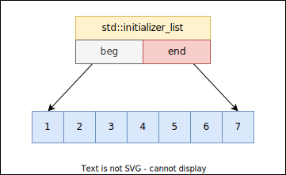

# Utility library
[cppref](https://en.cppreference.com/w/cpp/utility)  

## `std::allocator`


--------------------------------------------------------------------------------

## `std::initializer_list`

```C++
template <typename T>
class initializer_list;
```
<p align="center">
    <br/>
    <i>Sekil: std::initializer_list</i>
</p>

* `<initializer_list>` baslik dosyasinda tanimlidir.
* Ogeler icin derleyici `const` bir dizi olusturur, `initializer_list` bu diziye bir range olusturur. Bu ogelerin degistirilmesi **UB**dir.
* Elemanlar ayni turden olmak zorundadir.
* Elemanlarin constexpr olmasi zorunlu degildir.
  
[Ornek](res/src/initializer_list01.cpp)

## auto ile initializer_with kullanimi kurallari
C++11'den sonra initializer_list icin `auto` type deduction ile kurallar degisti.

* `initializer_list`e auto type deduction icin `=` kullanilmalidir.[C++17]
  ```C++
  auto x = {1, 4, 9, 2, 5};     // x = std::initializer_list<int>
  auto y { 10 };                // y = int
  auto y { 10, 20 };            // sentaks hatasi
  ```

* `auto` type deduction ile `template` type deduction mekanizmasinin kurallari **initializer_list istisna olmak uzere** tamamen aynidir.
  Bir fonksiyon sablonuna tur cikarimi yapilirken, initializer_list'e cikarim dogrudan yapilamaz.
  ```C++
  template<typename T>
  void func(T)
  {
  }
  
  auto x = {1, 2, 3, 4, 5}; // x = initialzier_list
  func({1, 2, 3, 4, 5});    // syntax error
  ```
* Sinifin initializer_list ctor'u soz konusu oldugu zaman `=` kullanimi zorunlu degildir. Oncelikli olarak `initializer_list` overloadu secilir.
  ```C++
  class Nec{ 
  public:
      Nec(int) {
          std::cout << "Nec(int)\n";
      }
      
      Nec(int, int) {
          std::cout << "Nec(int, int)\n";
      }
      
      Nec(std::initializer_list<int>) {
          std::cout << "Nec(std::initializer_list<int>)\n";
      }
  };
  
  Nec x1(12);         // Nec(int)
  Nec x2(12, 56);     // Nec(int, int)
  Nec x3{ 12 };       // Nec(std::initializer_list<int>)
  Nec x4{ 12, 56 };   // Nec(std::initializer_list<int>)
  ```

--------------------------------------------------------------------------------
  
## `std::pair`

`<utility>`'de tanimlidir.

Mantiksal olarak birbiri ile iliskili iki turun bir arada tutulmasi icin kullanilir.

<details>
<summary><b>Possible implementation</b> (Click to expand)</summary>

```C++
template<typename T, typename U>
struct pair{
  T first;
  U second;
};
```
</details>
<!--  -->

**Ornek**
```C++
std::pair<int, double> p{1, 0.5};
std::cout << "p.first = " << p.first << '\n';
std::cout << "p.second = " << p.second << '\n';
```

<details>
<summary><b>C dilinde</b> (Click to expand)</summary>

Template araci olmamasi nedeniyle fonksiyonel makro kullanilarak benzer bir yapi kurulabilir.
```C
#define cr_pr_type(t, u) struct Pair_##t##_##u { \
    t first;  \
    u second; \
}
```
```C
cr_pr_type(int, double) x;  // Pair_int_double x;
cr_pr_type(int, int) y;     // Pair_int_int y;
```
</details>
<!--  -->

* default initialize edilmesi halinde **value initialize** edilmektedir. Eger turlerden biri sinif turu ise, **default ctor** cagrilmaktadir.
* [C++17] CTAD ile initialize edilebilir
  ```C++
  pair x = {34, 3.14};
  ```
* Farkli turlerden pair nesneleri, eger `first` ve `second` memberlari karsilikli olarak atanabiliyor ise birbirlerine atanabilmektedir.
  ```C++
  pair<int, int> x {1, 2};
  pair<double, double> y {1.1, 2.2};
  pair<string, string> z { "" , "" }
  
  x = y;    // legal
  x = z;    // illegal
  ```

* `pair` sinif sablonunun `operator<<` ve `operator>>` overloadlari bulunmamaktadir.
 
**make_pair**
Basitlestirilmis olarak:
```C++
template <typename T, typename U>
std::pair<T, U> make_pair(const T& t, const U& u) {
  return std::pair<T, U>{t, u};
}
```
```C++
auto x = make_pair(12, Date{1,1,1923});
```

--------------------------------------------------------------------------------


## `std::tuple`
A fixed-size collection of heterogeneous values. It is a generalization of `std::pair`.

```C++
template<typename... Types >
class tuple;
```
* `<tuple>` baslik dosyasinda bulunur.
* Template argumanlarinin **constexpr** olmasi zorunludur.
* Template argumanlari **reference** turleri olabilmektedir.
* Dinamik bir dongusel yapi ile tuple elemanlarina erismek mumkun degildir.  
  *Static olarak template teknikleri uygularanarak erisilebilir.*  


### Member functions
`(constructor)` `operator=()` `swap()`

* Default initialize edilen `tuple` turunden nesnenin elemanlari *value initialize* edilir.

[Ornek: ctors](res/src/tuple01.cpp)  

### Non-member functions
`make_tuple()` `tie()` `forward_as_tuple()` `tuple_cat()` `std::get()` `operator==()` `operator<=>()` 

* `std::get` index bilgisi ile yada tur bilgisi ile tuple elemanina erisim olanagi saglar.  
  > :warning: Ayni turden birden fazla olmasi durumunda tur ile erisim sentaks hatasidir.

* Karsilastirma operator fonksiyonlari tuple nesnelerini index sirasi ile *equivalance bozulana kadar* karsilastirir.  
  <details>
  <summary><b>Poor man's comparison</b> (Click to expand)</summary>

  ```C++
  bool opearator<(const Date& a, const Date& b)
  {
    return a.y < b.y || a.m < b.m || a.d < b.d;
  }
  ```
  yerine
  ```C++
  bool opearator<(const Date& d1, const Date& d2)
  {
    return std::tuple(d1.y, d1.m, d1.d) < std::tuple(d2.y, d2.m, d2.d);
  }
  ```
  </details>
  <!--  -->

  <details>
  <summary><b>Swapping with  tie</b> (Click to expand)</summary>
  
  ```C++
  int temp = x;
  x = y;
  y = z;
  z = temp;
  ```
  yerine
  ```C++
  tie(x, y, z) = tie(y, z, x);
  ```
  </details>
  <!--  -->
  

[Ornek: get interface](res/src/tuple02.cpp)  
[Ornek: comparison](res/src/tuple03.cpp)    
[Ornek: tie ve structured binding](res/src/tuple04.cpp)  
[Ornek: swap with tie](res/src/tuple06.cpp)  

### Helper classes
`tuple_size` `tuple_element` `uses_allocator` `basic_common_reference` `common_type` `ignore` 

[Ornek](res/src/tuple05.cpp)  

--------------------------------------------------------------------------------

## `std::bitset`
```C++
template<std::size_t N> 
class bitset;
```
The class template bitset represents a fixed-size sequence of N bits.

* `<bitset>` baslik dosyasinda bulunur.

[Ornek: Operations](res/src/bitset02.cpp)

### Member functions
`(constructor)` `operator==` `operator!=`  

* Default ctor
* `ULL` Conversion ctor
* CopyConstructible
* CopyAssignable

[Ornek: ctors](res/src/bitset01.cpp)

### Element access
`operator[]` `test()` `all()` `any()` `none()` `count()`  

> :triangular_flag_on_post: 
> `set/reset` fonksiyonlarinin tum bitler uzerinde islem yapan parametresiz overloadu bulunur.

> :triangular_flag_on_post: 
> chaining uygulanabilmektedir.

> :warning: 
> `operator[]` fonksiyonunun geri donus turu `bitset<N>::reference`'dir. 
> <details>
> <summary><b>Aciklama</b> (Click to expand)</summary>
> 
> En dusuk adreslenebilir deger **byte**dir. Dolayisiyla `operator[]` fonksiyonu bir `bit`i set etmek icin: 
> ```C++
> bitset<32> bs{0};
> 
> bs[3] = true; // bs.operator[](3).operator=(true);
> 
> if(bs[2]);
> if(bs.operator[](2).operator bool());
> 
> bs[4] = bs[2];    // bs.operator[](4).operator=(bs.operator[](2));
> ```
> ```C++
> bitset<32> bs{0};
> 
> auto b1 = bs[4];       // auto = bitset<32>::reference
> bitset<32>::reference b = bs.operator[](4);
> 
> auto b2 = bs.operator[](4).operator bool();   // auto = bool
> ```
> 
> </details>
> <!--  -->
> 

### Capacity
`size()`

### Modifiers
`set()` `reset()` `flip()`  

`operator&=` `operator|=` `operator^=` `operator~`   
`operator<<=` `operator>>=` `operator<<` `operator>>`   


> :warning: `ostream` ve `bitset` siniflarinin `operator<<` ve `operator>>` fonksiyonlari ayni oncelige sahiptir ve soldan saga islenmektedir.  
> ```C++
> cout << bs >> 5;      // sentaks hatasi: << ve >> ayni oncelikte ve once soldan isleniyor.
> (cout << bs) >> 5;    // cout'un >> operatoru yok
> ```
  
  
### Conversions
`to_string()` `to_ulong()` `to_ullong()`   


### Non-member functions
`operator&` `operator|` `operator^`  

`operator<<` `operator>>`  


### Helper classes
`std::hash<std::bitset>`

--------------------------------------------------------------------------------

## Vocabulary Types
### `std::optional`


### `std::variant`


### `std::any`


