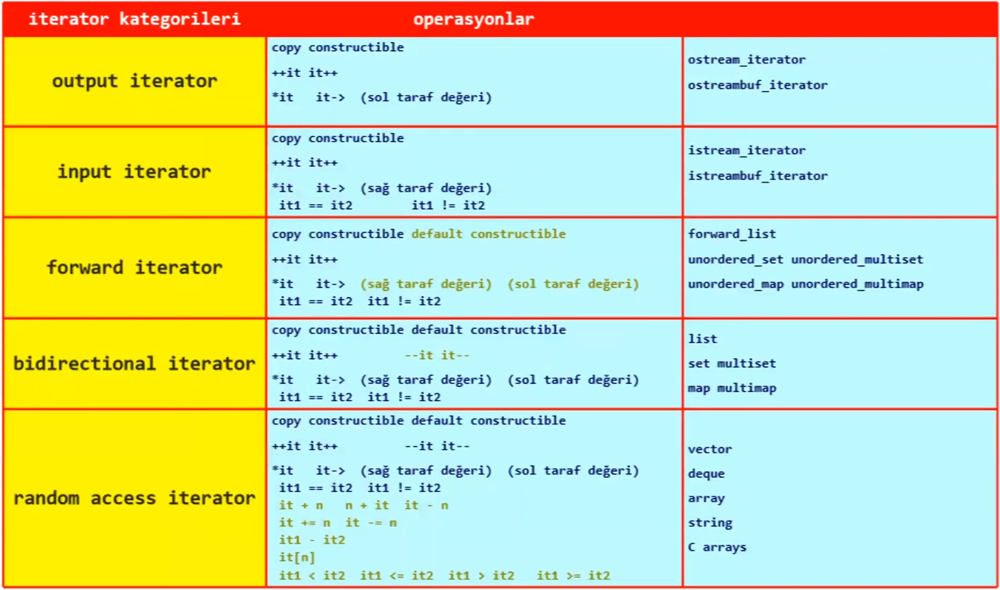
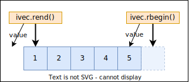

# Iterators
Iteratorler, farkli veri yapilari ile tek tip olacak bicim calisilabilmesine olanak saglamak amaci ile olusturulmus, bir ogenin konumunu gosteren varliklardir.

* Iterartor dereference edilirse o konumda bulunan ogeye erisim saglanir.

**Range kavrami**  
Iki konum ile belirtilen bir araligi ifade etmektedir.  
```
[konum1, konum2)
```
[Ornek: Range](res/src/range01.cpp)  

* `<algorithm>` headerinda bulunan fonksiyonlar bir range ile calisir.

**Iterator Kategorileri**  
Iterator kategorisi, bir iteratorun interface'inde hangi islemlerin bulundugu belirtmektedir.

<table>
<tr>
    <th>Iterator Kategorisi</th>
    <th>Operasyonlar</th>
    <th>Tag</th>
    <th></th>
</tr>
<!--  -->
<tr>
<td>output iterator</td>
<td>

```text
copy constructable

++it it++

*it it-> (lvalue)
```

</td>
<td><pre>output_iterator_tag</pre></td>
<td>

```C++
ostream_iterator
ostreambuf_iterator
```

</td>
</tr>
<!--  -->
<tr>
<td>input iterator</td>
<td>

```text
copy constructable

++it it++

*it it-> (rvalue)

it1 == it2      it1 != it2
```

</td>
<td><pre>input_iterator_tag</pre></td>
<td>

```C++
istream_iterator
istreambuf_iterator
```

</td>
</tr>
<!--  -->
<tr>
<td>forward iterator</td>
<td>

```text
default constructable
copy constructable

++it it++

*it it-> (rvalue) (lvalue)

it1 == it2      it1 != it2
```

</td>
<td><pre>forward_iterator_tag</pre></td>
<td>

```C++
forward_list
unordered_set
unordered_multiset
unordered_map
unordered_multimap
```

</td>
</tr>
<!--  -->
<tr>
<td>bidirectional iterator</td>
<td>

```text
default constructable
copy constructable

++it it++
--it it--

*it it-> (rvalue) (lvalue)

it1 == it2      it1 != it2
```

</td>
<td><pre>bidirectional_iterator_tag</pre></td>
<td>

```C++
list
set
multiset
map
multmap
```

</td>
</tr>
<!--  -->
<tr>
<td>random accecss iterator</td>
<td>

```text
default constructable
copy constructable

++it it++
--it it--

*it it-> (rvalue) (lvalue)

it1 == it2      it1 != it2
it + n      it - n      n + it
it +=n      it -= n
it1 - it2
it[n]
it1 < it2   it1 <= it2
it1 > it2   it1 >= it2
```

</td>
<td><pre>random_access_iterator_tag</pre></td>
<td>

```C++
vector
deque
array
string
C arrays
```

</td>
</tr>
<!-- TODO: Add contigious iterator -->
</table>

<!--  -->

<!-- 
<p align="center">
    <br/>
    <i>Sekil: Iterator Kategori</i>
</p> 
-->

* Bir iterator'un kategorisi `iterator_category` tagleri ile compile-time'da elde edilebilir.
  ```C++
  using iter_cat_t = std::vector<int>::iterator::iterator_category;
  std::is_same_v<iter_cat_t, std::random_access_iterator_tag>;
  ```
* `*` ve `->` operatorleri *lvalue* ise sadece **okuma** amacli, *rvalue* ise sadece **yazma** amacli kullanilabilmektedir.

## Iterator Types
* `TContainer::iterator`
  ```
  c.begin() / c.end()
  ```
* [`TContainer::reverse_iterator`](#reverse_iterator--make_reverse_iterator)    *(Adapter)*
  ```
  c.rbegin() / c.rend()
  ```
* [`TContainer::const_iterator`](#const_iterator)
  ```
  c.cbegin() / c.cend()
  ```
* `TContainer::const_reverse_iterator`  *(Adapter)*
  ```
  c.crbegin() / c.crend()
  ```


## Iterator Operations
### `std::advance`
```C++
template <typename Iter>
void advance(Iter& it, int n);
```
Iteratorun kategorisinden bagimsiz olarak bir iteratoru $n$ pozisyon ilerletiyor.

<details>
<summary><b>Possible implementation</b> (Click to expand)</summary>

[*constexpr-if teknigi*](res/src/advance_constexprif.cpp)
```C++
#include <type_traits>  // std::is_same_v

template <typename Iter>
void advance(Iter& it, int n)
{
  if constexpr (std::is_same_v<typename Iter::iterator_category, 
                               std::random_access_iterator_tag>) 
  { 
    it += n;
  }
  else 
  {
    while(n--) ++it;
  }
}
```
[*tag-dispatch teknigi*](res/src/advance_tagdispatch.cpp)
```C++
template <typename Iter>
void advance_impl(Iter& it, int n, std::random_access_iterator_tag)
{
    it += n;
}

template <typename Iter>
void advance_impl(Iter& it, int n, std::bidirectional_iterator_tag)
{
    while(n--) ++it;
}

template <typename Iter>
void advance(Iter& it, int n)
{
    advance_impl(it, n, typename Iter::iterator_category{});
}
```
</details>
<!--  -->

* `advance` fonksiyonu, arguman olarak verilen **iterator kategorisine bagli olarak** uygun olan implementasyonu secmektedir.  
   *Eger bir iterator **RandIter** kategorisinde ise `+=` islemi ile n adet konum degistirilebilir. Eger degil ise `+=` operatoru bulunmayacaktir.*
* `advance` fonksiyonu ilk parametresi lvalue ref, bu nedenle rvalue expr ile cagrilamaz.
* Bidirectional iterator kullaniliyor ise `advance` fonksiyonuna, negatif deger gecilebilir.

[Ornek](res/src/advance01.cpp)

### `std::distance`
```C++
template<class It>
int distance(It first, It last);
```
Iki iteratorun kategorisinden bagimsiz olarak arasindaki farki hesaplar.

<details>
<summary><b>Ornek</b> (Click to expand)</summary>

*implementation via constexpr-if, available in C++17*
```C++
template<class It>
int distance(It first, It last)
{
    using category = typename It::iterator_category;
    static_assert(std::is_base_of_v<std::input_iterator_tag, category>);
 
    if constexpr (std::is_base_of_v<std::random_access_iterator_tag, category>)
        return last - first;
    else {
        int result = 0;
        while (first != last) {
            ++first;
            ++result;
        }
        return result;
    }
}
```
</details>
<!--  -->

* `std::distance` iterator kategorisine uygun olan bir implementasyonu secmektedir. 
* `std::distance` ilk parametresi `++` operatoru ile ikinci parametreye gidebilmelidir, aksi halde **UB** olur!

[Ornek](res/src/distance01.cpp)

### `std::next`/`std::prev`
```C++
template<class InputIt>
InputIt next(InputIt it, int n = 1)
{
    std::advance(it, n);
    return it;
}

template<class BidirIt>
BidirIt prev(BidirIt it, int n = 1)
```
Verilen iteratoru degistirmeden kategorisinden bagimsiz olarak verilen $n$ degeri kadar ileri/geri konumu gosterecek bicimde **yeni bir iterator** olusturur.
<details>
<summary><b>Possible implementation</b> (Click to expand)</summary>

```C++
template<class InputIt>
InputIt next(InputIt it, int n = 1)
{
    std::advance(it, n);
    return it;
}

template<class BidirIt>
BidirIt prev(BidirIt it, int n = 1)
{
    std::advance(it, -n);
    return it;
}
```
</details>
<!--  -->

* `next` ve `prev`'de erisilecek konumun varligindan programci sorumludur! Aksi halde **UB** olusur.
* `next` ve `prev` cagrilarinda inline extension uygulanmaktadir.
* `advance` fonksiyonundan farki, `next` ve `prev` yeni bir iterator nesnesi olusturmaktadir.

[Ornek](res/src/next_prev01.cpp)

## Range Access
### `std::begin()`/`std::cbegin`
### `std::end()`/`std::cend`
### `std::rbegin()`/`std::crbegin`
### `std::rend()`/`std::crend`

### `std::size`
```C++
template<typename C>
constexpr auto size(const C& c ) -> decltype(c.size());
```
Returns the size of the given range.

<details>
<summary><b>Possible implementation</b> (Click to expand)</summary>

```C++
template <class C> 
constexpr auto size(const C& c) -> decltype(c.size())
{
    return c.size();
}

template <class C>
constexpr auto ssize(const C& c) 
    -> std::common_type_t<std::ptrdiff_t,
                          std::make_signed_t<decltype(c.size())>> 
{
    using R = std::common_type_t<std::ptrdiff_t,
                                 std::make_signed_t<decltype(c.size())>>;
    return static_cast<R>(c.size());
}

template <class T, std::size_t N>
constexpr std::size_t size(const T (&array)[N]) noexcept
{
    return N;
}

template <class T, std::ptrdiff_t N>
constexpr std::ptrdiff_t ssize(const T (&array)[N]) noexcept
{
    return N;
}
```
</details>
<!--  -->

[Ornek](res/src/size01.cpp)

### `std::empty`
```C++

```
Returns whether the given range is empty.

<details>
<summary><b>Possible implementation</b> (Click to expand)</summary>

```C++
template <class C> 
[[nodiscard]] constexpr auto empty(const C& c) -> decltype(c.empty())
{
    return c.empty();
}

template <class T, std::size_t N> 
[[nodiscard]] constexpr bool empty(const T (&array)[N]) noexcept
{
    return false;
}

template <class E> 
[[nodiscard]] constexpr bool empty(std::initializer_list<E> il) noexcept
{
    return il.size() == 0;
}
```
</details>
<!--  -->

[Ornek](res/src/empty01.cpp)

### `std::data`


## Iterator Adapters
### `reverse_iterator` / `make_reverse_iterator`

<p align="center">
    <br/>
    <i>Sekil: reverse_iterator dereferencing</i>
</p>

<details>
<summary><b>Possible implementation</b> (Click to expand)</summary>

```C++
template<typename T>
class reverse_iterator {
public:
    T operator*()
    {
        return *(iter - 1);
    }
    
    iterator base() const { 
        return iter;
    }
    
    T& operator++() {
        return --iter;
    }
    
    T& operator--() {
        return ++iter;
    }
private:
    iterator iter;
};

template< class Iter >
reverse_iterator<Iter> make_reverse_iterator(Iter i)
{
    return reverse_iterator<Iter>(i);
}
```
</details>
<!--  -->

* Kullanilabilmesi icin iterator kategorisinin en az **bidirectional iterator** olmasi gerekmektedir.
* `reverse_iterator::base()` fonksiyonu adaptorun sarmaladigi iteratoru dondurmektedir.

> :warning: 
> `reverse_iterator` dereference edilirken, bulundugu konumun **bir eksigi** konumu isaret eder, ancak `base()` fonksiyonu bulundugu konumu gosteren bir iteratoru doner.

[Ornek](res/src/reverse_iter01.cpp)

### `insert_iterator` / `inserter`
```C++
template<typename C>
class insert_iterator;

template<typename C>
insert_iterator<C> inserter(C& c, typename C::iterator i);
```
`std::insert_iterator`, öğeleri inşa edildiği bir container'in verilen iterator konumuna ekleyen bir *LegacyOutputIterator*'dur. Container'in `insert()` üye işlevi, iterator (dereferecen edilmis olsun ya da olmasın) atama yapildiginda çağrılır. std::insert_iterator'ı artırmak işlem yapmamaktadir.

`inserter`, bir container için bağımsız değişken türünden türetilen bir `std::insert_iterator` oluşturulmasini saglayan bir fonksiyon sablonudur.
<details>
<summary><b>Possible implementation</b> (Click to expand)</summary>

```C++
template<typename C>
class insert_iterator
{
protected:
  C& container;
  Iter iter;
  
public:
  insert_iterator(C& _container, Iter _iter)
  : container(_container), iter(_iter) {}
  
  insert_iterator& operator=(const typename C::value_type& __value)
  {
        iter = container.insert(iter, __value);
        ++iter;
        return *this;
  }
  
  insert_iterator& operator=(typename C::value_type&& __value)
  {
        iter = container.insert(iter, std::move(__value));
        ++iter;
        return *this;
  }
  
  insert_iterator& operator*() { return *this; }
  insert_iterator& operator++() { return *this; }
  insert_iterator& operator++(int) { return *this; }
};

template<typename C>
insert_iterator<C> inserter(C& c, typename C::iterator i)
{
    return insert_iterator<C>(c, i);
}
```
</details>
<!--  -->

[Ornek](res/src/inserter01.cpp)

### `front_insert_iterator` / `front_inserter`
```C++
template<typename C>
class front_insert_iterator;

template <typename C>
front_insert_iterator<C> front_inserter(C& c);
```
`std::front_insert_iterator`, öğeleri inşa edildiği bir container'in başına ekleyen bir *LegacyOutputIterator*'dur. Container'in `push_front()` üye işlevi, iterator (dereferecen edilmis olsun ya da olmasın) atama yapildiginda çağrılır. std::front_insert_iterator'ı artırmak işlem yapmamaktadir.

`front_inserter`, bir container için bağımsız değişken türünden türetilen bir `std::front_insert_iterator` oluşturulmasini saglayan bir fonksiyon sablonudur.

<details>
<summary><b>Possible implementation</b> (Click to expand)</summary>

```C++
template <typename C> 
class front_insert_iterator {
public:
    front_insert_iterator(C& c) : mc{ c } {}
    front_insert_iterator& operator*() {
        return *this;
    }
    
    front_insert_iterator& operator++() {
        return *this;
    }
    
    front_insert_iterator& operator++(int) {
        return *this;
    }
    
    front_insert_iterator& operator=(const typename C::value_type& val) {
        mc.push_front(val);
        return *this;
    }
private:
    C& mc;
};

template<typename C>
front_insert_iterator<C> front_inserter(C& c )
{
    return front_insert_iterator<C>(c);
}
```
</details>
<!--  -->

[Ornek](res/src/front_inserter01.cpp)

### `back_insert_iterator` / `back_inserter`
```C++
template<typename C>
class back_insert_iterator;

template <typename C>
back_insert_iterator<C> back_inserter(C& c);
```
`std::back_insert_iterator`, öğeleri inşa edildiği bir container'in sonuna ekleyen bir *LegacyOutputIterator*'dur. Container'in `push_back()` üye işlevi, iterator (dereferecen edilmis olsun ya da olmasın) atama yapildiginda çağrılır. std::back_insert_iterator'ı artırmak işlem yapmamaktadir.

`back_inserter`, bir container için bağımsız değişken türünden türetilen bir `std::back_insert_iterator` oluşturulmasini saglayan bir fonksiyon sablonudur.

<details>
<summary><b>Possible implementation</b> (Click to expand)</summary>

```C++
template <typename C> 
class back_insert_iterator {
public:
    back_insert_iterator(C& c) : mc{ c } {}
    back_insert_iterator& operator*() {
        return *this;
    }
    
    back_insert_iterator& operator++() {
        return *this;
    }
    
    back_insert_iterator& operator++(int) {
        return *this;
    }
    
    back_insert_iterator& operator=(const typename C::value_type& val) {
        mc.push_back(val);
        return *this;
    }
private:
    C& mc;
};

template <typename C>
back_insert_iterator<C> back_inserter(C& c) {
    return Back_insert_iterator<C>(c);
}
```
</details>
<!--  -->

[Ornek](res/src/back_inserter01.cpp)

### `move_iterator` / `make_move_iterator`

## Stream Iterators

### `istream_iterator`
### `ostream_iterator`
### `istreambuf_iterator`
### `ostreambuf_iterator`


## `const_iterator`
Bir iterator nesnesini **low-level const** olarak kullanilabilmesini saglamaktadir.

<details>
<summary><b>Possible implementation</b> (Click to expand)</summary>

```C++
template<typename C>
auto cbegin(const C& __cont) noexcept(noexcept(std::begin(__cont)))
      -> decltype(std::begin(__cont))
{ 
    return std::begin(__cont);
}
```
</details>
<!--  -->

`iter` nesnesi, top-level const bir sinif nesnesidir. Dolayisiyla sadece const uye fonksiyonlari cagrilabilir:
```C++
const vector<int>::iterator iter = ivec.begin();  
*iter = 45;    // gecerli
++iter;        // sentaks hatasi: cunku iter nesnesi const bir nesne.
```
`citer` nesnesi, low-level const bir sinif nesnesidir. Yani; kendisi `const` degildir, ancak bulundugu konumdaki elemana `const int` turu ile erisim saglamaktadir:
```C++
vector<int>::const_iterator citer = ivec.begin();
++citer;
*citer = 45;    // sentaks hatasi
```

* `const_iterator` turunden bir nesne dereference edildiginde `const` bir nesne doner.  
  *Tutulan nesne konumundaki deger degistirilemez.*
* `cbegin()` ve `cend()` fonksiyonlari `const_iterator` turunden bir iterator doner.
  ```C++
  auto citer = ivec.cbegin();    // citer = vector<int>::const_iterator
  ```