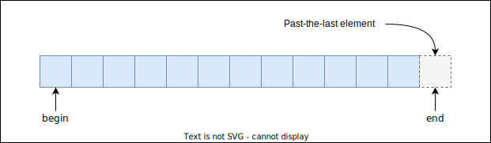

# Containers
*(collections)*  

Containerlar, ogeleri bir arada tutan veri yapilarini implemente edilen sinif sablonlaridir.

* **Containers**  
  * Sequence containers  
    * `std::vector`                     *(dinamik dizi veri yapisi)*
    * `std::deque`                      *(dinamik dizilerin dizisi yapisi)*
    * `std::list`                       *(double linked list)*
    * `std::forward_list` [C++11]       *(linked list)*
    * `std::string`                     
    * `std::array` [C++11]              *(C dizileri icin sarmalayici)*
  * Associative containers              *(binary search trees)*  
    Varlik nedeni bir anahtar degeri ile bir ogeye erismek veya ogenin varligini sorgulamaktir.
    * `std::set`                        
      Bir degeri, bir veri kumesinde varligini sorgulama  
    * `std::multiset`                   
      set'den farkli olarak birden fazla ayni anahtardan tutulabiliyor
    * `std::map`                        
      Bir anahtar degeri ile iliskilendirilmis bir degerin tutulmasi
    * `std::multimap`                   
      std::map'den farkli olarak birden fazla ayni anahtardan tutulabiliyor
  * Unordered associative containers  
    *Amortized constant time ile hashtable*
    * `std::unordered_set`           [C++11]  *(Hashset)*
    * `std::unordered_multiset`      [C++11]  
    * `std::unordered_map`           [C++11]  *(Hashmap)*
    * `std::unordered_multimap`      [C++11]  

* **Container Adapters**  
  Kendileri bir container degil, ancak bir container'i kapsayarak ilgili veri yapisina uygun olarak adapte etmektedirler.
  * `std::stack`                              
  * `std::queue`                              
  * `std::priority_queue`                     
  * `std::flat_set` [C++23]                   
  * `std::flat_map` [C++23]                   
  * `std::flat_multiset` [C++23]              
  * `std::flat_multimap` [C++23]              

> **Not**  
> Bazi veri yapilari standart kutuphanede bulunmamaktadir. *(Orn, graph, binary map, vb...)*  
> Bu veri yapilari baska kutuphaneler ile *(orn. libboost gibi)* elde edilebilir. 
> 
> Boost kutuphanesi, standart kutuphaneye gore biraz daha hizli yeni ozellik eklemesi yapabiliyor. Gecmiste, boost'da olan ancak stdlib'de olmayan bazi ozellikler stdlib'e eklenmistir.

* Kullanilan veri yapisina gore **cache hit/miss** orani verimi buyuk olcude etkileyebilmektedir.

## STL Container'larin Ortak Ozellikleri

* Bircok uye fonksiyon cogu containerlarda *bazi istisnalar disinda* aynidir:
  Ortak fonksiyon interface:
  ```C++
  container::size_type size() const;  // (Istisna: forward_list'de bulunmuyor)
  bool c.empty() const;
  void clear();
  void erase(Iter pos);
  void erase(Iter beg, Iter end);
  container::iterator begin() const;
  container::iterator end() const;
  container::const_iterator cbegin() const;
  container::const_iterator cend() const;
  ```
  Type Interface:
  ```C++
  container::value_type
  contaienr::size_type
  container::iterator
  container::const_iterator
  ```
  
* `begin()` fonksiyonlari, containerdaki ilk ogenin konumunu belirtir.
* `end()` fonksiyonlari, containerdaki son ogeden sonraki konumu belirtir.  
  Bu konuma **sentinel deger** denir.
<p align="center">
  <br/>
  <i>Sekil: begin ve end</i>
</p>
  
* Global `begin` ve `end` fonksiyonlari C dizileri ile de kullanilabilir.
  ```C++
  int a[] = {1,2,3,4,5,6,7,8,9,10};
          
  for (auto i = begin(a); begin(a) != end(a); ++i)
  {
      cout << *i << ',';
  }
  ```
<!-- Ders 34 @ 0:06:00 -->

  
* STL containerlarin bazi uye fonksiyonlarin `iterator` parametreli overloadlari bulunur.
* STL containerlar, dogrudan reference semantigi ile calismamaktadir. Container'a eklenmek istenen nesnenin kopyasi eklenir.
* Modern C++ ile nesnenin kopyasi yerine move islemi yapilabiliyor.
* Modern C++ ile kopyalama yada tasima soz konusu olmadan, perfect forwarding'den faydalanarak, verilen argumanlar ile direkt kabin icinde olusturulabiliyor. Boyle fonksiyonlara `emplace` fonksiyonlari denilmektedir.
  * Kopyalama yada tasima soz konusu degil, direkt olarak yerinde nesne olusturulmaktadir.
* Containerlarda nesnelerin referensi tutulamamaktadir. Alternatif olarak sunlar yapilabilir:
  1. Kapta (raw) pointer tutmak
  2. Kapta (smart) pointer tutmak
  3. Kapta `std::referecen_wrapper` ile kapsanmis bir obje referansi tutmak
     *Normalde container icinde reference tipinden nesne tutulamaz.*
* **global algoritmalar vs member function algoritmalar**  
  Uye fonksiyonlarin sinifin ic yapisina daha iyi hakim olmasindan dolayi verim acisindan daha iyi olma ihtimali bulunmaktadir.  
  * `reverse` global fonksiyonu her elemani kopyalayarak swap ederken, uye fonksiyon 
head tail pointerlarini degistirerel daha verimli olarak bu islemi gerceklestirebilir.  
  * binary tree find fonksiyonu `O(logn)` iken global find algoritmasi `O(n)`'dir.
