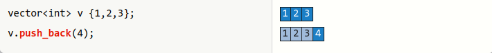
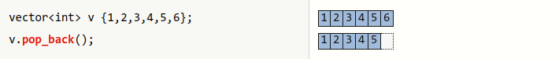
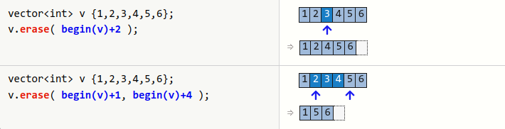
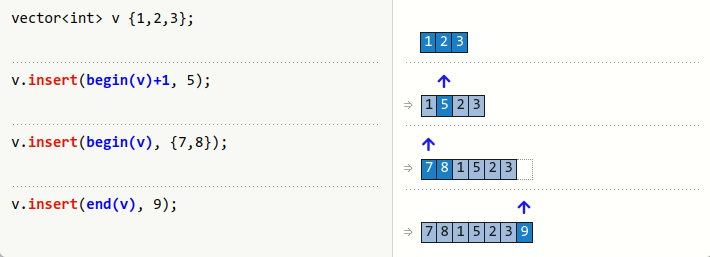
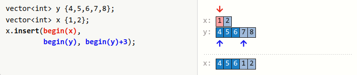

## `std::vector`

C++'s default dynamic array

```C++
template <typename T, typename A = std::allocator<T>>
class vector;

template<class Allocator>
class vector<bool, Allocator>;
```

:heavy_check_mark: Random access iterator: Dinamik dizi bellekte ardisik olarak olusturulmasindan dolayi ogeye erisim `O(1)`'dir.  
:heavy_check_mark: fast traversal; good for linear search  
:heavy_check_mark: insertion at the end in amortized constant time  
:x: potentially slow if insert/erase operations at front and/or random positions dominate  
:x: potentially slow if element type has high copy/assignment cost  
    (reordering elements requires copying/moving them)  
:x: all operations that can change capacity (insert, push_back, …) may invalidate references/pointers to any vector element  
:x: potentially long allocation times for very large amount of values  

### Implementasyon detaylari
* Vector sinifi 3 adet pointer'a sahiptir.
    1. Dinamik dizi baslangicini isaret eden
    2. Dinamik dizinin bitisini isaret eden
    3. Container'da bulunan son elemani isaret eden
* **capacity**: Allocate edilen bellek blogunda tutulabilecek oge sayisi  
* **size**: Dinamik bellek alaninda tutulmakta olan oge sayisi  

<p align="center">
    <!-- <br/> -->
    <br/>
    <i>Sekil: vector memory layout</i>
</p>

* Reallocation yapilirken bir katsayi ile buyutulur.  
  *gcc ve clang'de 2 kat, msvc'de 1.5 kat*
* Gereksiz reallocation'dan kacinmak icin tahmini olarak ihtiyac duyulan eleman sayisini vector olusturulurken verilebilir.
* Iteratorler ve pointerlar reallocation yapildiktan sonra danglig duruma duser.
* Ekleme islemi `O(1)`'dir ancak bazen olusabilecek reallocation'dan dolayi buna **amortized constant time** denir.
* `vector` sinifinda **small buffer optimization** yoktur.
* `std::allocator<T>` varsayilan olarak `new` ve `delete` operatorlerini kullanir.


### Iterator Invalidations
All iterators into a vector are invalidated if its capacity is changed or elements are moved.

| Operation                | Invalidated                                                                                                        |
| ------------------------ | ------------------------------------------------------------------------------------------------------------------ |
| All read only operations | Never                                                                                                              |
| swap, std::swap          | end()                                                                                                              |
| clear, operator=, assign | always                                                                                                             |
| reserve, shrink_to_fit   | If the vector changed capacity, all of them. If not, none.                                                         |
| erase                    | Erased elements and all elements after them (including end())                                                      |
| push_back, emplace_back  | If the vector changed capacity, all of them. If not, only end().                                                   |
| insert, emplace          | If the vector changed capacity, all of them. If not, only those at or after the insertion point (including end()). |
| resize                   | If the vector changed capacity, all of them. If not, only end() and any elements erased.                           |
| pop_back                 | The element erased and end().                                                                                      |

All iterators into a vector are invalidated if its capacity is changed or elements are moved by insert, push_back, emplace, emplace_back, erase, =, assign, resize, reserve. 
* use new valid iterator returned by insert/erase
* the returned iterator refers to the original position
```C++
vector<int> ivec{ 0, 1, 2, 3, 4, 5, 6};
auto i = begin(ivec) + 3;

// v.insert(i, 8);
i = v.insert(i, 8);

// v.erase(i);
i = v.erase(i);
```


### Member Functions
#### Constructors
```C++
vector<T>();                        // (1) default ctor
vector<T>(size_t);                  // (2) preallocation ctor
vector<T>(size_t, T);               // (3) fill ctor
vector<T>(const vector<T>&);        // (4) copy ctor (deep)
vector<T>(vector<T>&&);             // (5) move ctor
vector<T>(initializer_list<T>);     // (6) initializer_list ctor
vector<T>(InIter beg, InIter end);  // (7) range ctor
```
* (2)'nin kullanilabilmesi icin `T` turunun **default constructable** olmasi gerekmektedir.

[Ornek](res/src/vector_ctor01.cpp)

#### `vector::operator=()`
```C++
vector& operator=( const vector& other );
vector& operator=( vector&& other ) noexcept(/* implementation-defined */);
vector& operator=( std::initializer_list<T> ilist );
```
[Ornek](res/src/vector07.cpp)
#### `vector::assign()`
```C++
void assign( size_type count, const T& value );

template< class InputIt >
void assign( InputIt first, InputIt last );

void assign( std::initializer_list<T> ilist );
```
Replaces the contents of the container.
[Ornek](res/src/vector08.cpp)

#### Element Access
##### `vector::at()`
```C++
T& vector::at(size_type pos);
const T& vector::at(size_type pos) const;
```
* out of range index verilir ise `std::out_of_range` exception firlatilir.
[Ornek](res/src/vector03.cpp)

##### `vector::operator[]()`
```C++
T& vector::operator[](size_type pos);
const T& vector::operator[](size_type pos) const;
```
* out of range index verilir ise **UB** olusur.
[Ornek](res/src/vector03.cpp)

##### `vector::front()` / `vector::back()`
```C++
T& vector::front();
const T& vector::front() const;

T& vector::back();
const T& vector::back() const;
```
[Ornek](res/src/vector04.cpp)

##### `vector::data()`
```C++
T* data() noexcept;
const T* data() const noexcept;
```
Returns pointer to the underlying array serving as element storage. The pointer is such that range `[data(), data() + size())` is always a valid range, even if the container is empty *(data() is not dereferenceable in that case)*.

[Ornek](res/src/vector12.cpp)

#### Iterators
##### `begin()` / `end()` / `cbegin()` / `cend()`
```C++
iterator vector::begin() noexcept;
const_iterator vector::begin() const noexcept;
const_iterator vector::cbegin() const noexcept;

iterator vector::end() noexcept;
const_iterator vector::end() const noexcept;
const_iterator vector::cend() const noexcept;
```
##### `rbegin()` / `rend()` / `crbegin()` / `crend()`
```C++
reverse_iterator vector::rbegin() noexcept;
const_reverse_iterator vector::rbegin() const noexcept;
const_reverse_iterator vector::crbegin() const noexcept;

reverse_iterator vector::rend() noexcept;
const_reverse_iterator vector::rend() const noexcept;
const_reverse_iterator vector::crend() const noexcept;
```


#### Capacity
##### `vector::empty()`
##### `vector::size()`
##### `vector::max_size()`
##### `vector::capacity()`
[Ornek](res/src/vector01.cpp)

##### `vector::reserve()`
```C++
void vector::reserve( size_type new_cap );
```
Reserves capacity.
[Ornek](res/src/vector01.cpp)


##### `vector::shrink_to_fit()`
```C++
void vector::shrink_to_fit();
```
* vector sinifi ekleme yapildikca buyur ancak kendiliginden kuculmez.

> :warning: 
> Erasing elements from a vector does never change the capacity and thus never frees any memory.

[Ornek](res/src/vector02.cpp)


#### Modifiers
##### `vector::clear()`
```C++
void vector::clear() noexcept;
```
Erases all elements from the container. After this call, `size()` returns zero.
Leaves the capacity() of the vector unchanged.

<p align="center">
    
</p>


[Ornek](res/src/vector02.cpp)
##### `vector::push_back()`
```C++
void vector::push_back(const T& value);   // (1)
void vector::push_back(T&& value);        // (2)
```
Appends the given element value to the end of the container.
1) The new element is initialized as a copy of value.
2) value is moved into the new element.

<p align="center">
    
</p>

[Ornek](res/src/vector06.cpp)

##### `vector::pop_back()`
```C++
void vector::pop_back();
```
Son elemani container'dan cikarir.

<p align="center">
    
</p>

* Bos bir container ile `pop_back` cagrisi yapilmasi **UB**'dir.

[Ornek](res/src/vector11.cpp)

##### `vector::erase()`
```C++
iterator vector::erase(const_iterator pos);                             // (1)
iterator vector::erase(const_iterator first, const_iterator last);      // (2)
```
Belirtilen elemanlari container'dan siler ve en son silinmis ogeden sonraki ilk ogenin konumunu geri doner.

* (1) `pos` konumunda bulunan elemani container'dan siler. 
* (2) `[first, last)` range'inde bulunan elemanlari container'dan siler.

<p align="center">
    <br/>
</p>

[Ornek](res/src/vector10.cpp)

> :warning: 
> Silinen ogenin hayati sonlandigi icin dtor'u calistirilir.

<!-- Iterator following the last removed element.
* If pos refers to the last element, then the end() iterator is returned.
* If last == end() prior to removal, then the updated end() iterator is returned.
* If [first, last) is an empty range, then last is returned. -->


##### `vector::insert()`
```C++
iterator vector::insert(const_iterator pos, const T& value);                    // (1)
iterator vector::insert(const_iterator pos, T&& value);                         // (2)
iterator vector::insert(const_iterator pos, size_type count, const T& value);   // (3)

template<typename InputIt>
iterator vector::insert(const_iterator pos, InputIt first, InputIt last);       // (4)
```

`pos` iteratorunun gosterdigi konuma eleman ekleme yapar ve **insert edilen ilk ogenin** konumunu belirten bir iterator geri dondurur.

<p align="center">
    <br/>
    <br/>
</p>

[Ornek](res/src/vector09.cpp)

##### `vector::emplace()`
```C++
template< class... Args >
iterator emplace( const_iterator pos, Args&&... args );
```
Olusturulacak nesnenin ctor argumanlarini forward ederek containerin icinde belirtilen `pos` konumunda olusturulmasini saglamaktadir.

[Ornek](res/src/vector14.cpp)

##### `vector::emplace_back()`
```C++
template< class... Args >
reference emplace_back( Args&&... args );
```
Olusturulacak nesnenin ctor argumanlarini forward ederek containerin icinde son eleman olarak olusturulmasini saglamaktadir.

[Ornek](res/src/vector14.cpp)

##### `vector::resize()`
```C++
void vector::resize(size_type count );
void vector::resize(size_type count, const value_type& value);
```
Resizes the container to contain count elements.

* Hem oge ekleme, hemde oge silme amacli kullanilabilir.
* Ekleme ve silme islemleri sondan yapilir.

[Ornek](res/src/vector05.cpp)

##### `vector::swap()`
```C++
void vector::swap( vector& other ) noexcept(/* see below */);
```
Exchanges the contents and capacity of the container with those of other. Does not invoke any move, copy, or swap operations on individual elements.

All iterators and references remain valid. The past-the-end iterator is invalidated.

[Ornek](res/src/vector13.cpp)
<!-- ### Non-member Functions -->


--------------------
