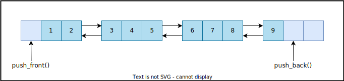

## `std::deque`
*Double Ended Queue*  

Dinamik dizilerin dizisi.

```C++
template <typename T, typename A = std::allocator<T>>
class Deque;
```

:heavy_check_mark: Random access iterator, constant-time random access (with extremely small overhead)  
:heavy_check_mark: good insertion and deletion performance at both ends *(amortized constant time)*  
:heavy_check_mark: insertion does not invalidate references/pointers to elements  
:heavy_check_mark: fast traversal; good for linear searches  
:heavy_minus_sign: Fragmentasyona karsi `vector`'den daha dayanikli, `list` ve turevlerinden daha dayaniksiz.  
:x: potentially slow if insert/erase operations at random positions dominate  
:x: potentially slow if element type has high copy/assignment cost (reordering elements requires copying/moving them)  
:x: potentially long allocation times for very large amount of values   

<p align="center">
    <br/>
    <i>Sekil: deque</i>
</p>

* Veri chunklarda tutulmaktadir.
  *C dizileri uzerinde islem yapan bir fonksiyona vector bellek blogu adresini gecebiliriz, ancak deque icin bu gecerli degil.*
* Size'in bastan kac oldugu belli degilse ve daha kucuk chunklar halinde allocation yapilmakta,  ancak tamamen bir reallocation islemi yapilmiyor.
  *Eger vectordeki buyume ongorulemiyor ise deque daha iyi bir secenek olabilir.*
* [`vector<bool>` specialization](211_vector.md#stdvectorbool-partial-specialization)'i yerine `deque<bool>` kullanmak icin
  ```C++
  deque<bool> bdeq(10);
  auto b0 = bdeq[0];  // b0 = bool
  ```

### Iterator Invalidations
**Ekleme**  
* Iki uctan birinde yapiliyor ise iteratorler invalid oluyor ancak referanslar gecerli
* Ortandan yapiliyor ise ikisi de gecersiz.

**Silme**  
* Iki uctan birinde yapiliyor ise sadece silinen iteratorler invalid oluyor
* Ortandan yapiliyor ise ikisi de gecersiz.

[Ornek](res/src/deque01.cpp)

<!-- TODO: deque interface'i tamamla -->
<!-- Container ortak interfacei -->
<!-- Sequence Container ortak interfacei -->

#### Iterators 
`begin()` `end()`  `cbegin()` `cend()`  `rbegin()` `rend()`  `crbegin()` `crend()` 


### Notlar
* `deque::shrink_to_fit()` capacity olmamasina ragmen, fazlalik bos chunklarin iade edilmesi icin kullanilabilmektedir.