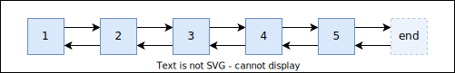

## `std::list`

*Doubly linked list* veri yapisidir.

:heavy_check_mark: restructuring operations don't require elements to be moved/copied *(good for storing large objects with high copy/assignment cost)*  
:heavy_check_mark: swap islemi pointer swap edilerek yapilmaktadir.  
&nbsp;&nbsp;&nbsp;&nbsp;&nbsp; *Bagli listede nodelari destroy etmeden bir listenden cikarip baska bir list containerina eklenebilmektedir.*  
&nbsp;&nbsp;&nbsp;&nbsp;&nbsp; *`vector` ve `deque`'da swap yapildiginda fiilen swap yapmak disinda baska ihtimal bulunmuyor.*  
:heavy_check_mark: constant-time *O(1)* splicing (of complete lists)  
:heavy_check_mark: Konumu bilenen bir yerden ekleme/silme **O(1)**'dir.  
:x: Bidirectional iterators: random access only in linear time *O(n)*  
:x: slow traversal due to bad memory locality  
&nbsp;&nbsp;&nbsp;&nbsp;&nbsp; Modern sistemlerin avantajlarindan faydalanamayabilmektedir.  
:x: Bellek alani kapsaminda dezavantajlidir.  
&nbsp;&nbsp;&nbsp;&nbsp;&nbsp; `list<int>` acilimi icin her bir oge (2 * 8) + 4 byte bellek alani isgal etmektedir.  
&nbsp;&nbsp;&nbsp;&nbsp;&nbsp; Dinamik bellek alaninin ilave bir header alani da isgal etmektedir.  

<p align="center">
  <br/>
  <i>Sekil: std::list</i>
</p>

<!-- TODO: list interface'i tamamla -->
<!-- Container ortak interfacei -->
<!-- Sequence Container ortak interfacei -->
[Ornek: Basics](res/src/list01.cpp)

### `std::list`'e ozgu fonksiyonlar
Bazi algoritmalarin liste ozgu implementasyonlari sinifin member fonksiyonu olarak bulunmaktadir:
* `list::unique`
* `list::sort`
* `list::remove`/`list::remove_if`
* `list::reverse`

[Ornek: Algoritma fonksiyonlari](res/src/list02.cpp)

#### `list::merge`
```C++
void list::merge(list& other);
void list::merge(list&& other);

template <typename Compare>
void list::merge(list& other, Compare comp);

template <typename Compare>
void list::merge(list&& other, Compare comp);
```
Sirali iki listeyi **sirali olarak birlestirme** algoritmasidir.*O(n)*  

[Ornek](res/src/list03.cpp)  

#### `list::splice`
```C++
void list::splice(const_iterator pos, list& other);
void list::splice(const_iterator pos, list&& other);

void list::splice(const_iterator pos, list& other, const_iterator it);
void list::splice(const_iterator pos, list&& other, const_iterator it);

void list::splice(const_iterator pos, list& other, const_iterator first, const_iterator last);
void list::splice(const_iterator pos, list&& other, const_iterator first, const_iterator last);
```
Bir listeden ayni turden baska bir listeye elemanlari aktarmaktadir.

[Ornek](res/src/list04.cpp)  
