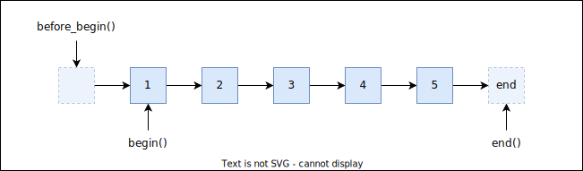

## `std::forward_list`

*Singly linked list* veri yapisidir. Verililik acisindan C'de implement edilen tekli bagli liste yapisina benzer minimalist bir yapisi vardir.

:heavy_check_mark: uses less memory than list  
:heavy_check_mark: restructuring operations don't require elements to be moved/copied  
&nbsp;&nbsp;&nbsp;&nbsp;&nbsp; *(good for storing large objects with high copy/assignment cost)*  
:heavy_check_mark: constant-time splicing (of complete lists)  
:x: random access only in linear time  
:x: slow traversal due to bad memory locality  
:x: **Forward iterator**: only forward traversal possible  
:x: somewhat cumbersome interface due to forward-only links *(does not have tail)*  
&nbsp;&nbsp;&nbsp;&nbsp;&nbsp; no `size()`, `back()`, `push_back()`, `pop_back()`, `insert()`  
&nbsp;&nbsp;&nbsp;&nbsp;&nbsp; instead: `insert_after()`, `splice_after()`, `before_begin()`

> :warning: *`size()` fonksiyonu olmayan tek standart container*  
> size bilgisinin hesaplamasi icin liste dolasilmak zorundadir. *([`std::distance`](100_iterators.md#stddistance) fonksiyonu kullanilabilir.)*

<p align="center">
  <br/>
  <i>Sekil: std::forward_list</i>
</p>


* Veri yapisinin dogasindan kaynakli olarak, ekleme ve silme islemlerinde verilen konuma degil, sonraki konuma ekleme/silme yapilabilir.
  * `insert_after`/`emplace_after`
  * `erase_after`

  Basa ekleme/silme yapabilinmesi icin `before_begin` olan bir iterator fonksiyonu vardir.  
  `before_begin` iteratorunun dereference edilmesi **UB**'dir.


[Ornek: Basics](res/src/forward_list01.cpp)  
[Ornek: Algoritmalar (Custom find)](res/src/forward_list05.cpp)  
[Ornek: Algoritmalar (before_iterator)](res/src/forward_list04.cpp)  

### `std::forwad_list`'e ozgu fonksiyonlar

#### `forward_list::insert_after`
```C++
iterator insert_after(const_iterator pos, const T& value);                  // (1)
iterator insert_after(const_iterator pos, T&& value);                       // (2)
iterator insert_after(const_iterator pos, size_type count, const T& value); // (3)

template<typename InputIt>
iterator insert_after(const_iterator pos, InputIt first, InputIt last);   // (4)
iterator insert_after(const_iterator pos, initializer_list<T> ilist);     // (5)
```

[Ornek](res/src/forward_list02.cpp)

#### `forward_list::erase_after`
```C++
iterator erase_after( const_iterator pos );                               // (1)
iterator erase_after( const_iterator first, const_iterator last );        // (2)
```

[Ornek](res/src/forward_list03.cpp)


Notlar 38. dersten devam ediyor.
