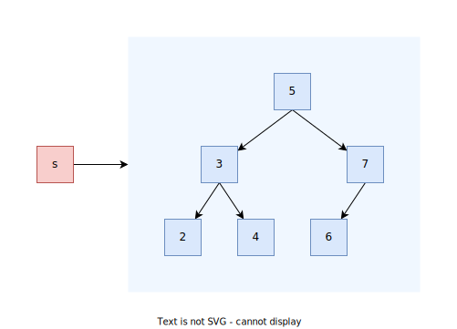

### `std::set`/`std::multiset`
```C++
template <typename Key, 
          typename Comp = std::less<Key>, 
          typename Alloc = std::allocator<Key>>
class SetType;
```

<p align="center">
    <br/>
    <i>Sekil: std::set</i>
</p>

#### Constructors
```C++
set();                                                                    // (1)
explicit set( const Compare& comp,                                        // (1)
              const Allocator& alloc = Allocator() );
explicit set( const Allocator& alloc );                                   // (1)

template< class InputIt >
set( InputIt first, InputIt last,                                         // (2)
     const Compare& comp = Compare(),
     const Allocator& alloc = Allocator() );
template< class InputIt >
set( InputIt first, InputIt last, const Allocator& alloc)                 // (2)
    : set(first, last, Compare(), alloc) {}
    
set( const set& other );                                                  // (3)
set( const set& other, const Allocator& alloc );                          // (3)

set( set&& other );                                                       // (4)
set( set&& other, const Allocator& alloc );                               // (4)

set( std::initializer_list<value_type> init,                              // (5)
     const Compare& comp = Compare(),
     const Allocator& alloc = Allocator() );
set( std::initializer_list<value_type> init, const Allocator& alloc )     // (5)
    : set(init, Compare(), alloc) {}
```
* (1) Default ctor
* (2) Range ctor
* (3) Copy ctor
* (4) Move ctor
* (5) `std::initializer_list` ctor

[Ornek: Constructors](res/src/set_ctor01.cpp)

#### Lookup operations
##### `set::find` / `multiset::find`
```C++
iterator find( const Key& key );
const_iterator find( const Key& key ) const;
```
Ilk bulunan ogeyi return eder, eger oge bulunamaz ise `end()` konumunu doner.

[Ornek](res/src/set03.cpp)

> :warning: Arama degeri `key` ile bulunan ogenin degeri `*iter` ayni deger olmak zorunda degildir.  
> *Ornegin bir `fighter` objesini isim ile anahtarlanacak bicimde bir sette tutuldugunda erisilen obje ile arama anahatari farkli olacaktir.*

##### `set::count`/`multiset::count`
```C++
size_type count( const Key& key ) const;
```
Returns the number of elements with key that compares equivalent to the specified argument.
This is either 1 or 0 for `std::set` since the container does not allow duplicates.

> :warning: 
> `set::count()` fonksiyonu bir set icinde ayni anahtar sahip ogeden en fazla 1 tane olabilmesine ragmen ilk ogeyi bulsa dahi range sonlanana kadar calismaya devam etmektedir.

[Ornek](res/src/set04.cpp)

##### `set::contains`/`multiset::contains`[C++20]
```C++
bool contains( const Key& key ) const;
```
Checks if there is an element with key equivalent to key in the container.

[Ornek](res/src/set05.cpp)

##### `set::lower_bound` / `set::upper_bound` / `multiset::lower_bound` / `multiset::upper_bound`
```C++
iterator lower_bound( const Key& key );
const_iterator lower_bound( const Key& key ) const;

iterator upper_bound( const Key& key );
const_iterator upper_bound( const Key& key ) const;
```
[bknz: Binary search operations on sorted ranges](300_algorithms.md#binary-search-operations-on-sorted-ranges)  
[Ornek](res/src/set09.cpp)  

##### `set::equal_range` / `multiset::equal_range`
```C++
std::pair<iterator,iterator> equal_range( const Key& key );
std::pair<const_iterator,const_iterator> equal_range( const Key& key ) const;
```
[bknz: Binary search operations on sorted ranges](300_algorithms.md#binary-search-operations-on-sorted-ranges)  
[Ornek](res/src/set09.cpp)  

#### Modifier operations

##### `set::insert` / `multiset::insert`
```C++
std::pair<iterator, bool> set::insert(const value_type& value );
std::pair<iterator, bool> set::insert(value_type&& value );
```
```C++
iterator multiset::insert( const value_type& value );
iterator multiset::insert( value_type&& value );
```
```C++
iterator insert( iterator pos, const value_type& value );
iterator insert( const_iterator pos, const value_type& value );
iterator insert( const_iterator pos, value_type&& value );

template< class InputIt >
void insert( InputIt first, InputIt last );
void insert( std::initializer_list<value_type> ilist );

insert_return_type insert( node_type&& nh );
iterator insert( const_iterator pos, node_type&& nh );
```
Ekleme islemi basari ise eklenen ogenin konumunu gosteren bir iterator, eger zaten oge bulunuyor ise mevcut ogenin konumunu gosteren bir iterator doner.  

> :warning: `set::insert` bir `pair` donerken, `multiset::insert` sadece `iterator` doner.

> :triangular_flag_on_post: **Hint insert**  
> Eger eklenecek konumu yaklasik olarak biliniyor ise, verimlilik acisindan bir ipucu konumu ile ekleme yapan bir fonksiyon bulunur. Ayrica, diger template fonksiyonlari ile uyumluluk amaciyla da  kullanilabilmektedir.

[Ornek](res/src/set02.cpp)  


##### `set::erase`/`multimap::erase`
```C++
iterator erase( iterator pos );                       // (1)
iterator erase( iterator first, iterator last );      // (2)
size_type erase( const Key& key );                    // (3)
```
Belirtilen ogeleri siler. (1) ve (2) overloadlari silinen son ogenin konumunu, (3) ise silinin oge adetini geri doner.

[Ornek](res/src/set06.cpp)  


##### `set::emplace`/`multiset::emplace`
```C++
template< class... Args >
std::pair<iterator,bool> set::emplace( Args&&... args );
```
```C++
template< class... Args >
iterator multiset::emplace( Args&&... args );
```
Kopyalama yada tasima yapmadan container tarafindan saglanan bellek alaninda **perfect forwarding**den faydalanarak nesne olusturulmasini saglar.

[Ornek](res/src/set08.cpp)  


##### `set::emplace_hint`/`multisetset::emplace_hint`
```C++
template <class... Args>
iterator emplace_hint( const_iterator hint, Args&&... args );
```
```C++
template <class... Args>
iterator emplace_hint( const_iterator hint, Args&&... args );
```
Kopyalama yada tasima yapmadan container tarafindan saglanan bellek alaninda **perfect forwarding**den faydalanarak bir hint konumu ile nesne olusturulmasini saglar.

[Ornek](res/src/set08.cpp)  


##### `set::extract`/`multiset::extract`
```C++
node_type std::set::extract(const_iterator position);
node_type std::set::extract(const Key& key);
```
Container icinde olusturulmus ogenin yok edilmeden container'dan cikarilabilmesini saglamaktadir. Geri donus turu `node_type` derleyiciye bagli *move only* bir turdur. Key bulunamaz ise bos bir node doner.

* Ayni yada farkli bir set'e tekrar eklenebilir
* Referanslar invalidate olmaz.

[Ornek](res/src/set07.cpp)  


##### `set::merge`/ `multiset::merge`
```C++
template<class C2>
void merge( std::set<Key, C2, Allocator>& source );

template<class C2>
void merge( std::set<Key, C2, Allocator>&& source );
```
Merges a set into `*this`.

[Ornek](res/src/set10.cpp)