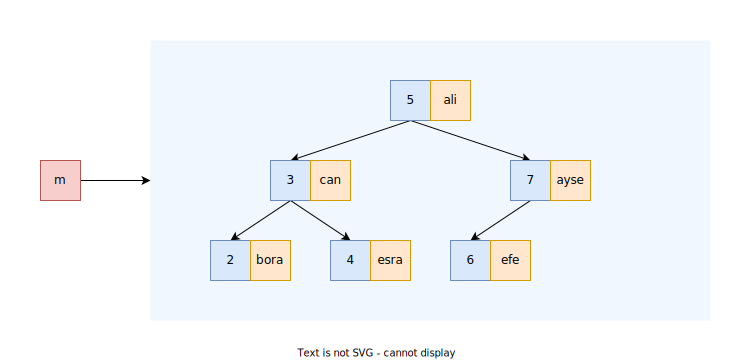

### `std::map`/`std::multimap`
`std::set` anahtar ile anahtar degerlerine erisim saglar iken, `std::map` ise anahtar karsiligi anahtarla iliskili bir degere erisim saglamaktadir.

```C++
template <typename Key, 
          typename Value,
          typename Comp = std::less<Key>, 
          typename Alloc = std::allocator<std::pair<Key, Value>>>
class MapTypes;
```

<p align="center">
    <br/>
    <i>Sekil: std::map</i>
</p>


> :triangular_flag_on_post: 
> `std::map` interface'i `std::set` interface'ine oldukca benzemektedir.

> :triangular_flag_on_post: 
> `std::map`de tutulan degerlerin bir `std::pair` oldugunu unutmayin.
> ```C++
> pair<string, int> iter = mmap.begin();
> iter->first;      // key
> iter->second;     // value
> ```
> ```C++
> const auto& [key, value] = mmap.begin();
> ```

#### Constructors
Constructor'larin yapisi `set` ile aynidir. Sadece `initializer_list` bir `pair` acilimi gerektirmektedir.

```C++

```

* (1) Default ctor
* (2) Range ctor
* (3) Copy ctor
* (4) Move ctor
* (5) `std::initializer_list` ctor

[Ornek: Constructors](res/src/map_ctor01.cpp)
[Ornek: Constructors](res/src/map00.cpp)

#### Lookup operations
#####  `std::contains`
  ```C++
  
  ```

* `find`
  ```C++
  if(auto iter = mmap.find(name); iter != mmap.end()) {
    cout << name << " " << iter->second << '\n';
  }
  ```

* `count`
  ```C++
  
  ```

#### Modifier operations

##### `map::insert`/`multimap::insert`
```C++

```
Geri donus degeri map icin `pair<iterator,bool>`, multimap icin `iterator`dur.

* Anahtar degerini degistirmek icin mevcut anahtari silip tekrar eklenmesi gerekirken, deger referans uzerinden degistirilebilmektedir.

> :triangular_flag_on_post: 
> `std::map` icinde *var olan bir anahtar* degeri `insert` edilirse ekleme yada degerde degisiklik yapilmamaktadir.

[Ornek](res/src/map01.cpp)

##### `map::operator[]`
```C++
TValue& operator[](const TKey& key);
```
Eger anahtar degeri varsa `TValue&`, yoksa `map.insert(make_pair(key, TValue{}))` ile yeni bir oge ureterek nesnenin referansini donmektedir. Ancak `TValue`'nun default ctor'u bulunmuyor ise sentaks hatasina neden olur.

> :warning: 
> `opeartor[]` fonksiyonu sadece non-const oldugu icin const map nesneleri ile cagri yapilamaz.

> :triangular_flag_on_post: 
>  Bu fonksiyon sadece `std::map`'de bulunmaktadir.  
> &nbsp;&nbsp;&nbsp;&nbsp;&nbsp; `std::multimap`'in anahtar degerleri unique olmadigi icin `opeartor[]` fonksiyonu yoktur.


[Ornek](res/src/map02.cpp)  
[Ornek](res/src/map03.cpp)  

##### `map::insert_or_assign`/`multimap::insert_or_assign`

```C++
pair<iterator, bool> insert_or_assign(const TKey& key, M&& obj);
```

> :triangular_flag_on_post: 
> `map::operator[]` ile eklenen anahtarin yeni bir insert mu ya da var olan bir degere mi atama yapiliyor ayrimi yapilamamasindan dolayi alternatif olarak kullanilabilmektedir. 


```C++
map<int, string> mmap;

// anahtar var ise
string& value = mmap[12];

// anahtar yok ise
// asagidaki islemi yaparak yeni bir nesne uretip ve bunun referansini geri doner:
?? mmap.insert(make_pair(12, TValue{}));
```
```C++
map<string, int> mmap;
Irand{0, 100} rand;
rfill(mmap, 10, [] { return make_pair(rname(), rand())});
print(mmap);

string name = "necati";
mmap[name] = 77;

print(mmap);
```

##### `map::merge`/ `multimap::merge`
Katilan container bosaltilarak sahip oldugu ogeleri baska bir containera katar.
```C++
set<int> x { 1, 5, 7, 9, 3};
set<int> y { 2, 4, 8, 90};
x.merge(y);
```
[Ornek](src/38_map_example4.cpp)


