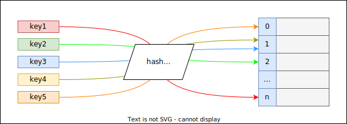

## Unordered Associative Containers

*hashset/hashmap*

Hashtable ile implement edilmislerdir. *$\mathcal{O}(1)$* complexity ile arama yapilabilmektedir.

<!-- * Ekleme: *$\mathcal{O}(\log{}n)$*
* Silme: *$\mathcal{O}(\log{}n)$* -->

| Container                 |  Alias  | Value Type |     Multikey?      |      header       |
| ------------------------- | :-----: | :--------: | :----------------: | :---------------: |
| `std::unordered_set`      | hashset |    key     | :heavy_minus_sign: | `<unordered_set>` |
| `std::unordered_multiset` |         |    key     | :heavy_plus_sign:  | `<unordered_set>` |
| `std::unordered_map`      | hashmap | key-value  | :heavy_minus_sign: | `<unordered_map>` |
| `std::unordered_multimap` |         | key-value  | :heavy_plus_sign:  | `<unordered_map>` |

Associative containerlar icin gecerli olan `set`/`map` ve `multiset`/`multimap` iliskisi bu container'lar icin de gecerlidir.

### Hash Function
Anahtar degerinden bir *index degeri* ureten fonksiyonlardir.

<p align="center">
   <br/>
   <i>Sekil: hashing</i>
</p>

Ideal bir hash fonksiyonu asagidaki ozelliklere sahip olmalidir:
1. Hesaplama maliyeti dusuk
2. Farkli anahtarlar icin mumkun oldugu kadar farkli indeks degerleri uretmeli
3. Ayni anahtarlar icin ayni degeri uretmeli

Farkli anahtarlarin ayni degeri uretmesi durumuna **collision** *(cakisma)* denir. 
Cakisma durumlarin icin ana akim derleyiciler genellikle *bagli liste* stratejisini uygulamaktadir.

```C++
template<typename Key, 
         typename Hash = std::hash<Key>, 
         typename KeyEq = std::equal_to<Key>, 
         typename Alloc = std::allocator<Key>>
class ...;
```
* `Hash`: Anahtar degerinden bir index uretimi icin kullanilacak fonksiyon turu  

  `std::hash` sinif sablonunun primitive turler ve STL'de bulunan turler icin specializationlari bulunmaktadir. User-defined turler icin bir hasher saglanmalidir.
   
  [Ornek: std::hash](res/src/hasher01.cpp)  
  [Ornek: Custom hasher impl](res/src/hasher02.cpp)  
  [Ornek: boost::hash_val](res/src/hasher03.cpp)  
  
  > :triangular_flag_on_post: 
  > `boost::hash` fonksiyonun kullanilmasi tavsiye edilmektedir. 

* `KeyEq`: Anahtar degeri, hash fonksiyonundan gecirildikten sonra uretilen index'de bulunan nesnelerin anahtar degerleri ile karsilastirmasi icin kullanilacak fonksiyon turu  
   
  Associative container karsilastirma icin bir [comparator](240_associative_containers.md#comparator-ve-equivalance) *([less](400_function_objects.md#operator-function-objects))* kullanilirken, unordered associative container'lar **equality** *([equal_to](400_function_objects.md#operator-function-objects))* kullanmaktadir.
   
  > :triangular_flag_on_post: 
  > `Key` turunun `KeyEq`'da verilen tur ile calisabilmesi gerekmektedir.  
  > &nbsp;&nbsp;&nbsp;&nbsp;&nbsp;*Ornegin; `equal_to` icin `Key` turunun `operator==` karsilastirmasi yapilabiliyor olmalidir.*

<!--  -->


