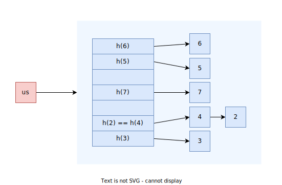

### `std::unordered_set`/`std::unordered_multiset`
```C++
template<typename Key, 
         typename Hash = std::hash<Key>, 
         typename KeyEq = std::equal_to<Key>, 
         typename Alloc = std::allocator<Key>>
class unordered_set;
```

<p align="center">
   <br/>
   <i>Sekil: std::unordered_set</i>
</p>

:x: **Forward Iterator**: 

> :triangular_flag_on_post: 
> `std::set` ile `std::unordered_set` arasinda ortak bir arayuz vardir.  

#### Iterator Invalidations

| Operations                                   | Invalidated                |
| -------------------------------------------- | -------------------------- |
| All read only operations, `swap`/`std::swap` | Never                      |
| `clear`/`rehash`/`reserve`/`operator=`       | Always                     |
| `insert`/`emplace`/`emplace_hint`            | Only if causes rehash      |
| `erase`                                      | Only to the element erased |

References and pointers to data stored in the container are only invalidated by erasing that element, even when the corresponding iterator is invalidated.


#### Constructors
```C++

```

#### Iterators
`begin` `cbegin` `end` `cend`

> :warning: FwIter kategorisinde olmasinda dolayi `reverse_iterator` bulunmaz.

#### Capacity
`empty` `size` `max_size` 

#### Lookup
`count` `find` `contains` `equal_range`

> :warning: 
> `lower_bound`, `upper_bound` fonksiyonlari bulunmamaktadir.

#### Modifiers
`clear` `insert` `emplace` `emplace_hint` `erase` `swap` `extract` `merge` 

#### Bucket Interface
##### `bucket_count`
```C++
size_type bucket_count() const;
```
Returns the number of buckets in the container.  

[Ornek](res/src/uset_bucket01.cpp)

##### `max_bucket_count`
```C++
size_type max_bucket_count() const;
```
Returns the maximum number of buckets the container is able to hold due to system or library implementation limitations.

[Ornek](res/src/uset_bucket01.cpp)

##### `bucket_size`
```C++
size_type bucket_size( size_type n ) const;
```
Returns the number of elements in the bucket with index n.

[Ornek](res/src/uset_bucket01.cpp)

##### `bucket`
```C++
size_type bucket( const Key& key ) const;
```
Returns the index of the bucket for key key. Elements (if any) with keys equivalent to key are always found in this bucket. The returned value is valid only for instances of the container for which bucket_count() returns the same value.

> :warning: 
> The behavior is undefined if bucket_count() is zero.

[Ornek](res/src/uset_bucket01.cpp)


#### Hash Policy
##### `load_factor`
```C++
float load_factor() const;
```
Returns the average number of elements per bucket, that is, `size()/bucket_count()`.

[Ornek](res/src/uset_bucket01.cpp)

##### `max_load_factor`
```C++
float max_load_factor() const;              // (1)
void max_load_factor( float ml );           // (2)
```
Manages the maximum load factor (number of elements per bucket). 

The container automatically increases the number of buckets if the load factor exceeds this threshold.

> :information_source: 
> Collision sayisini azaltmak icin genelde tavsiye edilen `0.7`-`0.8` arasinda olmasidir.

[Ornek](res/src/uset_bucket01.cpp)

##### `rehash`
```C++
void rehash( size_type count );
```
Sets the number of buckets to count and rehashes the container, i.e. puts the elements into appropriate buckets considering that total number of buckets has changed. 

If the new number of buckets makes load factor more than maximum load factor, then the new number of buckets is at least `size()/max_load_factor()`.

[Ornek](res/src/uset_hashpolicy01.cpp)

##### `reserve`
```C++
void reserve( size_type count );
```
Sets the number of buckets to the number needed to accomodate at least count elements without exceeding maximum load factor and rehashes the container, i.e. puts the elements into appropriate buckets considering that total number of buckets has changed. Effectively calls rehash(std::ceil(count / max_load_factor())).

[Ornek](res/src/uset_hashpolicy01.cpp)


#### Observers
##### `unordered_set::hash_function`
```C++
hasher hash_function() const;
```
Returns the function that hashes the keys.

##### `unordered_set::key_eq`
```C++
key_equal key_eq() const;
```
Returns the function that compares keys for equality.

#### Non-Member Functions
`operator==` `operator!=` `std::swap` `erase_if`   

> :warning: 
> containerlar arasinda *lexicographical compare* fonksiyonu bulunmamaktadir.

