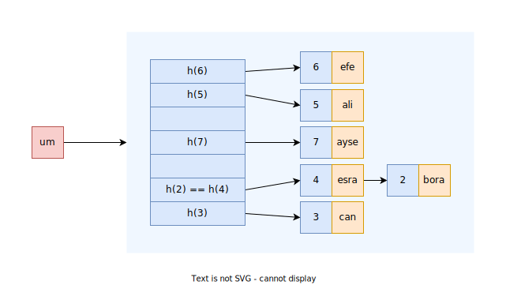

### `std::unordered_map`/`std::unordered_multimap`
```C++
template<typename Key,
         typename Value,
         typename Hash = std::hash<Key>, 
         typename KeyEq = std::equal_to<Key>, 
         typename Alloc = std::allocator<pair<Key,Value>>>
class unordered_map;
```

<p align="center">
   <br/>
   <i>Sekil: std::unordered_map</i>
</p>

> :triangular_flag_on_post: 
> `std::map` ile `std::unordered_map` arasinda ortak bir arayuz vardir. 


#### Iterator Invalidations

| Operations                                     | Invalidated                |
| ---------------------------------------------- | -------------------------- |
| All read only operations, `swap`/`std::swap`   | Never                      |
| `clear`/`rehash`/`reserve`/`operator=`         | Always                     |
| `insert`/`emplace`/`emplace_hint`/`operator[]` | Only if causes rehash      |
| `erase`                                        | Only to the element erased |


#### Constructors
```C++

```

#### Iterators
`begin` `cbegin` `end` `cend`

> :warning: FwIter kategorisinde olmasinda dolayi `reverse_iterator` bulunmaz.

#### Capacity
`empty` `size` `max_size` 

#### Lookup
`at` `operator[]` `count` `find` `contains` `equal_range`

> :warning: 
> `lower_bound`, `upper_bound` fonksiyonlari bulunmamaktadir.

#### Modifiers
`clear` `insert` `insert_or_assign` `emplace` `emplace_hint` `erase` `swap` `extract` `merge` 

##### `try_emplace`


#### Bucket Interface
`bucket_count` `max_bucket_count` `bucket_size` `bucket`  


#### Hash Policy
`load_factor` `max_load_factor` `rehash` `reserve`  

#### Observers
`hash_function` `key_eq`

#### Non-member functions
`operator==` `operator!=` `std::swap` `erase_if`   
