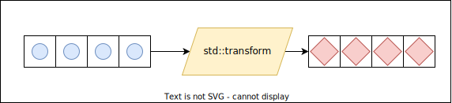

# Algorithms
Ana amaci bir veri yapisi uzerinde islem yapma olan parametreleri iterator olan fonksiyon sablonlaridir.

**Conventions**
1. Template parametrelerinde kullanilabilecek minimum iterator kategorisi belirtilir.  
2. Fonksiyon parametrelerinde once kaynak range, sonra hedef range bildirilir.  
3. Yazma islemi yapan algoritmalar en son yazdiklari konumdan bir sonraki konumu geri donerler.  
4. Bazi algoritmalarin geri donus degeri turu ayri bir template parametresidir.
5. Iteratorler ile ilgili islemlerin hicbiri exception firlatmaz.
6. Range parametreli bir algoritmaya **gecerli bir range** verilmelidir.
   * `begin` iteratoru arttirildiginda `end` iteratorune gidebilmesi gerekmektedir.
   * Range'in bos olmasi gecersiz degildir.
7. Hedef range, en az kaynak range kadar oge tutabiliyor olmalidir.
8. Arama algoritmalari bulunan ogenin konumunu iterator ile dondurur. Bulunamaz ise, fonksiyona gonderilen range'in `end`'ini dondurur. 

> :warning: 
> Asagidaki islemlerin hicbiri *exception throw etmez*, **UB**'dir:
> * Range parametreli bir algoritmaya **gecersiz bir range** verilmesi
> * Bos bir container'da `begin`'in dereference edilmesi
>   * Allocate edilmemis bir konuma yazma islemi
> * `end` konumunun dereference edilmesi

> **DIKKAT!**
> Algoritmalar (parametre degiskenleri iterator olan fonksiyonlar) iterator konumlarindaki nesnelerin degerlerini degistirebilirler. Ancak asla ve asla iteratorlere sahip containerlara eleman ekleyemezler, eleman silemezler!
> ```C++
> template<typename Iter>
> void algo(Iter beg, Iter end)
> {
>   // algo hangi container ile calistigini bilemedigi icin 
>   // burada container'a ekleme cikarma yapmak mumkun degildir!
> }
> 
> vector<int> ivec {1, 3, 5, 7, 9};
> std::cout << "ivec.size() = " << ivec.size() << '\n';
> algo(ivec.begin(), ivec.end());
> std::cout << "ivec.size() = " << ivec.size() << '\n';
> ```
> Ancak silme algoritmalari **lojik silme** (logical erasure) yapmaktadir.
> ```C++
> 4 7 7 7 7 2 2 2 3 4 4 9 2 7 5 6 1 5 6  // 2 degerleri silinmis olsaydi soyle olacakti:
> 4 7 7 7 7 3 4 4 9 7 5 6 1 5 6 ? ? ? ?
> ^                             ^       ^
> B                             L       E
>                               (logical end)
> ```
> [[bknz: remove-erase idiom](999_kavramlar.md#remove-erase-idiom)]
> 
> <!-- TODO: *RAII nesneleri turunden bir containerda remove yapilirsa resource release garantisi var mi?* -->


> :triangular_flag_on_post: 
> [C++20]'den itibaren algoritmalara `constexpr` olarak tanimlandi.

> :triangular_flag_on_post: 
> Sonu `copy` ile biten algoritmalar range kendisi yerine kopyasi uzerinde calisir.


**Predicate**  
Geri donus turu `bool` olan bir callable'lara **predicate** denilir.  

Soz konusu predicate;  
* tek parametreye sahip ise **unary predicate**
* iki parametrelilere ise **binary predicate** 

[Ornek](res/src/predicate01.cpp)


## Non-modifying sequence operations
### `std::find` / `std::find_if` / `find_if_not`
*(lineer search)*

```C++
template<typename InIter, typename T>
InIter find(InIter beg, InIter end, const T& val);

template <typename InIter, typename Pred>
InIter find_if(InIter beg, InIter end, Pred predicate);
```
<details>
<summary><b>Possible implementation</b> (Click to expand)</summary>

```C++
template<typename InIter, typename T>
InIter find(InIter beg, InIter end, const T& val)
{
    while(beg != end) 
    {
        if(*beg == val)
        {
            return beg;
        }
        ++beg;
    }
    
    return end;
}
```
```C++
template <typename InIter, typename Pred>
InIter find_if(InIter beg, InIter end, Pred predicate)
{
    while (beg != end)
    {
        if (preciate(*beg))
            return beg;
        ++beg;
    }

    return end;
}
```
</details>
<!--  -->

Bir range'de bulunan ogelerden belirli bir kosulu saglayan ilk ogenin konumunu return eder. Eger bulunamaz ise range'in end konumunu return eder.

[Ornek](res/src/find01.cpp)

### `std::count` / `std::count_if`
```C++
template< class InputIt, class T>
int count(InputIt first, InputIt last, const T& val);

template< class InputIt, class UnaryPredicate>
int count_if(InputIt first, InputIt last, UnaryPredicate p);
```

<details>
<summary><b>Possible implementation</b> (Click to expand)</summary>

```C++
template<class InputIt, class T>
int count(InputIt first, InputIt last, const T& value)
{
    typename iterator_traits<InputIt>::difference_type ret = 0;
    for (; first != last; ++first)
        if (*first == value)
            ++ret;
    return ret;
}

template<class InputIt, class UnaryPredicate>
int count_if(InputIt first, InputIt last, UnaryPredicate p)
{
    typename iterator_traits<InputIt>::difference_type ret = 0;
    for (; first != last; ++first)
        if (p(*first))
            ++ret;
    return ret;
}
```
</details>
<!--  -->


Belirli bir kosulu saglayan eleman sayisini geri doner.
[Ornek](res/src/count01.cpp)

### `std::for_each`
```C++
template<typename Iter, typename UFunc>
UFunc for_each(Iter beg, Iter end, UFunc f);
```
Bir range'deki ogeleri bir callable'a gondermektedir.

<details>
<summary><b>Possible implementation</b> (Click to expand)</summary>

```C++
template<typename Iter, typename UFunc>
UFunc for_each(Iter beg, Iter end, UFunc f)
{
    while(beg != end) 
    {
        f(*beg++);
    }
    
    return f;
}
```
</details>
<!--  -->

> :warning: 
> Geri donus degeri parametre olarak aldigi **callable**'dir.

[Ornek](res/src/for_each01.cpp)

## Modifying sequence operations

### `std::copy`/`copy_if`

```C++
template <typename InIter, typename OutIter>
OutIter copy(InIter beg, InIter end, OutIter dest_beg);

template <typename InIter, typename OutIter, typename Pred>
OutIter copy_if(InIter beg, InIter end, OutIter dest_beg, Pred pred);
```
Bir range'deki ogeleri baska bir range'e kopyalanmasini saglar.

<details>
<summary><b>Possible implementation</b> (Click to expand)</summary>

```C++
template <typename InIter, typename OutIter>
OutIter copy(InIter beg, InIter end, OutIter dest_beg)
{
    while(beg != end){
        *dest_beg++ = *beg++;
    }
    
    return dest_beg;
}
```
```C++
template <typename InIter, typename OutIter, typename Pred>
OutIter copy_if(InIter beg, InIter end, OutIter dest_beg, Pred pred)
{
    while (beg != end)
    {
        if (pred(*beg))
        {
            *desg_beg++ = *beg;
        }
        ++beg;
    }

    return dest_beg;
}
```
</details>
<!--  -->

[Ornek](res/src/copy01.cpp)

* Copy algoritmasinin calisabilmesi icin turlerin birbirine atabilmesi gerekir.  
  *Onemli olan containerlarin turu degil, ogelerin turudur.*

### `std::reverse`
```C++
template< class BidirIt >
void reverse( BidirIt first, BidirIt last );
```

<details>
<summary><b>Possible implementation</b> (Click to expand)</summary>

```C++
template<class BidirIt>
void reverse(BidirIt first, BidirIt last)
{
    using iter_cat = typename std::iterator_traits<BidirIt>::iterator_category;
 
    // Tag dispatch, e.g. calling reverse_impl(first, last, iter_cat()),
    // can be used in C++14 and earlier modes.
    if constexpr (std::is_base_of_v<std::random_access_iterator_tag, iter_cat>)
    {
        if (first == last)
            return;
 
        for (--last; first < last; (void)++first, --last)
            std::iter_swap(first, last);
    }
    else
        while (first != last && first != --last)
            std::iter_swap(first++, last);
}
```
</details>
<!--  -->

[Ornek](res/src/reverse01.cpp)


### `std::swap`
```C++
template<typename T >
void swap(T& a, T& b);
```
Parametre olarak verilen nesnelerin takasinin yapilabilmesini saglar.

> :warning: 
> Iteratorler birbiri ile swap edildiginde container'da bulunan elemanlar yer degistirmez.

[Ornek](res/src/swap01.cpp)

### `std::iter_swap`
```C++
template<typename ForwardIt1, typename ForwardIt2>
void iter_swap(ForwardIt1& a, ForwardIt2& b);
```
Iteratorlerin bulundugu konumdaki nesnelerin takasinin yapilabilmesini saglar.  

* Genellikle generic kodlarda kullanilir.
* Farkli containerlarin elemanlari arasinda tur uyumu var ise, elemanlari containerlar arasinda takas etmek icin kullanilabilir.

[Ornek](res/src/iter_swap01.cpp)

> :warning: 
> `iter_swap` ile `swap` karisitirilmamalidir!


### `std::transform`
```C++
template<typename InIter, typename OutIter, typename UFunc>
OutIter Transform(InIter beg, InIter end, OutIter dst_beg, UFunc f);

template<typename InIter1, typename InIter2, typename OutIter, typename BFunc>
OutIter transform(InIter1 beg1, InIter1 end1, InIter2 beg2, OutIter dst_beg, BFunc f);
```
Bir container'da bulunan tum ogelerin baska bir container icine donusturulerek eklenmesini saglar.
<details>
<summary><b>Possible implementation</b> (Click to expand)</summary>

```C++
template<typename InIter, typename OutIter, typename UFunc>
OutIter transform(InIter beg, InIter end, OutIter dst_beg, UFunc f) 
{ 
    while(beg != end) {
        *dst_beg++ = f(*beg++);
    }
    return dst_beg;
}

template<typename InIter1, typename InIter2, typename OutIter, typename BFunc>
OutIter transform(InIter1 beg1, InIter1 end1, InIter2 beg2, OutIter dst_beg, BFunc f)
{ 
    while(beg1 != end1) {
        *dst_beg++ = f(*beg1++, *beg2++);
    }
    return dst_beg;
}
```
</details>
<!--  -->

[Ornekler](res/src/transform01.cpp)

<p align="center">
    <br/>
    <i>Sekil: std::transform</i>
</p>

### `std::remove` / `std::remove_if`
```C++
template< class ForwardIt, class T >
ForwardIt remove( ForwardIt first, ForwardIt last, const T& value );

template< class ForwardIt, class UnaryPredicate >
ForwardIt remove_if( ForwardIt first, ForwardIt last, UnaryPredicate p );
```
Removes all elements satisfying specific criteria from the range `[first, last)` and returns a past-the-end iterator for the new end of the range.

<details>
<summary><b>Possible implementation</b> (Click to expand)</summary>

```C++
template<class ForwardIt, class T>
ForwardIt remove(ForwardIt first, ForwardIt last, const T& value)
{
    first = std::find(first, last, value);
    if (first != last)
        for (ForwardIt i = first; ++i != last;)
            if (!(*i == value))
                *first++ = std::move(*i);
    return first;
}

template<class ForwardIt, class UnaryPredicate>
ForwardIt remove_if(ForwardIt first, ForwardIt last, UnaryPredicate p)
{
    first = std::find_if(first, last, p);
    if (first != last)
        for (ForwardIt i = first; ++i != last;)
            if (!p(*i))
                *first++ = std::move(*i);
    return first;
}
```
</details>
<!--  -->

[Ornek](res/src/remove01.cpp)

### `std::unique`
```C++
template< class ForwardIt >
ForwardIt unique( ForwardIt first, ForwardIt last );

template< class ForwardIt, class BinaryPredicate >
ForwardIt unique( ForwardIt first, ForwardIt last, BinaryPredicate p );
```
Ardisik olarak birbirine esit olan ogelerin sayisini 1'e indirir ve *logical end* konumunu gosteren bir iterator geri doner.

* Siralanmis bir container uzerinde `unique` calistirildiginda her ogeden bir adet kalir.

<details>
<summary><b>Possible implementation</b> (Click to expand)</summary>

```C++
template<class ForwardIt>
ForwardIt unique(ForwardIt first, ForwardIt last)
{
    if (first == last)
        return last;
 
    ForwardIt result = first;
    while (++first != last)
        if (!(*result == *first) && ++result != first)
            *result = std::move(*first);
 
    return ++result;
}

template<class ForwardIt, class BinaryPredicate>
ForwardIt unique(ForwardIt first, ForwardIt last, BinaryPredicate p)
{
    if (first == last)
        return last;
 
    ForwardIt result = first;
    while (++first != last)
        if (!p(*result, *first) && ++result != first)
            *result = std::move(*first);
 
    return ++result;
}
```
</details>
<!--  -->

[Ornek](res/src/unique01.cpp)

### `std::replace` / `std::replace_if`
```C++
template< class ForwardIt, class T >
void replace( ForwardIt first, ForwardIt last, const T& old_value, const T& new_value );

template< class ForwardIt, class UnaryPredicate, class T >
void replace_if( ForwardIt first, ForwardIt last,
                 UnaryPredicate p, const T& new_value );
```
Replaces all elements satisfying specific criteria with `new_value` in the range `[first, last)`.

<details>
<summary><b>Possible implementation</b> (Click to expand)</summary>

```C++
template<class ForwardIt, class T>
void replace(ForwardIt first, ForwardIt last,
             const T& old_value, const T& new_value)
{
    for (; first != last; ++first)
        if (*first == old_value)
            *first = new_value;
}

template<class ForwardIt, class UnaryPredicate, class T>
void replace_if(ForwardIt first, ForwardIt last,
                UnaryPredicate p, const T& new_value)
{
    for (; first != last; ++first)
        if (p(*first))
            *first = new_value;
}
```
</details>
<!--  -->

[Ornek](res/src/replace01.cpp)

## Partitioning operations
### `std::partition`
```C++
template< class ForwardIt, class UnaryPredicate>
ForwardIt partition(ForwardIt first, ForwardIt last, UnaryPredicate p);
```
Bir range icerisinde bulunan ogelerden kosulu saglayan ve saglamayan iki grup olusturulmasini saglar.  
`p` unary predicate which returns ​true if the element should be ordered before other elements.

**partition_point**: partition edilmis bir range uzerinde verilen kosulu saglamayanlardan ilkinin konumunu dondurur.

<details>
<summary><b>Possible implementation</b> (Click to expand)</summary>

```C++
template<class ForwardIt, class UnaryPredicate>
ForwardIt partition(ForwardIt first, ForwardIt last, UnaryPredicate p)
{
    first = std::find_if_not(first, last, p);
    if (first == last)
        return first;
 
    for (auto i = std::next(first); i != last; ++i)
    {
        if (p(*i))
        {
            std::iter_swap(i, first);
            ++first;
        }
    }
 
    return first;
}
```
</details>
<!--  -->

[Ornek](res/src/partition01.cpp)

### `std::partition_point`
```C++
template< class ForwardIt, class UnaryPredicate >
ForwardIt partition_point( ForwardIt first, ForwardIt last, UnaryPredicate p );
```
Partition edilmis bir range'deki partition konumunu gosteren bir iterator donmektedir.

[Ornek](res/src/partition01.cpp)

### `std::stable_partition`

### `std::is_partitioned`
```C++
template< class InputIt, class UnaryPredicate >
bool is_partitioned( InputIt first, InputIt last, UnaryPredicate p );
```

### `std::partition_copy`
```C++
template< class InputIt, class OutputIt1,
          class OutputIt2, class UnaryPredicate >
std::pair<OutputIt1, OutputIt2>
    partition_copy( InputIt first, InputIt last,
                    OutputIt1 d_first_true, OutputIt2 d_first_false,
                    UnaryPredicate p );
                    

```

[Ornek](res/src/partition01.cpp)

## Sorting operations

**Siralama kriteri**: Iki ogenin birbiri ile karsilastirilmasi sirasinda hangisinin buyuk oldugunu saptamaya yonelik ifadedir.

STL'de siralamaya yonelik algoritmalarin hepsinin siralama kriteri parametreli overloadu bulunur.

### `std::is_sorted`
```C++
template< class ForwardIt >
bool is_sorted( ForwardIt first, ForwardIt last );

template< class ForwardIt, class Compare >
bool is_sorted( ForwardIt first, ForwardIt last, Compare comp );
```
Checks if the elements in range [first, last) are sorted.

* `std::is_sorted` returns true for empty ranges and ranges of length one.

<details>
<summary><b>Possible implementation</b> (Click to expand)</summary>

```C++
template<class ForwardIt>
bool is_sorted(ForwardIt first, ForwardIt last)
{
    return std::is_sorted_until(first, last) == last;
}

template<class ForwardIt, class Compare>
bool is_sorted(ForwardIt first, ForwardIt last, Compare comp)
{
    return std::is_sorted_until(first, last, comp) == last;
}
```
</details>
<!--  -->

[Ornek](res/src/is_sorted01.cpp)

### `std::is_sorted_until`
```C++
template< class ForwardIt >
ForwardIt is_sorted_until( ForwardIt first, ForwardIt last );

template< class ForwardIt, class Compare >
ForwardIt is_sorted_until( ForwardIt first, ForwardIt last, Compare comp );
```
Verilen range icinde sirali olmayan ilk elemanin konumunu gosteren bir iterator doner.
```C++
vector<int> ivec = {2, 5, 6, 4, 8, 11, 16, 18, 27};
//                           ^
```

<details>
<summary><b>Possible implementation</b> (Click to expand)</summary>

```C++
template<class ForwardIt>
ForwardIt is_sorted_until(ForwardIt first, ForwardIt last)
{
    return std::is_sorted_until(first, last, std::less<>());
}

template <class ForwardIt, class Compare>
ForwardIt is_sorted_until(ForwardIt first, ForwardIt last, Compare comp)
{
    if (first != last)
    {
        ForwardIt next = first;
        while (++next != last)
        {
            if (comp(*next, *first))
                return next;
            first = next;
        }
    }
    return last;
}
```
</details>
<!--  -->

[Ornek](res/src/is_sorted01.cpp)


### `std::sort`
```C++
template<typename RandomIt >
constexpr void sort(RandomIt first, RandomIt last);

template<typename RandomIt, typename Compare>
void sort(RandomIt first, RandomIt last, Compare comp );
```

<details>
<summary><b>Possible implementation</b> (Click to expand)</summary>

* [libstdc++](https://github.com/gcc-mirror/gcc/blob/d9375e490072d1aae73a93949aa158fcd2a27018/libstdc%2B%2B-v3/include/bits/stl_algo.h#L1950)  
* [libc++](https://github.com/llvm/llvm-project/blob/e7fc254875ca9e82b899d5354fae9b5b779ff485/libcxx/include/__algorithm/sort.h#L264)  
</details>
<!--  -->

[Ornek](res/src/sort01.cpp)

### `std::partial_sort`
```C++
template< class RandomIt >
void partial_sort( RandomIt first, RandomIt middle, RandomIt last );

template< class RandomIt, class Compare >
void partial_sort( RandomIt first, RandomIt middle, RandomIt last,
                   Compare comp );
```
Rearranges elements such that the range `[first, middle)` contains the sorted `middle − first` smallest elements in the range `[first, last)`.

Tum seti siralama yerine, siralamanin ilk `n` sonucu.

[Ornek](res/src/partial_sort01.cpp)

### `std::stable_sort`
```C++
template< class RandomIt >
void stable_sort( RandomIt first, RandomIt last );

template< class RandomIt, class Compare >
void stable_sort( RandomIt first, RandomIt last, Compare comp );
```
Sorts the elements in the range [first, last) in non-descending order. The order of equivalent elements is guaranteed to be preserved.

Ayni degere sahip degerler siralamadan onceki konumlarini gorece olarak koruyorsa boyle siralama algoritmalarina **stable sort** denilir.

[Ornek](res/src/stable_sort01.cpp)

### `std::nth_element`
```C++
template< class RandomIt >
void nth_element( RandomIt first, RandomIt nth, RandomIt last );

template< class RandomIt, class Compare >
void nth_element( RandomIt first, RandomIt nth, RandomIt last, Compare comp );
```
Verilen range'in siralanmis hali uzerinde `n`'inci elemana gore partition yapmaktadir.

[Ornek](res/src/nth_element01.cpp)

## Binary search operations (on sorted ranges)

## Set operations (on sorted ranges)

## Heap operations
### `std::is_heap`
```C++
template< class RandomIt >
bool is_heap( RandomIt first, RandomIt last );

template< class RandomIt, class Compare >
bool is_heap( RandomIt first, RandomIt last, Compare comp );
```
Checks whether the elements in range `[first, last)` are a *max heap*

[Ornek](res/src/is_heap01.cpp)

### `std::is_heap_until`
```C++
template< class RandomIt >
RandomIt is_heap_until( RandomIt first, RandomIt last );

template< class RandomIt, class Compare >
RandomIt is_heap_until( RandomIt first, RandomIt last, Compare comp );
```
Examines the range [first, last) and finds the largest range beginning at first which is a max heap

[Ornek](res/src/is_heap01.cpp)

### `std::make_heap`
```C++
template< class RandomIt >
void make_heap( RandomIt first, RandomIt last );

template< class RandomIt, class Compare >
void make_heap( RandomIt first, RandomIt last, Compare comp );
```
Constructs a max heap in the range [first, last). The first version of the function uses operator< to compare the elements, the second uses the given comparison function comp.

[Ornek](res/src/make_heap01.cpp)

### `std::push_heap`
```C++
template< class RandomIt >
void push_heap( RandomIt first, RandomIt last );

template< class RandomIt, class Compare >
void push_heap( RandomIt first, RandomIt last,
                Compare comp );
```
Inserts the element at the position last-1 into the max heap defined by the range [first, last-1).

[Ornek](res/src/push_heap01.cpp)

### `std::pop_heap`
```C++
template< class RandomIt >
void pop_heap( RandomIt first, RandomIt last );

template< class RandomIt, class Compare >
void pop_heap( RandomIt first, RandomIt last, Compare comp );
```
Swaps the value in the position first and the value in the position last-1 and makes the subrange [first, last-1) into a heap. This has the effect of removing the first element from the heap defined by the range [first, last).

[Ornek](res/src/pop_heap01.cpp)

### `std::sort_heap`
```C++
template< class RandomIt >
void sort_heap( RandomIt first, RandomIt last );

template< class RandomIt, class Compare >
void sort_heap( RandomIt first, RandomIt last, Compare comp );
```
Converts the max heap [first, last) into a sorted range in ascending order. The resulting range no longer has the heap property.

<details>
<summary><b>Possible implementation</b> (Click to expand)</summary>

```C++
template< class RandomIt >
void sort_heap( RandomIt first, RandomIt last )
{
    while (first != last)
        std::pop_heap(first, last--);
}

template< class RandomIt, class Compare >
void sort_heap( RandomIt first, RandomIt last, Compare comp )
{
    while (first != last)
        std::pop_heap(first, last--, comp);
}
```
</details>
<!--  -->

[Ornek](res/src/sort_heap01.cpp)

## Minimum/maximum operations
### `std::min_element`/`std::max_element`
```C++
template<class ForwardIt>
ForwardIt min_element(ForwardIt first, ForwardIt last);

template<class ForwardIt, class Compare>
ForwardIt min_element(ForwardIt first, ForwardIt last, Compare comp);

template<class ForwardIt>
ForwardIt max_element(ForwardIt first, ForwardIt last);

template<class ForwardIt, class Compare>
ForwardIt max_element(ForwardIt first, ForwardIt last, Compare comp);
```

<details>
<summary><b>Possible implementation</b> (Click to expand)</summary>

```C++
template<class ForwardIt>
ForwardIt min_element(ForwardIt first, ForwardIt last)
{
    if (first == last)
        return last;
 
    ForwardIt smallest = first;
    ++first;
 
    for (; first != last; ++first)
        if (*first < *smallest)
            smallest = first;
 
    return smallest;
}

template<class ForwardIt, class Compare>
ForwardIt min_element(ForwardIt first, ForwardIt last, Compare comp)
{
    if (first == last)
        return last;
 
    ForwardIt smallest = first;
    ++first;
 
    for (; first != last; ++first)
        if (comp(*first, *smallest))
            smallest = first;
 
    return smallest;
}
```
```C++
template<class ForwardIt>
ForwardIt max_element(ForwardIt first, ForwardIt last)
{
    if (first == last)
        return last;
 
    ForwardIt largest = first;
    ++first;
 
    for (; first != last; ++first)
        if (*largest < *first)
            largest = first;
 
    return largest;
}

template<class ForwardIt, class Compare>
ForwardIt max_element(ForwardIt first, ForwardIt last, Compare comp)
{
    if (first == last)
        return last;
 
    ForwardIt largest = first;
    ++first;
 
    for (; first != last; ++first)
        if (comp(*largest, *first))
            largest = first;
 
    return largest;
}
```
</details>
<!--  -->

[Ornek](res/src/minmax_element01.cpp)

### `std::minmax_element`
```C++
template<class ForwardIt>
std::pair<ForwardIt, ForwardIt> minmax_element(ForwardIt first, ForwardIt last);

template<class ForwardIt, class Compare>
std::pair<ForwardIt, ForwardIt> minmax_element(ForwardIt first, ForwardIt last, Compare comp);
```

<details>
<summary><b>Possible implementation</b> (Click to expand)</summary>

```C++
template<class ForwardIt>
std::pair<ForwardIt, ForwardIt>
    minmax_element(ForwardIt first, ForwardIt last)
{
    using value_type = typename std::iterator_traits<ForwardIt>::value_type;
    return std::minmax_element(first, last, std::less<value_type>());
}

template<class ForwardIt, class Compare>
std::pair<ForwardIt, ForwardIt>
    minmax_element(ForwardIt first, ForwardIt last, Compare comp)
{
    auto min = first, max = first;
 
    if (first == last || ++first == last)
        return {min, max};
 
    if (comp(*first, *min))
        min = first;
    else
        max = first;
 
    while (++first != last)
    {
        auto i = first;
        if (++first == last)
        {
            if (comp(*i, *min))
                min = i;
            else if (!(comp(*i, *max)))
                max = i;
            break;
        }
        else
        {
            if (comp(*first, *i))
            {
                if (comp(*first, *min))
                    min = first;
                if (!(comp(*i, *max)))
                    max = i;
            }
            else
            {
                if (comp(*i, *min))
                    min = i;
                if (!(comp(*first, *max)))
                    max = first;
            }
        }
    }
    return {min, max};
}
```
</details>
<!--  -->

[Ornek](res/src/minmax_element01.cpp)

## Comparison operations  

### `std::lexicographical_compare`

```C++
template<typename InputIt1, typename InputIt2>                            // (1)
bool lexicographical_compare(InputIt1 first1, InputIt1 last1,
                             InputIt2 first2, InputIt2 last2);

template<typename InputIt1, typename InputIt2, typename Compare>          // (2)
bool lexicographical_compare(InputIt1 first1, InputIt1 last1,
                             InputIt2 first2, InputIt2 last2,
                             Compare comp);
```
Iki container bu algoritma ile karsilastirildiginda *sozlukteki gibi karsilastirma* yapmaktadir.  
*Range1 range2'den kucuk mu sorusunun cevabini doner.*

* (1) varsayilan olarak `<` operatoru ile karsilastirma yapmaktadir.

Lexicographical comparison islemi asagidaki ozelliklere sahiptir:
* Verilen araliklar eleman eleman karsilastirilmaktadir.
* Ilk farkli deger karsilastirmasi islem sonucunu belirlemektedir.
* Eger farkli eleman ile karsilasilmamis ise; range'lerden uzun olan buyuktur.
* Birebir ayni elemanlara sahip esit uzunlukta iki range birbirine esittir.
* Bos bir range, bos olmayandan kucuktur.
* Iki bos range karsilastirmasi birbirine esittir.

<details>
<summary><b>Possible implementation</b> (Click to expand)</summary>

```C++
template<class InputIt1, class InputIt2>
bool lexicographical_compare(InputIt1 first1, InputIt1 last1,
                             InputIt2 first2, InputIt2 last2)
{
    for (; (first1 != last1) && (first2 != last2); ++first1, (void) ++first2)
    {
        if (*first1 < *first2)
            return true;
        if (*first2 < *first1)
            return false;
    }
 
    return (first1 == last1) && (first2 != last2);
}

template<class InputIt1, class InputIt2, class Compare>
bool lexicographical_compare(InputIt1 first1, InputIt1 last1,
                             InputIt2 first2, InputIt2 last2, Compare comp)
{
    for (; (first1 != last1) && (first2 != last2); ++first1, (void) ++first2)
    {
        if (comp(*first1, *first2))
            return true;
        if (comp(*first2, *first1))
            return false;
    }
 
    return (first1 == last1) && (first2 != last2);
}
```
</details>
<!--  -->

[Ornek](res/src/lexicographical_compare01.cpp)

## Permutation operations

## Numeric operations

## Operations on uninitialized memory


### `reverse_copy`
```C++
template<class BidirIt, class OutputIt>
OutputIt reverse_copy(BidirIt first, BidirIt last, OutputIt d_first);
```
Range'in tersini hedef iterator'un gosterdigi konuma yazar.

<details>
<summary><b>Possible implementation</b> (Click to expand)</summary>

```C++
template<class BidirIt, class OutputIt>
OutputIt reverse_copy(BidirIt first, BidirIt last, OutputIt d_first)
{
    for (; first != last; ++d_first)
        *d_first = *(--last);
    return d_first;
}
```
</details>

[Ornek](res/src/reverse_copy01.cpp)

### `remove_copy` / `remove_copy_if`
```C++
template<typename InIter, typename OutIter, typename T>
OutIter remove_copy(InIter beg, InIter end, OutIter dst_end, const T& val);

template<typename InIter, typename OutIter, typename UnPred>
OutIter remove_copy_if(InIter beg, InIter end, OutIter dst_end, UnPred f);
```


<details>
<summary><b>Possible implementation</b> (Click to expand)</summary>

```C++
template<typename InIter, typename OutIter, typename T>
OutIter remove_copy(InIter beg, InIter end, OutIter dst_end, const T& val)
{
    while(beg != end) {
        if(*beg != val)
            *dst_beg++ = *beg;
        ++beg;
    }
    return dst_beg;
}

template<typename InIter, typename OutIter, typename UnPred>
OutIter remove_copy_if(InIter beg, InIter end, OutIter dst_end, UnPred f)
{
    while(beg != end) {
        if(!f(*beg))
            *dst_beg++ = *beg;
        ++beg;
    }
    return dst_beg;
}
```
</details>
<!--  -->

[Ornek](res/src/remove_copy01.cpp)


### `replace_copy` / `replace_copy_if`
```C++
template< class InputIt, class OutputIt, class T >                        // (1)
OutputIt replace_copy( InputIt first, InputIt last, OutputIt d_first,
                       const T& old_value, const T& new_value );

template< class InputIt, class OutputIt, class UnaryPredicate, class T >  // (2)
OutputIt replace_copy_if( InputIt first, InputIt last, OutputIt d_first,
                          UnaryPredicate p, const T& new_value );
```
Copies the elements from the range [first, last) to another range beginning at d_first, while replacing all elements satisfying specific criteria with new_value. If the source and destination ranges overlap, the behavior is undefined.

* (1) Replaces all elements that are equal to old_value (using operator==).
* (2) Replaces all elements for which predicate p returns true.

<details>
<summary><b>Possible implementation</b> (Click to expand)</summary>

```C++
template<class InputIt, class OutputIt, class T>
OutputIt replace_copy(InputIt first, InputIt last, OutputIt d_first,
                      const T& old_value, const T& new_value)
{
    for (; first != last; ++first)
        *d_first++ = (*first == old_value) ? new_value : *first;
    return d_first;
}

template<class InputIt, class OutputIt, 
         class UnaryPredicate, class T>
OutputIt replace_copy_if(InputIt first, InputIt last, OutputIt d_first,
                         UnaryPredicate p, const T& new_value)
{
    for (; first != last; ++first)
        *d_first++ = p(*first) ? new_value : *first;
    return d_first;
}
```
</details>

[Ornek](res/src/replace_copy01.cpp)