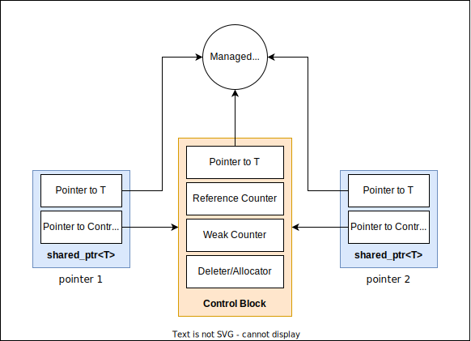

## `std::shared_ptr`
Paylasimli sahiplik semantigi ile birden fazla smart pointer tarafindan bir kaynagin hayatinin kontrol edilemebilmesini saglayan bir smart pointer'tir.

```C++
template<typename T>
class shared_ptr;
```
* Kopyalanabilir ve tasinabilir bir siniftir.

**Reference Counting**  
Bir kaynagi ortaklasa kullanan nesneler bir sekilde bu kaynagin ne kadar yerde kullanildigini biliyor.

<p align="center">
  <br/>
  <i>Sekil: Reference counting</i>
</p>

> :triangular_flag_on_post: "Odadan cikan son kisi isigi kapatsin" gibi bir benzetim yapilabilir.

### Member functions
`(constructor)` `(destructor)` `operator=`  

> :triangular_flag_on_post: `Deleter`, bir template parametresi degil, bir *type erased ctor parametresi*dir.

> :warning: `make_shared` kullanimi control blogu olusumunun optimize edilmesi nedeniyle tavsiye edilmektedir. [Ornek: ctor vs make_shared](res/src/shared_ptr02.cpp)

[Ornek](res/src/shared_ptr01.cpp)  
[Ornek: shared_ptr from unique_ptr](res/src/shared_ptr05.cpp)  

**Modifiers**  
`reset` `swap`  

**Observers**  
`get` `use_count` `unique` `operator bool` `owner_before`  

*Single-object version, unique_ptr<T>*  
`operator*` `operator->`  

*Array version, unique_ptr<T[]>*  
`operator[]`  

[Ornek: use_count 1](res/src/shared_ptr03.cpp)  

----------------------------------

## `std::enable_shared_from_this`

Bir *shared_ptr* ile hayatı kontrol edilen bir sınıfın üye fonksiyonu içinde kontrol edildigi shared_ptr'nin kopyasi çıkartilmak istenmekteyse, bu sinif *[CRTP](../04_advanced/000_crtp.md#crtp) örüntüsünden faydalanarak* `std::enable_shared_from_this` sınıfıni kalıtım yoluyla elde etmelidir.

[Ornek](res/src/shared_ptr04.cpp)
```C++
class Myclass : public std::enable_shared_from_this<Myclass> {
    void func()
    {
        auto sptr = shared_from_this();  // sptr, sp'nin kopyasidir
    }
};


auto sp = make_shared<Myclass>();
```

### Member functions
`(constructor)` `(destructor)`   
`operator=`  returns a reference to this  
`shared_from_this()`  returns a shared_ptr which shares ownership of **this*  
`weak_from_this()`  returns the weak_ptr which shares ownership of **this*  

> :warning: *shared_from_this* fonksiyonu bir shared_ptr tarafindan yonetilmeyen bir nesne ile cagrilirsa `std::bad_weak_ptr` turunden bir **exception** firlatmaktadir.

<!-- [Ornek kodlar](repos/necatiergin/cpp-kursu-kodlar/1760_SHARED_PTR) -->

------------------------------

## `std::weak_ptr`

Bir *shared_ptr*'nin gosterdigi nesnenin referans sayacini arttirmadan bir gozlemcisi olarak kullanilabilen bir siniftir. Bir *shared_ptr*'nin halen kaynaga sahip olup olmadigini sinama amaciyla kullanilmaktadir, **dereference edilememekte**dir.

```C++
template<typename T>
class weak_ptr;
```

### Member Functions
`(constructor)` `(destructor)` `operator=`  

> :warning: Eger bir `weak_ptr`'den `shared_ptr` olusturulur ise; `shared_ptr`'nin kaynaginin hayatta oldugundan emin olunmasi gerekmektedir. Aksi halde exception gonderilir.  

[Ornek: ctor](res/src/weak_ptr01.cpp)  

**Modifiers**  
`reset` `swap`  

**Observers**  
`use_count` `owner_before`  
`expired`:  *shared_ptr* bir kaynaga sahip degil ise true doner.  
`lock`:  Eger kaynak expire olmadiysa bir *shared_ptr* sinifi uretir, aksi halde `nullptr` doner.  

[Ornek: lock](res/src/weak_ptr02.cpp)  

----------------------------

### Cyclic reference
Birden fazla *shared_ptr* nesnesi kaynaklarini release edebilmek icin birbirlerini beklemesi durumunda ikisinin de kaynagini release edemedigi durumdur.

[Problem](res/src/cyclic_ref01.cpp)  
```C++
struct A;

struct B {
    std::shared_ptr<A> a_ptr;
};

struct A {
    std::shared_ptr<B> b_ptr;
};
```
```C++
std::shared_ptr<A> aptr{ new A };
std::shared_ptr<B> bptr{ new B };

aptr->b_ptr = bptr; // bptr release edilemiyor, cunku aptr icinde shared_ptr nesnesi var
bptr->a_ptr = aptr; // aptr release edilemiyor, cunku bptr icinde shared_ptr nesnesi var
```

Bu durumda nesnelerin hayatlarini sonlandirabilmesi icin *weak_ptr* kullanilarak referans sayaci arttirilmadan gozlemci olabilmesini saglamaktir:

[Cozum](res/src/cyclic_ref02.cpp)  
```C++
struct A;

struct B {
    std::weak_ptr<A> a_ptr;
};

struct A {
    std::weak_ptr<B> b_ptr;
};
```
```C++
std::shared_ptr<A> aptr{ new A };
std::shared_ptr<B> bptr{ new B };

aptr->b_ptr = bptr;
bptr->a_ptr = aptr;
```

[Ornek 1: Kedi oyunu](res/src/cyclic_ref03.cpp)  
[Ornek 2: Container](res/src/cyclic_ref04.cpp)  


